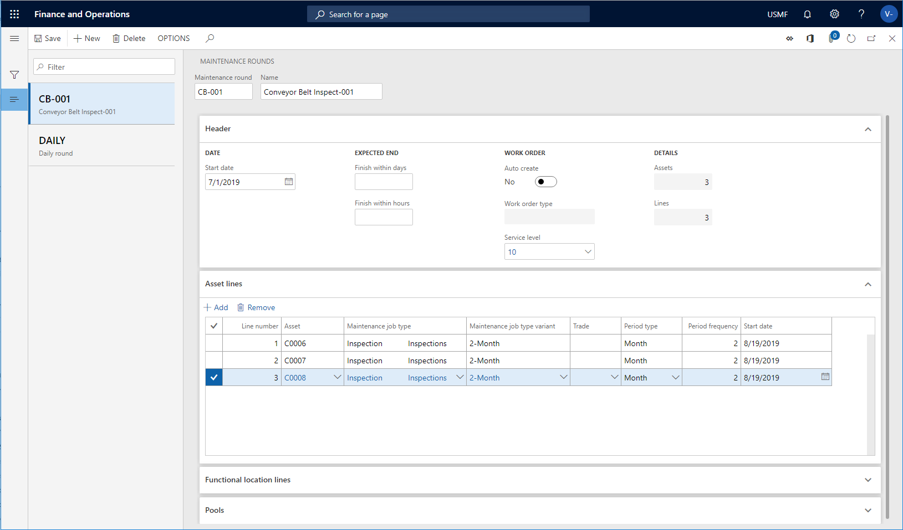
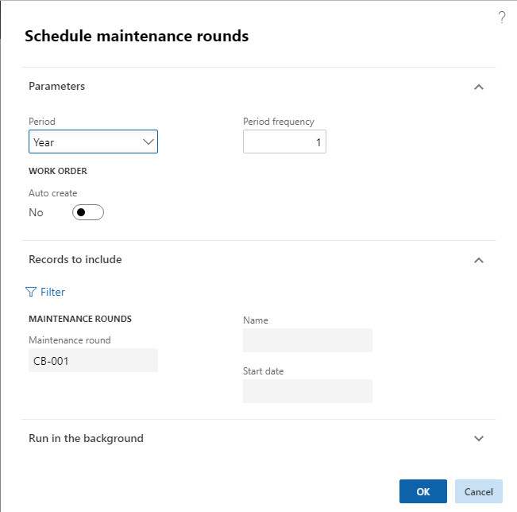
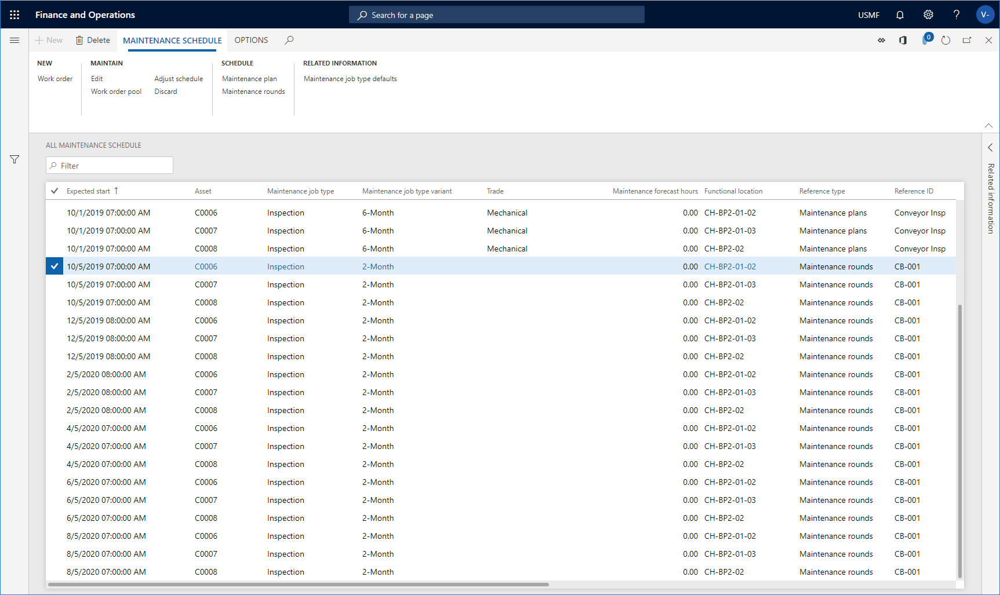

---
# required metadata

title: Maintenance rounds
description: This topic explains maintenance rounds in Asset Management.
author: johanhoffmann
ms.date: 08/27/2019
ms.topic: article
ms.prod: 
ms.technology: 

# optional metadata

ms.search.form: EntAssetRoundTable 
# ROBOTS: 
audience: Application User
# ms.devlang: 
ms.reviewer: kamaybac
# ms.tgt_pltfrm: 
ms.custom: 
ms.assetid: 
ms.search.region: Global
# ms.search.industry: 
ms.author: johanho
ms.search.validFrom: 2019-08-31
ms.dyn365.ops.version: 10.0.5

---

# Maintenance rounds

[!include [banner](../../includes/banner.md)]

 

In **Asset Management**, you can create maintenance rounds for various assets, on which you need to carry out a similar task at regular intervals. For example, lubrication jobs or safety inspection jobs that need to be carried out on a number of machines within the same intervals. First step is to create a maintenance round, including assets that require the same form of maintenance job. Next, you schedule the maintenance rounds. When you have completed the maintenance rounds schedule, you can see all the job records relating to the round in the **All maintenance schedule** and **Open maintenance schedule lines**.

>[!NOTE]
>Maintenance rounds can also be set up on functional locations to be completed on the assets installed on the functional location at the time of creation of the round-based work order. Refer to [Create functional locations](../functional-locations/create-functional-locations.md) for more information on the setup of maintenance rounds on functional locations.

## Set up a maintenance round

1. Click **Asset management** > **Setup** > **Preventive maintenance** > **Maintenance rounds**.

2. Click **New** to create a new maintenance round.

3. Insert and ID in the **Maintenance round** field, and a name for the maintenance round in the **Name** field.

4. Select a start date for the round in the **Start date** field.

5. In the **Finish within days** and **Finish within hours** fields, you can insert expected end date in days or hours. The expected end date is calculated relative to the start date, which is calculated when maintenance schedule lines are created. For example, you can insert "7" in the **Finish within days** field to indicate that the related job should be completed within a week from the start date.

6. Select "Yes" on the **Auto create** toggle button if work orders should automatically be created from maintenance schedule lines that are created from this maintenance round.

7. In the **Work order type** field, select the work order type to be used on work orders created from this maintenance round.

8. In the **Service level** field, select the work order service level to be used on work orders created from this maintenance round.

9. On the **Asset lines** FastTab, click **Add** to add an asset to the maintenance round.

10. A line number is automatically inserted in the **Line number** field to indicate the sequence of the assets in maintenance round.

11. Select the asset in the **Asset** field.

12. Select the maintenance job type for the asset in the **Maintenance job type** field.

13. If required, select **Maintenance job typ variant** and **Trade** related to the maintenance job type.

14. Select the recurrence (day, week, etc.) in the **Period type** field.

15. In the **Period frequency** field, insert the number of recurrences for the maintenance round. Example: If you have selected "Day" in the **Period type** field, and you insert the number "7" in this field, new maintenance round lines are created during preventive maintenance scheduling once a week.

16. Select a start date for the asset to be included in the maintenance round in the **Start date** field. This date may differ from the start date set on the maintenance round.

17. Repeat steps 9-16 to add more assets to the maintenance round.

18. On the **Functional location lines** FastTab, click **Add** to add a functional location to the maintenance round. Refer to the description of the related fields above. The same fields are available as for creating an asset line, but you can also select **Manufacturer** and **Model** for a functional location, if required. If you only select a functional location on a line, but make no selections in **Asset type**, **Manufacturer**, **Model**, **Maintenance job type**, **Maintenance job type variant** and **Trade**, all assets related to that functional location at the time of maintenance scheduling will be included in the maintenance round.

19. On the **Pools** FastTab, click **Add** to select a work order pool to be included in the maintenance round. Several work order pools can be connected to one maintenance round.

20. Save your setup.

>[!NOTE]
>The **Assets** and **Lines** fields located in the **Details** group on the **Header** FastTab show the total number of assets and lines related to the selected maintenance round.

The illustration below shows and example of a maintenance round containing three assets.

## Schedule maintenance rounds

When you've set up a maintenance round, you run a schedule job to schedule all the jobs related to the maintenance round.

1. Click **Asset management** > **Periodic** > **Preventive maintenance** > **Schedule maintenance rounds**, or **Asset management** > **Common** > **Maintenance schedule** > **All maintenance schedule** or **Open maintenance schedule lines** or **Open maintenance schedule pools** > select maintenance schedule line in the list > **Maintenance rounds** button.

2. In the **Period** field, select the period type to be used for the scheduling job.

3. In the **Period frequency** field, insert the number of periods to be included in the scheduling job. The start of the scheduling is the current date.

4. Select "Yes" on the **Auto create** toggle button if a work order should automatically be created on the basis of a maintenance round.

>[!NOTE]
>If this toggle button is set to "Yes", and the **Auto create** toggle button is also set to "Yes" on the maintenance round in **Maintenance rounds** form, work orders are created based on the maintenance round lines, and maintenance schedule lines with status "Work order created" are also created. If only one of the **Auto create** toggle buttons is set to "Yes", in this drop-down or in **Maintenance rounds**, only maintenance schedule lines are created with status "Created". In that case, no work orders are created.

5. If required, you can select specific rounds or another start date for the schedule job. Click **Filter**, and add the rounds to be included.

6. Click **OK**.

7. You are now able to see the maintenance rounds jobs in **Asset management** > **Common** > **Maintenance schedule** > **All maintenance schedule** or **Open maintenance schedule lines**. If the scheduled rounds are connected to a work order pool, you also see maintenance schedule lines in **Open maintenance schedule pools**. Maintenance schedule lines created from a round have the reference type "Maintenance rounds".

The two illustrations below show a schedule job in the **Schedule maintenance rounds** dialog, and the maintenance schedule lines created in **All maintenance schedule** based on that schedule job.

- When work orders are manually created on assets that are covered by a vendor warranty, a dialog box is shown to make the user aware of the warranty. The creation of the work order can then be canceled. The check for a warranty relation is omitted for work orders that are automatically created.  
- You can set up a batch job on the **Run in the background** FastTab to schedule rounds at regular intervals.  
- If a round is included in several work order pools (refer to [Work order pools](../work-orders/work-order-pools.md)), one record is shown for each pool in **Open maintenance schedule pools**. This is done to optimize the filtering options for work order pools.

[!INCLUDE[footer-include](../../../includes/footer-banner.md)]