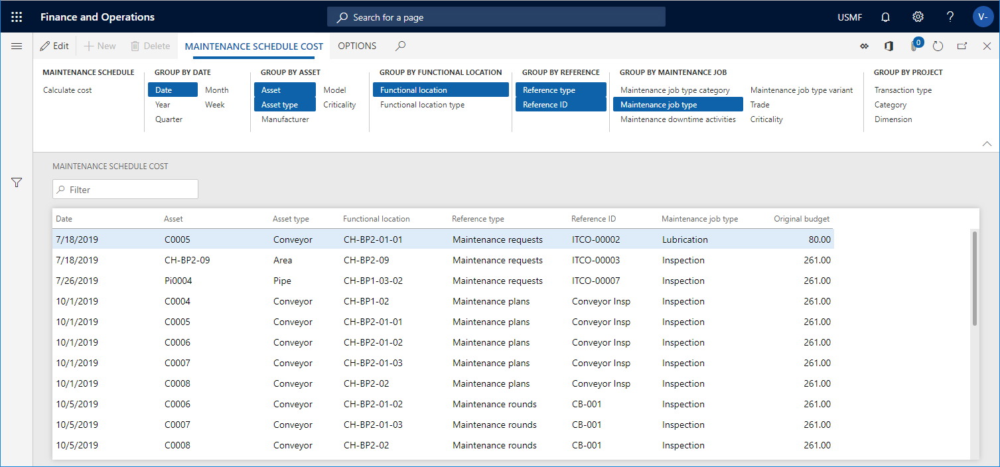

# Maintenance schedule cost

[!include [banner](../../includes/banner.md)]

 

In Asset Management, you can calculate budget costs on maintenance schedule lines. This is useful if you want to get an overview of expected costs, for example, costs relating to planned preventive maintenance jobs for the next year. The calculations are based on existing maintenance schedule lines of type "Maintenance plans" and "Maintenance rounds" and "Maintenance requests".

1. Click **Asset management** > **Inquiries** > **Assets** > **Maintenance schedule cost**.

2. In the **Maintenance schedule cost** dialog, you can select a **Financial dimension set** if you want to see costs grouped in financial dimensions.

>[!NOTE]
>Financial dimension sets are set up in **General ledger** > **Chart of accounts** > **Dimensions** > **Financial dimension sets**.

3. You can use the **Level** field to indicate how detailed you want the maintenance schedule lines to be regarding functional locations. For example, if you insert the number "1" in the field, and you have a multi-level functional location structure, all maintenance schedule lines for a functional location will be shown on the top level, and therefore the hours on a line may be added up from functional locations located at a lower level. If you insert the number "0" in the **Level** field, you will see a detailed result showing all maintenance schedule lines on all the functional location levels to which they are related.

4. If you want to make a calculation for specific assets, click **Filter** on the **Records to include** FastTab, and select the relevant assets. If required, you can also specify an **Expected start** date for the cost calculation or select a different **Status** for the cost calculation

5. Click **OK** to start the cost calculation.

6. On the **Maintenance schedule cost** tab > in the **Group by...** Action Pane groups, click the relevant buttons to show the required detail level of the cost calculation. The selected Action Pane group buttons are highlighted. Click on a button to activate or deactivate it.

7. Click the **Calculate cost** button if you want to make a new cost calculation.

The illustration below shows the results of a maintenance schedule cost calculation.

[!INCLUDE[footer-include](../../../includes/footer-banner.md)]