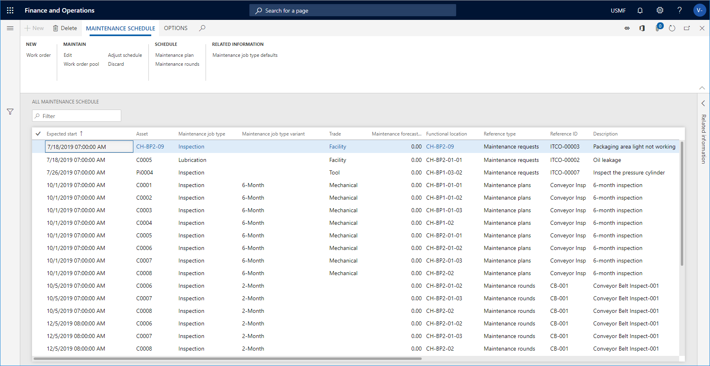

# Maintenance schedule

[!include [banner](../../includes/banner.md)]

 

The maintenance schedule contains a list of all the expected preventive maintenance plans, maintenance requests, and maintenance rounds to be carried out. Some schedule lines may have been converted to work orders.

The four maintenance schedule views are slightly different, depending on which maintenance schedule lines you want to see.

| Menu item                  | Description of contents                                                                                                                                             |
|----------------------------|----------------------------------------------------------------------------------------------------------------------------------------------------------------------------------------------|
| All maintenance schedule       | All maintenance schedule lines are shown.     |
| My asset schedule        | All maintenance schedule lines containing assets installed on functional locations to which you are related as a worker (set up in [Maintenance workers and worker groups](../setup-for-objects/workers-and-worker-groups.md)) are shown in this list. |
| Open maintenance schedule lines | Maintenance schedule lines with status "Created" - meaning they have not yet been converted to a work order or discarded - are shown in this list.                                            |
| Open maintenance schedule pools | Maintenance schedule lines related to a work order pool are shown in this list.                                                                                                                  |

>[!NOTE]
>If a maintenance schedule line is included in several work order pools (refer to [Work order pools](../work-orders/work-order-pools.md)), one record is shown for each pool in **Open maintenance schedule pools**. This is done to optimize filtering options on work order pools.

To open a maintenance schedule:

1. Click **Asset management** > **Maintenance schedule** > **All maintenance schedule** or **Open maintenance schedule lines** or **Open maintenance schedule pools**.

2. To update the maintenance schedule, click **Maintenance plan** or **Maintenance rounds**. 

3. You can edit a maintenance schedule line by selecting it and clicking **Edit**. For example, you can easily update the service level or the worker responsible for the job. You can only edit maintenance schedule lines that have not yet been connected to a work order.

4. You can delete a maintenance schedule line by selecting it in the list page and clicking **Delete**.

5. You can discard a maintenance schedule line by selecting it in the list page and clicking **Discard**. This function is useful if, for example, an asset has a 2,000 km maintenance plan and a 10,000 km maintenance plan. Then, you may want to discard the line created from the 2,000 km maintenance plan when it coincides with 10,000 km, 20,000 km, 30,000 km, and so on. If you discard a maintenance schedule line related to a maintenance plan, that line will never again appear when that maintenance plan is scheduled.

6. You can select a number of maintenance schedule lines in **All maintenance schedule** and click **Work order pool**, if you want all selected lines to be included in the same work order pool.

7. You can select a number of maintenance schedule lines in **All maintenance schedule** or **Open maintenance schedule lines** or **Open maintenance schedule pools** and click **Adjust schedule** if you want to make the same adjustments on several lines. You can change expected start and end dates, service level, and the responsible maintenance worker group or responsible maintenance worker related to the selected maintenance schedule lines.

- When a maintenance schedule line has been related to a work order, the work order ID will be displayed in the **Work order** field.  
- In **All assets** details view > **Asset maintenance plans** FastTab, you can select maintenance plans for the asset. Later, if you delete a maintenance plan line related to an asset in **All assets**, you also automatically delete all maintenance schedule lines with status "Created" that have been created based on that maintenance plan. Learn more in [Create an asset](../objects/create-an-object.md).

The illustration below shows the **All maintenance schedule** list page.

[!INCLUDE[footer-include](../../../includes/footer-banner.md)]