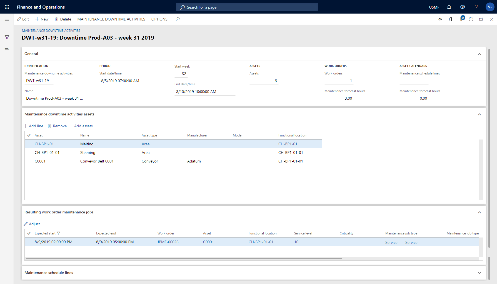
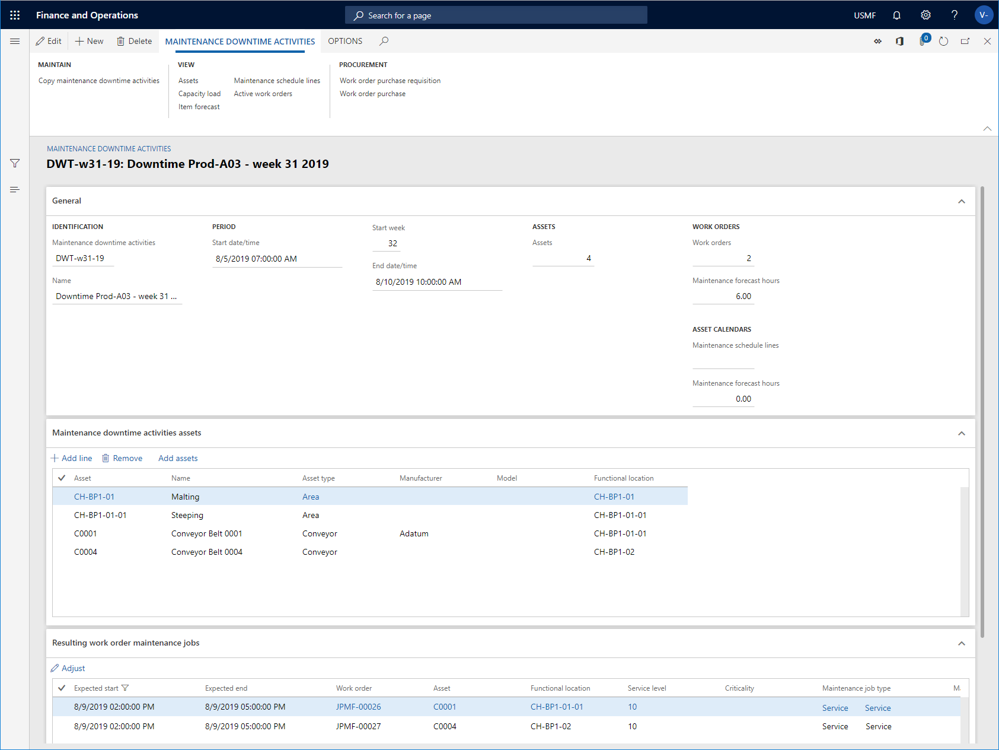
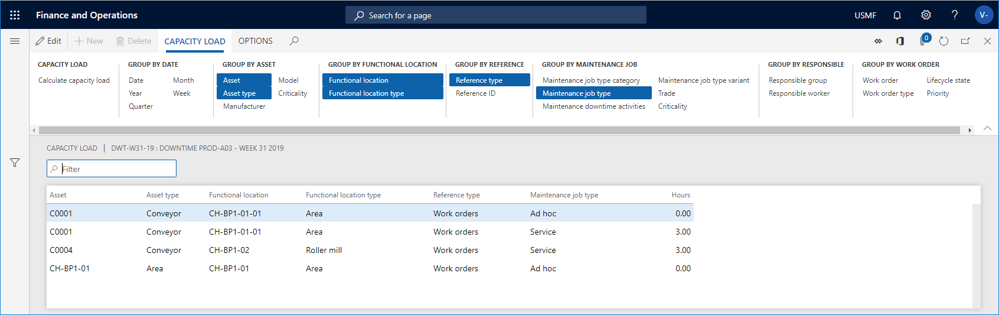
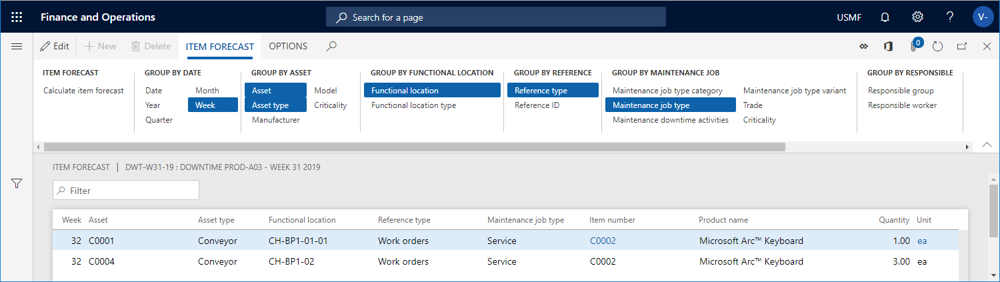

# Maintenance downtime activities

[!include [banner](../../includes/banner.md)]

Maintenance downtime is used to get an overview of the capacity required to carry out maintenance jobs on specific assets during a specific period. For example, you can create a maintenance downtime registration for Production line 10 in Production Hall 29-A on production site 02. The maintenance downtime registration has a start and end time indicating the period in which the assets related to the maintenance stop are not available for production.

**Maintenance downtime activities** is an overview of maintenance schedule lines and work order maintenance jobs on related assets during a specified period. The lines related to work order maintenance jobs all have an expected start date within the maintenance stop period. You can extract useful information and make adjustments to planned maintenance jobs:

- Get an overview of required shut-down periods of production equipment (assets).  
- Get an overview of planned maintenance (hours), grouped by competencies (responsible maintenance worker groups or maintenance workers), for example capacity load on electricians, smiths, or other maintenance work groups required to do the planned maintenance jobs.  
- Make adjustments to maintenance schedule lines or work order maintenance jobs related to the assets, for example, change expected start and end times on a line, or select other maintenance workers to optimize the workflow for maintenance workers and maintenance worker groups.

When assets have been selected on a maintenance downtime registration, all open maintenance schedule lines and work order maintenance jobs relating to active work orders are included in the maintenance downtime registration.

## Maintenance downtime activities

Click **Asset management** > **Maintenance downtime activities** > **All maintenance downtime activities** to open a list of all maintenance downtime activities and see some of the information related to the activities. Click on a link in the **Maintenance downtime activities** column to open the details view. The illustration below shows an example of the **Maintenance downtime activities** list.

## Create a maintenance downtime activity

1. Click **Asset management** > **Maintenance downtime activities** > **All maintenance downtime activities** or **Active maintenance downtime activities**.

2. Click **New**.

3. Insert an ID in the **Maintenance downtime activities** field and a name in the **Name** field.

4. Insert the period for the maintenance stop in the **Start date/time** and **End date/time** fields.

5. On the **Maintenance downtime activities assets** FastTab> click **Add line** to add assets, one at a time, to the maintenance downtime activity.

6. Click **Save** when all assets have been added. The illustration below shows an example of a maintenance downtime activity with related assets and maintenance jobs.

7. The work order maintenance jobs and open maintenance schedule lines related to the selected assets are shown on the **Resulting work order maintenance jobs** and **Maintenance schedule lines** FastTabs. On the **General** FastTab > **Work orders** group > **Maintenance forecast hours** field and **General** FastTab > **Maintenance schedule** group > **Maintenance forecast hours** field , you see the total number of hours forecasted for work order maintenance jobs and maintenance schedule lines.

The illustration below shows an example of the **Maintenance downtime activities** details view.

>[!NOTE]
>The work order maintenance jobs and maintenance schedule lines related to the selected assets are automatically updated if new work orders or maintenance schedule lines are created after you created the maintenance downtime activity. For example, if you schedule maintenance plans or maintenance rounds on the related assets two days after the maintenance downtime activity was created, new maintenance schedule lines are automatically added to the maintenance downtime activity.

8. In **All maintenance downtime activities** > **Maintenance downtime activities** > select a maintenance downtime activity in the list and click **Capacity load** to open the **Calculate capacity load** dialog. Use this dialog to get an overview of capacity load on, for example, dates, assets, asset types, and maintenance job types. Note that the dates shown in the dialog are the start and end dates selected in **Maintenance downtime activities**. This calculation includes the assets related to the maintenance downtime activity.

9. In the **Calculate capacity load** dialog, edit start and end times if required, and select if you want to include work orders and maintenance schedules in the calculation. You can use the **Level** field to indicate how detailed you want the capacity load calculation to be regarding functional locations. For example, if you insert the number "1" in the field, and you have a multi-level functional location structure, all assets for a functional location, which are selected on the maintenance downtime activity, will be shown on the top level, and therefore the hours on a line may be added up from functional locations located at a lower level. If you insert the number "0" in the **Level** field, you will see a detailed result showing all capacity load lines on all the functional location levels to which they are related.

10. Click **OK** to start the calculation. The total number of hours is shown in the **Capacity load** overview. On the **Capacity load** tab > the **Group by...** Action Pane groups, click the relevant buttons to get a more detailed overview of the allocation of forecasted hours. The illustration below shows the results of a **Capacity load** calculation.

11. After you get an overview of the capacity load, if you want to make adjustments on work order maintenance jobs or maintenance schedule lines, return to the **Maintenance downtime activities** details view and select the lines you want to adjust on the **Resulting work order maintenance jobs** and **Maintenance schedule lines** FastTabs.

12. Click the **Adjust** button and update expected start/end dates, service level, or responsible maintenance workers for the selected work order maintenance jobs or maintenance schedule lines.

13. Click **OK** when you have made the required adjustments. 

>[!NOTE]
>Work order maintenance jobs and maintenance schedule lines that are not included in the maintenance downtime period after you have made adjustments are automatically removed from **Maintenance downtime activities**.

14. In **All maintenance downtime activities** > **Maintenance downtime activities** > select a maintenance downtime activity in the list and click **Item forecast** to open the **Calculate item forecast** dialog. Use this dialog to calculate forecasts for items (spare parts and other required items) and group them to get an overview, for example, by date, asset, asset type, and maintenance job type. Note that the dates shown in the dialog are the start and end dates selected in **Maintenance downtime activities**. This calculation includes spare parts and items related to the assets that are selected on the maintenance downtime activity.

15. In the **Calculate item forecast** dialog, edit start and end times if required, and select if you want to include work orders and maintenance schedules in the calculation. You can use the **Level** field to indicate how detailed you want the capacity load calculation to be regarding functional locations. For example, if you insert the number "1" in the field, and you have a multi-level functional location structure, all assets for a functional location, which are selected on the maintenance downtime activity, will be shown on the top level, and therefore the hours on a line may be added up from functional locations located at a lower level. If you insert the number "0" in the **Level** field, you will see a detailed result showing all capacity load lines on all the functional location levels to which they are related.

16. Click **OK** to start the calculation. The total number of item forecasts is shown in the  **Item forecast** overview. On the **Item forecast** tab > the **Group by...** Action Pane groups, click the relevant buttons to get a more detailed overview of the allocation of forecasted items.The illustration below shows the results of an **Item forecast** calculation.

- You can copy assets from one maintenance downtime activity to another. In **All maintenance downtime activities**, select the **Copy maintenance downtime activities** button, and make your selections in the **From maintenance downtime activities** and **To maintenance downtime activities** fields, and click **OK**.
- In **All maintenance downtime activities**, click the **Maintenance schedule lines** button or the **Active work orders** button to open the related lists and view the lines related to the selected maintenance downtime activity.

[!INCLUDE[footer-include](../../../includes/footer-banner.md)]