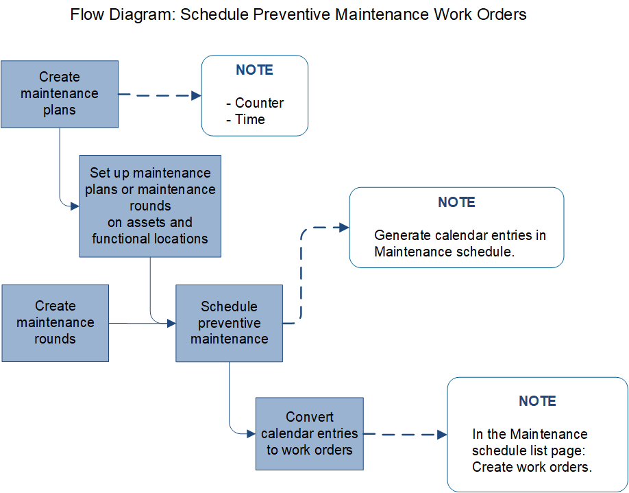

# Preventive maintenance overview

[!include [banner](../../includes/banner.md)]

This article explains preventive maintenance in Asset Management. Preventive maintenance is a discipline involving planned maintenance jobs, for example, regular service, calibration, and inspections. In Asset Management, you can create maintenance plans and set them up on assets and functional locations. You can also set up maintenance rounds on functional locations. Maintenance plans on assets are active regardless of where the asset is installed. Maintenance plans and maintenance rounds on functional location are active for the assets currently installed at the location. Instead of setting up maintenance plans on assets, or setting up maintenance rounds on functional locations, you can create maintenance rounds that include multiple assets on which you need to perform related types of maintenance jobs in the same work routine. Maintenance rounds created from assets (instead of on functional locations) let you select several assets for one maintenance round, even if they aren't installed on the same functional location.

Maintenance plans are used for preventive and reactive maintenance on individual assets. Maintenance rounds are used for preventive maintenance on a group or a set of assets. Maintenance plans and maintenance rounds are used for generating work order proposals. The work order proposals are saved as maintenance schedule lines, which can be bundled and converted into work orders.

The following illustration provides an overview of the work flow from creating maintenance plans and maintenance rounds to creating work orders for assets, based on those maintenance plans and maintenance rounds.

[!INCLUDE[footer-include](../../../includes/footer-banner.md)]
