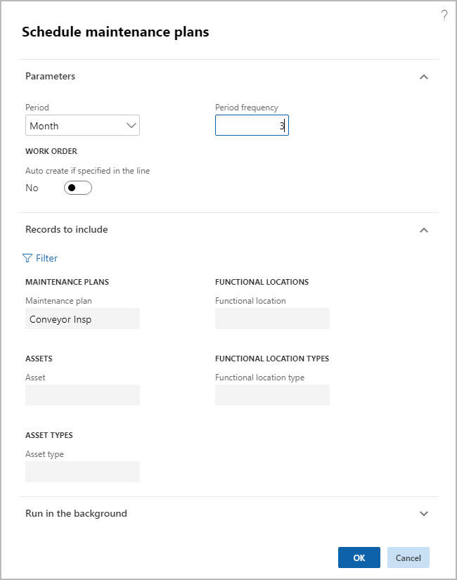
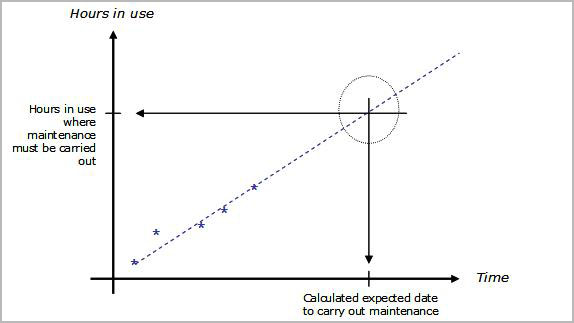

# Schedule maintenance plans

[!include [banner](../../includes/banner.md)]

Preventive maintenance scheduling generates calendar entries on assets, based on the maintenance plans set up on the assets. You can schedule calendar entries based on selected maintenance plans, asset types, and assets.

1. Go to **Asset management \> Periodic \> Preventive maintenance \> Schedule maintenance plans**.
1. You can select a time interval in the **Period** and **Period frequency** fields.

    > [!NOTE]
    > The **Period** and **Period frequency** fields indicate how far ahead in time you want maintenance schedule lines to be created, based on the maintenance plans you have created (time-based or counter-based). In the figure below, maintenance schedule lines (= work order proposals) are created from the current date and three months onwards.

1. Select *Yes* on the **Auto create if specified in the line** toggle button if work orders should automatically be created according to the maintenance plan line.

    > [!NOTE]
    > If this toggle button is set to *Yes*, and the **Auto create** check box is also selected on maintenance plan lines in **Maintenance plans**, work orders are created based on the maintenance plan lines, and maintenance schedule lines with status *Work order created* are also created. If only one option is selected (**Auto create if specified in the line** toggle button in this dialog or **Auto create** check box in **Maintenance plans** form), only maintenance schedule lines are created with status *Created*. In that case, no work orders are created.

1. It's possible to generate calendar entries based on maintenance plans (time or counter), assets, asset types, functional locations, and functional location types. If necessary, select the **Filter** button and make your selections as needed.

    *Regarding scheduling of maintenance plans on functional locations*: If you update the setup of asset types, manufacturers, and models on maintenance plans in **All functional locations** > **Maintenance plans** FastTab after you have scheduled maintenance plans, existing maintenance schedule entries related to that functional location are automatically deleted. In order to create new calendar entries, which correspond with the updated maintenance plan setup on the functional location, you must run a new maintenance plan schedule for that functional location. Read more about the setup of asset types, manufacturers, and models on functional locations in [Create functional locations](../functional-locations/create-functional-locations.md).

    *Example*: You want to create a maintenance plan for a specific functional location, meaning all assets set up on that functional location at any given time will be included when you schedule the maintenance plan. In that case, you create a maintenance plan and select the specific functional location, but you do NOT add any assets in the maintenance plan. The result is that when you schedule that maintenance plan, maintenance schedule lines will be created for all the assets related to the functional location at that time.

    If you make changes to asset types, manufacturers, and models in **Asset types**, those changes only affect new assets that use the updated asset type. Read more about asset type setup in [Asset types](../setup-for-objects/object-types.md).  

1. Select **OK** to start the generation of maintenance schedule entries on assets. The generated entries will be shown in the **All maintenance schedule** list page. The following illustration shows an example of the **Schedule maintenance plans** dialog.

    

    - In the **Schedule maintenance plans** dialog, you can set up batch jobs on the **Run in the background** FastTab to automatically generate calendar entries at regular intervals.  
    - When you schedule preventive maintenance, maintenance schedule lines with expected start date and time earlier than the system date and time won't be created.  

The following figure provides a graphic illustration of a time-based maintenance plan calculation.  

Regarding counter-based maintenance plans: In the following figures, two different counter registration cycles are shown. They're based on a maintenance plan set up for asset *V0001*, expecting the asset (a car) to run approx. 2,000 km every month.

In the first example, the expected 2,000 km aren't reached every month. According to the counter-based maintenance plan, the threshold is 2,000 km, meaning when you run a maintenance plan scheduling, a maintenance schedule line should be created each time the 2,000-kilometer threshold is reached. In example 1, there are four registration lines, but the 2,000-kilometer threshold is only reached once. This means that when you run schedule maintenance plans this asset, for example for a three-month period, only one maintenance schedule line will be created.

In the second example, 2,000 km or more are registered every month. Therefore, three maintenance lines would be created if you schedule maintenance plans for this asset for a three-month period.

The examples described here show that all counter registrations made on an asset show a trend describing wear and tear on the asset. That trend is used as calculation basis at the time of maintenance plan scheduling.

[!INCLUDE[footer-include](../../../includes/footer-banner.md)]
