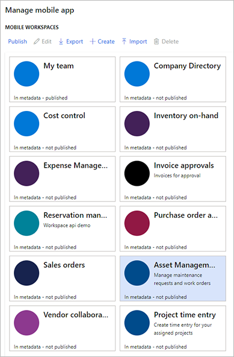
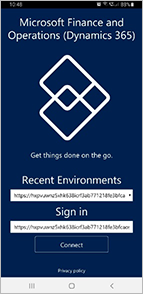
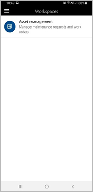
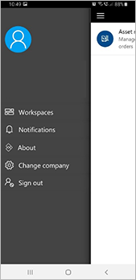
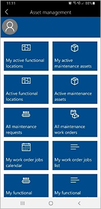

---
# required metadata

title: Set up the Asset management mobile workspace
description: This article describes how to set up Microsoft Dynamics 365 Supply Chain Management and the finance and operations (Dynamics 365) mobile app to run an Asset management mobile workspace that workers can use to perform asset management tasks.
author: johanhoffmann
ms.date: 01/15/2021
ms.topic: article
ms.prod: 
ms.technology: 

# optional metadata

# ms.search.form:  [Operations AOT form name to tie this article to]
audience: Application User
# ms.devlang: 
ms.reviewer: kamaybac

# ms.tgt_pltfrm: 
# ms.custom: [used by loc for articles migrated from the wiki]
ms.search.region: Global
# ms.search.industry: [leave blank for most, retail, public sector]
ms.author: johanho
ms.search.validFrom: 2020-12-22
ms.dyn365.ops.version: 10.0.17
---

# Set up the Asset management mobile workspace

[!include [banner](../../includes/banner.md)]
[!include [mobile app deprecated](../../fin-ops-core/dev-itpro/includes/mobile-app-deprecation-banner.md)]

This article describes how to set up Microsoft Dynamics 365 Supply Chain Management and the finance and operations (Dynamics 365) mobile app to run an **Asset management** mobile workspace that workers can use to perform asset management tasks.

## Set up maintenance worker users in Supply Chain Management

For each user that requires access to the **Asset management** mobile workspace, follow these steps.

1. In Supply Chain Management, go to **Human resources \> Workers**, and make sure that a worker record exists for the user that you want to set up. Create a new worker record as required.
1. Go to **Asset management \> Setup \> Workers \> Workers**, and make sure that the worker record that you identified (or created) in the previous step is mapped to a maintenance worker record. Create a new maintenance worker record as required, and set the **Worker** field to the worker record from the previous step.
1. Go to **Asset management \> Setup \> Workers \> Maintenance worker groups**, and make sure that the maintenance worker record that you identified (or created) in the previous step belongs to a maintenance worker group.
1. Go to **System administration \> Users**.
1. Select the relevant user in the grid.
1. On the **User Details** FastTab, set the **Person** field to the worker account that you want to associate with the current user account. This worker account should be the worker record that you identified (or created) in step 1 and mapped to a maintenance worker record in step 2.

> [!NOTE]
> User permissions and security roles apply to the features of the **Asset management** mobile workspace just as they apply to the features of the Supply Chain Management user interface. Therefore, every user that you set up to access the **Asset management** mobile workspace must have the security roles that are required to perform similar operations directly in Supply Chain Management.

## Publish the Asset management mobile workspace

To make asset management features available in the finance and operations (Dynamics 365) mobile app, you must publish the **Asset management** mobile workspace.

1. In Supply Chain Management, select the **Settings** button (the gear symbol in upper-right corner), and then select **Mobile app** on the menu.
1. In the **Manage mobile app** dialog box, find the **Asset Management** tile. If it contains the text "In metadata - not published," the workspace hasn't yet been published. If it contains the text "In metadata - published," the workspace has already been published, and you can skip the rest of this procedure.

    

1. Select the **Asset Management** tile, and then select **Publish** on the toolbar. After a few seconds, you should receive a notification that states that the workspace has been successfully published. Additionally, the text on the tile should change to "In metadata - published."

## Install and set up the finance and operations (Dynamics 365) mobile app

1. Go to one of the following app stores to install the **Microsoft finance and operations (Dynamics 365)** app on your mobile device:

    - [For Google Android devices](https://go.microsoft.com/fwlink/?linkid=850662)
    - [For Apple iOS devices](https://go.microsoft.com/fwlink/?linkid=850663)

1. Open the finance and operations (Dynamics 365) app. The sign-in page should appear. In the **Sign in** field, enter your Supply Chain Management URL, or select a recent URL in the **Recent environments** list, and then tap **Connect**.

    

1. If you're prompted to confirm the connection, select the **I understand** check box, and then tap **Connect**.
1. On the **Pick an account** page, use your Microsoft account to sign in to the mobile application.

    The **Workspaces** page appears. It lists every mobile workspace that has been published by your Supply Chain Management instance.

    

1. If you must change the legal entity (company), tap the Menu button (sometimes referred to as the hamburger or the hamburger button) in the upper-left corner, and then tap **Change company**.

    

1. On the **Workspaces** page, select the workspace that you want to work with to open it.

    

## Work with the Asset management mobile workspace

For more information about how to work with the **Asset management** mobile workspace, see [Use the Asset management mobile workspace](asset-management-mobile-workspace.md).

For more information about the finance and operations (Dynamics 365) mobile app, see the [Mobile app home page](../../fin-ops-core/dev-itpro/mobile-apps/Mobile-app-home-page.md).

[!INCLUDE[footer-include](../../includes/footer-banner.md)]
