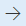

# Functional location lifecycle states

[!include [banner](../../includes/banner.md)]

This article describes how to set up functional location lifecycle states and lifecycle models in Asset Management. Functional location lifecycle states define the states that a functional location can go through, for example, created, active, and ended. You're able to view all functional locations, regardless of their lifecycle state, in the **All functional locations** list page. You can change the state of a functional location by selecting it in the **All functional locations** list page and selecting **Update functional location state**.

## Set up functional location lifecycle states

1. Select **Asset management** \> **Setup** \> **Functional locations** \> **Lifecycle states**.
1. Select **New** to create a new functional location state.
1. Insert the state ID in the **Lifecycle state** field and a name for the functional location state in the **Name** field. In the **Lifecycle models** field, you can see the number of functional location lifecycle models that uses the functional location state.
1. On the **General** FastTab, select *Yes* on the **Active** toggle button if the functional location should be active at this state.
1. Select *Yes* on the **Create assets** toggle button if it should be possible to automatically create an asset with the same name as the functional location and install it on the functional location at this state.  

    > [!NOTE]
    > This toggle button relates to the **Asset type** field on the **General** FastTab on the **Functional location types** page (**Asset management** \> **Setup** \> **Functional locations** \> **Functional location types**).

1. Set **Rename location** to *Yes* to make it possible to change the name of the functional location at this state.
1. Set **New sub locations** to *Yes* to make it possible to add new sub locations to the functional location at this state.
1. Set **Install assets** to *Yes* to make it possible to install assets on the functional location at this state.
1. Set **Install assets** to *Yes* to make it possible to delete the functional location at this state.
1. Select an asset state in the **Lifecycle state** field if you want the asset lifecycle state for all assets installed on the functional location to be automatically updated at this state. For example, if you close down a functional location and set the functional location lifecycle state to *Ended*, you might want to automatically change the lifecycle state of the assets installed on that functional location to *Not in use*.

> [!NOTE]
> Functional location lifecycle states, lifecycle models, and types are related and used in the same way as work order lifecycle states, work order lifecycle models, and work order types.

## Set up functional location lifecycle models

When you have created the lifecycle states required for your functional locations, they can be divided into groups. This is done to create the lifecycle model flow that could be used for different types of functional locations. As a minimum, one standard functional location lifecycle model should be created.

1. Select **Asset management** \> **Setup** \> **Functional locations** \> **Lifecycle models**.
1. Select **New** to create a new lifecycle model.
1. Insert the lifecycle model ID in the **Lifecycle model** field and a name for the lifecycle model in the **Name** field. In the **Functional location types** and **Lifecycle states** fields, you can see the number of functional location types that uses the lifecycle model and the number of states selected in the lifecycle model.
1. On the **Lifecycle states** FastTab, select the states that should be included in the model. This is done by selecting a state in the **Lifecycle states remaining** section and selecting the  button.
1. If you want to select all the available states for a model, select the  button. All states are transferred to the **Lifecycle states selected** section.
1. If you want to remove a selected state from the model, select the state in the **Lifecycle states selected** section and then select the  button.
1. Select **Lifecycle state updates** to define which lifecycle states can follow a selected state.

[!INCLUDE[footer-include](../../../includes/footer-banner.md)]
