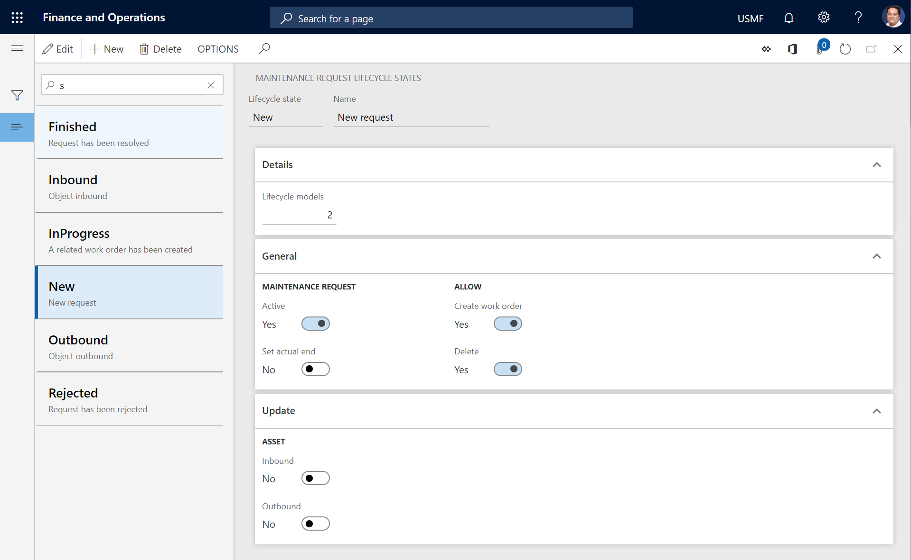
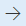
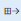
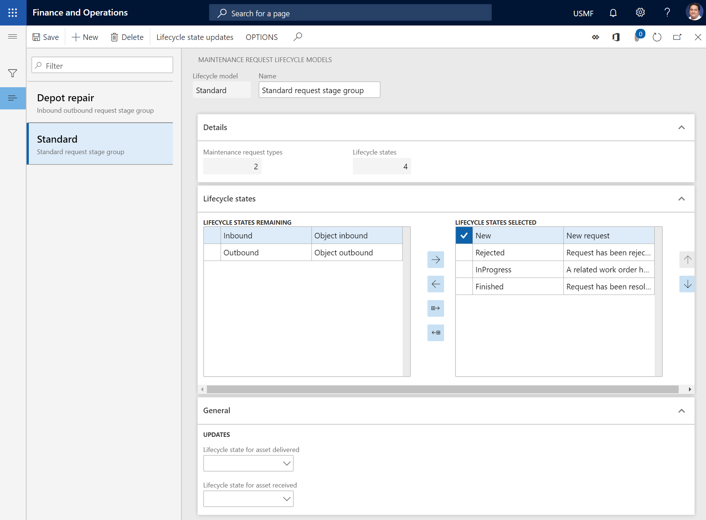

# Maintenance request lifecycle states

[!include [banner](../../includes/banner.md)]

 

Maintenance request lifecycle states define the stages that a request can go through. Examples include **Created**, **Active**, and **Ended**. When a maintenance request is converted to a work order, the maintenance request lifecycle state should be updated to **Ended** or **Closed** to indicate that the maintenance request is no longer active. On the **All maintenance requests** list page, you can view all maintenance requests, regardless of their lifecycle state.

## Set up maintenance request lifecycle states

1. Select **Asset management** \> **Setup** \> **Maintenance requests** \> **Lifecycle states**.
2. Select **New** to create a maintenance request lifecycle state.
3. In the **Lifecycle state** field, enter an ID for the lifecycle state.
4. In the **Name** field, enter a name.

    On the **Details** FastTab, the **Lifecycle models** field shows the number of maintenance request lifecycle models that use this lifecycle state.

5. On the **General** FastTab, set the **Active** option to **Yes** if a maintenance request should be active while it's in this lifecycle state.
6. Set the **Set actual end** option to **Yes** if an actual end date and time should automatically be entered on a maintenance request that is in this lifecycle state.
7. Set the **Create work order** option to **Yes** if a work order can be created from a maintenance request that is in this lifecycle state.
8. Set the **Delete** option to **Yes** if a maintenance request can be deleted while it's in this lifecycle state.
9. On the **Update** FastTab, the **Inbound** and **Outbound** options in the **Asset** section are relevant if you use depot repair. Set the appropriate option to **Yes** if the asset lifecycle state of assets that are selected on a maintenance request should automatically be updated to **Inbound** or **Outbound** when the maintenance request lifecycle state of that maintenance request is set to **Inbound** or **Outbound**.

The follow illustration shows an example of the **Maintenance request lifecycle states** page.

> [!NOTE]
> Maintenance request lifecycle states, lifecycle state groups, and types are related to, and used in the same way as, work order lifecycle states, lifecycle state groups, and types. 

## Set up maintenance request lifecycle models

After you've created the lifecycle states that are required for your maintenance requests, they can be divided into lifecycle state groups, or lifecycle models. Maintenance request lifecycle models are used to create the flow that can be used for different types of maintenance requests. At a minimum, one standard maintenance request lifecycle model should be created.

1. Select **Asset management** \> **Setup** \> **Maintenance requests** \> **Lifecycle models**.
2. Select **New** to create a maintenance request lifecycle model.
3. In the **Lifecycle model** field, enter an ID for the lifecycle model.
4. In the **Name** field, enter a name.

    On the **Details** FastTab, the **Lifecycle states** shows the number of lifecycle states that are selected in this lifecycle model. The **Maintenance request types** field shows the number of maintenance request types that use this lifecycle model.

5. On the **Lifecycle states** FastTab, select the lifecycle states that should be included in the lifecycle model:

    - To include a lifecycle state in the lifecycle model, select it in the **Lifecycle states remaining** section, and then select the right arrow button  to move it to the **Lifecycle states selected** section.
    - To include all the available lifecycle states in the lifecycle model, select the **Select all available states** button . All lifecycle states are moved to the **Lifecycle states selected** section.
    - To remove a lifecycle state from the lifecycle model, select it in the **Lifecycle states selected** section, and then select the left arrow button  to move it to the **Lifecycle states remaining** section.

6. On the **General** FastTab, the fields in the **Updates** section are relevant if you use depot repair.

    - In the **Lifecycle state for asset received** field, select the asset lifecycle state that assets that are selected on a maintenance request should automatically be updated to when they are received for depot repair.
    - In the **Lifecycle state for asset delivered** field, select the lifecycle state that assets that are selected on a maintenance request should automatically be updated to when they are returned after repair.

The following illustration shows an example of the **Maintenance request lifecycle models** page.

[!INCLUDE[footer-include](../../../includes/footer-banner.md)]