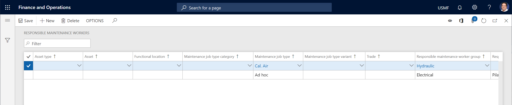

# Responsible maintenance workers

[!include [banner](../../includes/banner.md)]

 

Responsible maintenance workers can be related to asset types, assets, functional locations, maintenance job type categories, maintenance job types, maintenance job type variants, and trades. They can be used on work orders and maintenance requests to indicate a preference about the maintenance workers who should be responsible for a work order. (However, those maintenance workers aren't necessarily the same workers who are scheduled to carry out the work order.) Use of this functionality is optional. For example, it can be used to select responsible workers or worker groups for specific work types or work areas.

During a work order lifecycle or a maintenance request lifecycle, responsible maintenance workers can be changed or updated. This change or update might be related to, for example, a change in the maintenance request lifecycle state or the work order lifecycle state.

The setup on the **Responsible maintenance workers** page is *not* used during work order scheduling.

> [!NOTE]
> In Asset Management, you can also set up *preferred* maintenance workers who might be allocated to work orders during work order scheduling.

Before you can set up responsible maintenance workers, you must set up the workers and maintenance worker groups that should be available for selection. For information about how to set up workers and maintenance worker groups, see [Maintenance workers and worker groups](../setup-for-objects/workers-and-worker-groups.md).

## Set up responsible maintenance workers

1. Select **Asset management** \> **Setup** \> **Workers** \> **Responsible maintenance workers**.
2. Select **New** to create a record.
3. First create a default responsible maintenance worker or responsible maintenance worker group setup, where you set only the **Responsible maintenance worker group** field and/or the **Responsible worker** field. Leave the remaining fields blank. This default setup will be used during work order scheduling if no other, more specific combination matches the contents of the work order.

    > [!NOTE]
    > During creation of a maintenance request, when a responsible maintenance worker or responsible maintenance worker group is made available for selection on the **All maintenance requests** page, Asset Management goes through all responsible maintenance worker records to check for a possible match. It always checks the most specific combination first. In other words, Asset Management first checks for a match for the **Trade** field. If no match is found, it checks for a match for the **Maintenance job type variant** field. If no match is found, it checks for a match for the **Maintenance job type** field, and so on. As you can see in the layout of the page, this behavior means that, to find the most specific combination, Asset Management checks each record from right to left for a match (first **Trade**, then **Maintenance job type variant**, then **Maintenance job type**, then **Maintenance job type category**, then **Functional location**, then **Asset**, and finally **Asset type**). If no match is found, the default record that has no selections in those seven fields is used.

The following illustration shows an example of the **Responsible maintenance workers** page.

[!INCLUDE[footer-include](../../../includes/footer-banner.md)]