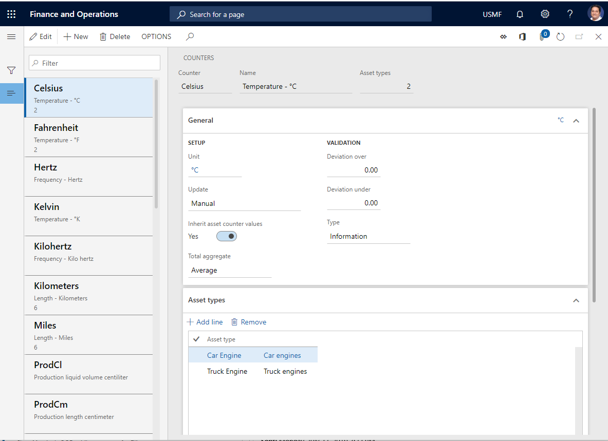

# Counters

[!include [banner](../../includes/banner.md)]

The article explains how to create counter types in Asset Management. Counter types are used to make counter registrations on assets, for example, regarding number of production hours, or quantity produced on the asset. Asset types are related to the counter types. This means that a counter can only be used on an asset if the counter is set up on the asset type used on the asset.

Before you can make counter registrations on assets, you first create the counter types you want to use in **Counters**. Next, you can create counter registrations on assets in **Counters**. 

Counters can be used on maintenance plans. A maintenance plan line can be of type "Counter", for example, relating to number of production hours or quantity produced. 

A counter registration can be updated manually or automatically based on production hours or quantity produced. A counter can be set up to use one of three update methods (selected in the **Update** field in **Counters**):
  
- Manual - you must manually register counter values.  
- Production hours - the counter is automatically updated based on number of production hours.  
- Production quantity - the counter is automatically updated based on number of quantity produced.  

>[!NOTE]
>If quantity produced is used, *all* registered items are included in the counter registration, good quantity as well as error quantity. It is always possible to make manual counter registrations, if required.

## Create counter types for asset counter registrations

1. Select **Asset management** > **Setup** > **Asset types** > **Counters**.
2. Select **New** to create a new counter type.
3. Insert an ID in the **Counter** field, and a counter name in the **Name** field.
4. On the **General** FastTab, select a counter unit in the **Unit** field.
5. In the **Update** field, select the update method to be used for the counter.
6. Select "Yes" on the **Inherit counter values** toggle button if child assets in an asset structure should automatically inherit counter registrations made on the parent asset.
7. In the **Total aggregate** field, select the summation method to be used for a counter using this counter type. "Sum" is the standard selection used to continuously add registered values to the total value. "Average" can be used if a counter is set up to monitor a threshold, for example, regarding temperature, vibrations, or wear and tear on an asset. 
8. In the **Deviation over** field, insert the upper level in percent for validating if manual counter registrations are within an expected range. The validation is based on a linear increase in existing counter registrations.
9. In the **Deviation under** field, insert the lower level in percent for validating if manual counter registrations are within an expected range. The validation is based on a linear decrease in existing counter registrations.
10. In the **Type** field, select the type of message (information, warning, error) to be shown if deviations outside the defined range occur when you make manual counter registrations.
11. On the **Asset types** FastTab, add the asset types that should be able to use the counter.
12. On the **Related asset counters** FastTab, add the counter that you want to be automatically updated when this counter is updated.

>[!NOTE]
>A related counter is automatically updated only if the related counter has the asset type, to which it is related, in the counter setup. For example: You set up a counter for "Production hours" and add the asset type "Truck Engine". When that counter is updated, a related counter "Oil" is also updated with the same counter values. The setup in **Counters** includes the setup on "Hours". Also, on the "Oil" counter, the asset type "Truck Engine" should be added to the **Asset types** FastTab to ensure the counter relation. See the screenshots below for an example of the setup on the Hours and Oil counters.

When asset types are added to a counter type in **Counters**, that counter is automatically added to the asset types on the **Counters** FastTab in [Asset types](../setup-for-objects/object-types.md).

[!INCLUDE[footer-include](../../../includes/footer-banner.md)]