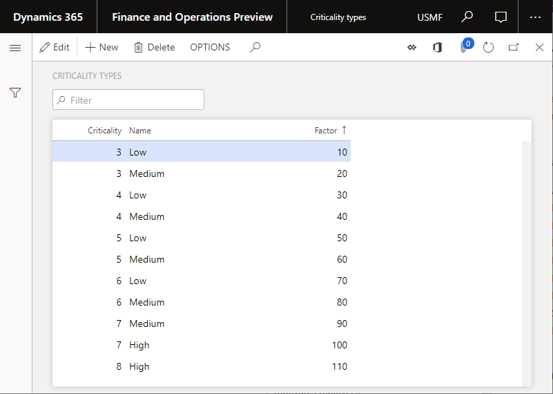

---
# required metadata

title: Asset criticality types
description: The article explains asset criticality types in Asset Management.
author: johanhoffmann
ms.date: 06/26/2019
ms.topic: article
ms.prod: 
ms.technology: 

# optional metadata

ms.search.form: EntAssetCriticality, EntAssetObjectCriticality
# ROBOTS: 
audience: Application User
# ms.devlang: 
ms.reviewer: kamaybac
# ms.tgt_pltfrm: 
ms.custom: 2214
ms.assetid: 2f3e0441-414d-402b-b28b-7ab0d650d658
ms.search.region: Global
# ms.search.industry: 
ms.author: johanho
ms.search.validFrom: 2016-02-28
ms.dyn365.ops.version: AX 7.0.0

---

# Asset criticality types

[!include [banner](../../includes/banner.md)]

 

The article explains asset criticality types in Asset Management. Asset criticality is related to assets and is transferred to work orders. It can't be changed on a work order. Asset criticality is used to calculate work order criticality during work order scheduling. In other words, it's used to calculate the extent to which a maintenance job on an asset affects the production schedule and productivity in your company. For more information about the setup that is related to the calculation of rating scores for work order scheduling, see [Asset Management parameters](../setup-for-objects/enterprise-asset-management-parameters.md).

To set up criticality, you first create the criticality types that should be used in the asset setup. You then set up asset criticalities.

## Set up criticality types

1. Select **Asset management** \> **Setup** \> **Assets** \> **Criticality types**.
2. Select **New** to create a record.
3. In the **Criticality** field, enter a number that indicates the criticality.
4. In the **Name** field, enter a name for the criticality type.
5. In the **Factor** field, enter a factor. This factor is used during the calculation of work order scheduling to determine the criticality record that should be used. (The record that has the highest factor is always used.) This setting is relevant if, as shown in the following illustration, criticality lines are created that have the same criticality value.

    

## Set up asset criticalities

1. Select **Asset management** \> **Setup** \> **Asset criticalities**.
2. Select **New** to create a record.
3. Depending on the required level of detail for asset criticality, make relevant selections in the **Functional location**, **Asset type**, **Manufacturer**, **Model**, **Asset**, **Job type category**, **Job type**, **Job type variant**, and **Job requirement** fields.

    > [!NOTE]
    > When an asset criticality is selected, Asset Management goes through all asset criticality records to check for a possible match. It always checks the most specific combination first. In other words, Asset Management first checks **Job requirement**. If no match is found, it checks **Job type variant**. If no match is found, it checks **Job type**, and so on. As you can see in the layout of the page, this behavior means that, to find the most specific combination, Asset Management checks each record from right to left for a match. If no match is found, the "default" record that has no selections is used.

4. In the **Criticality** field, select one of the criticality values that you created in the previous procedure.

### Notes about criticality setup

- If you change an asset criticality in this setup after you've already used it on a work order, the criticality on the work order isn't updated accordingly.
- The criticality on a work order is recalculated every time that a work order line is added to or deleted from the work order.
- If a work order contains several work order jobs, the highest criticality, according to the **Factor** field on the **Criticality types** page, is always used on the work order.
- Generally, asset criticality can change over a period. Criticality can be affected by the purchase of new equipment, refurbishments, and so on. Consider reevaluating your asset criticalities at regular intervals (for example, once per year or every other year) to make sure that your criticality definitions match your current production setup.

[!INCLUDE[footer-include](../../../includes/footer-banner.md)]