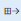
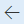

# Asset types

[!include [banner](../../includes/banner.md)]

This article explains how to create asset types. It also describes the elements that are related to asset types. Asset types are used as general categories for assets. Examples include CNC machines, measuring equipment, and truck engines. Asset types are used to manage the maintenance job types (maintenance tasks), asset lifecycle states, counters, asset attributes, condition assessment templates, and asset models that can be selected for an asset. When you create an asset, you must specify the asset type.

For each asset type, variations of the asset type setup can be created. For example, if you have an asset type that is named *Trucks*, you can create variations of that asset type for different asset manufacturers and asset models. To each asset type setup, you can add the required spare parts and maintenance plans.

First, you set up the required asset types. Next, you create the asset models that should be related to the asset types. Finally, on the **Asset type defaults** page, you create all the variations of asset types that are required for your equipment.

## Create an asset type

1. Select **Asset management** \> **Setup** \> **Asset types** \> **Asset types**.
2. Select **New** to create an asset type.
3. In the **Asset type** field, enter an asset type ID.
4. In the **Name** field, enter a name.
5. In the **Asset lifecycle model** field, select an asset lifecycle model. For more information about asset lifecycle states and asset lifecycle models, see [Asset lifecycle states](object-stages.md).
6. Set the **Total** option to *Yes* if summarized key performance indicator (KPI) values should be calculated for assets that have this asset type.
7. Select **Save**.
8. On the **Maintenance job types** FastTab, select the maintenance job types that should be related to the asset type:
    - To select a maintenance job type, select it in the **Maintenance job types remaining** field, and then select the right arrow button  to move it to the **Maintenance job types selected** section.
    - To select all available maintenance job types, select the  button. All maintenance job types are transferred from the **Maintenance job types remaining** field to the **Maintenance job types selected** field.
    - To cancel the selection of a maintenance job type, select it in the **Maintenance job types selected** field, and then select the left arrow button  to move it to the **Maintenance job types remaining** field.

9. You can also select the counters that should be related to the asset type. On the **Counters** FastTab, make your selections by using the methods that are described for maintenance job types in step 8. For more information about the setup of counters, see [Counters](counters.md).
10. You can also select the attribute types that should be related to the asset type. On the **Attribute types** FastTab, make your selections by using the methods that are described for maintenance job types in step 8. Then, to create the preferred sequence of attribute types, select an attribute type in the **Attribute types selected** field, and use the up arrow and down arrow buttons to move it. The sequence of attribute types will be shown on assets that use this asset type. For more information about asset attributes, see [Maintenance attribute types](../setup-for-functional-locations/specification-types.md).

    > [!NOTE]
    > When you add new attribute types on the **Attribute types** FastTab, existing assets are automatically updated with that information.

11. You can also select the condition assessment templates that should be related to the asset type. On the **Condition assessments** FastTab, make your selections by using the methods that are described for maintenance job types in step 8. For more information about condition assessment templates and registrations, see [Condition assessment](../setup-for-objects/condition-assessment.md).
12. The **Asset model** FastTab shows all the combinations of asset manufacturers and models that are set up on the selected asset type. To see the combinations divided according to manufacturer, select **Asset model** to open the **Asset model** page.

    On the **Asset model** page, you can add asset model–asset type relations. Additionally, on the **Asset types** page, you can add asset manufacturer–asset model relations directly to an asset type. Finally, on the **Asset model** page (**Asset management** \> **Setup** \> **Assets** \> **Asset model**), you can create new asset manufacturer–asset model–asset type relations. Therefore, there are three ways to set up and edit asset manufacturer–asset model–asset type relations. All the available combinations are shown from different perspectives, and you can select your preferred point of entry when you work with the setup.

> [!NOTE]
>
> - If you select counters on an asset type, the selections are automatically updated on the **Counters** page (**Asset management** > **Setup** > **Assets** > **Asset types** > **Counters**).
> - The fields in the **Details** section on the **General** FastTab show the number of maintenance job types, counters, attributes, and so on, that are set up on the selected asset type.

Typically, work orders that are manually created are related to corrective maintenance, whereas work orders that are automatically created are related to preventive maintenance. When you manually create work orders, only the maintenance job types that are selected on the **maintenance job types** FastTab of the **Asset types** page can be used. However, automatically created work orders can use all the maintenance job types you create on the **Maintenance job types** page (**Asset management** \> **Setup** \> **Jobs** \> **Maintenance job types**).

## Create asset type setup lines

1. Select **Asset management** \> **Setup** \> **Assets** \> **Asset types** \> **Asset type setup**. Alternatively, select **Asset management** \> **Setup** \> **Assets** \> **Asset types** \> **Asset types**, select an asset type, and then select **Asset type setup**.
2. The first time that you use the **Asset type setup** page, you might find the **Create combinations** button useful. You can use this button to quickly create all combinations of an asset model on an asset type. Select **Create combinations**, select the asset type to create combinations for, and then select **OK**.

    > [!NOTE]
    > If you won't use all the asset type setup combinations that were automatically created, you can delete a setup by selecting it and then selecting **Delete**.

3. Select **New** to manually create an asset type setup.
4. Depending on how specific the asset type setup should be, make selections in the **Asset type**, **Manufacturer**, and **Model** fields.
5. If a warranty agreement is related to the asset type, select the agreement in the **Vendor warranty** and **Customer warranty** fields.
6. On the **Spare parts** FastTab, select **Add** to add spare parts to the selected asset type setup.
7. To approve a spare part, select the spare part line, and then select **Approve**. You can select multiple lines for approval.
8. To see whether a spare part is used somewhere else in Asset Management (for example, in relation to assets and work orders), select the spare part line, and then select **Item where used** to open the **Item where used** page. To see all active spare parts in the list, select the **Active** check box. To see only approved spare parts, select the **Approved** check box.
9. On the **Maintenance plans** FastTab, select **Add** to add maintenance plans to the selected asset type setup.
10. To copy an asset type setup to another setup, you can use the Copy function. Select the asset type setup to copy a setup to, select **Copy setup**, and select the asset type setup to copy the setup from. The settings of the various options determine how much information is included. When you've finished, select **OK** to copy the setup.

> [!NOTE]
> If you have many spare part lines and maintenance plan lines that you'll reuse, the Copy function lets you quickly and easily set up data for many asset type setup combinations.

## Spare parts on the asset type setup

As was described in the "Create asset type setup lines" section, spare parts are set up on asset models on the **Asset type setup** page. Therefore, when you open the **Asset type setup** page, you see only the spare parts that are related to the selected combination of an asset type, asset manufacturer, and asset model. To see a list of all spare part records, open the **Spare parts** page (**Asset management** \> **Inquiries** \> **Spare parts**).

On the **Spare parts** page, you can also create new spare parts for existing combinations of an asset type, asset manufacturer, and asset model. You can decide whether you prefer to create spare part records on the **Asset type setup** page or the **Spare parts** page. The **Asset type setup** page provides an overview of data on the selected combination of an asset type, asset manufacturer, and asset model, whereas the **Spare parts** page provides a complete overview of all asset type setup lines. If the **Spare parts** page contains many records, the **Asset type setup** page might give you a better overview.

To see whether the spare part on the selected line is used anywhere else in Asset Management (for example, in relation to assets and work orders), select **Item where used** to open **Item where used** page.

[!INCLUDE[footer-include](../../../includes/footer-banner.md)]
