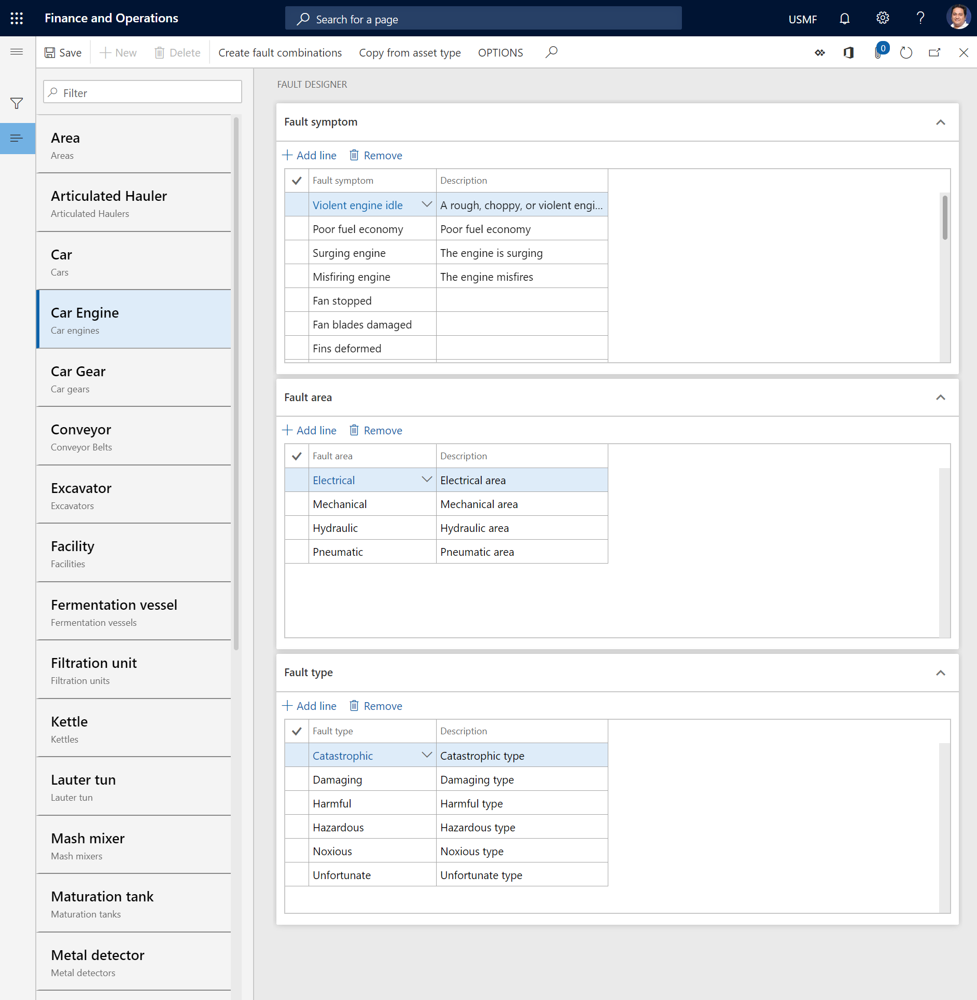

# Fault management

[!include [banner](../../includes/banner.md)]

 

In Asset Management, you can use the fault designer to set up fault symptoms, fault areas, and fault types on asset types. In this way, you can manage faults that are detected on assets. Additionally, fault causes and suggestions for fixing faults can be registered on a work order.

The process for fault registration and management consists of these steps.

1. Create a list of fault symptoms, fault areas, and fault types that might occur on your asset types.
2. In the fault designer, set up symptoms, fault areas, and fault types.

Here are some examples to help you understand the difference between fault symptoms, fault areas, and fault types.

**Fault symptoms:**

- Unbalanced voltages
- Short circuit
- Noise
- Leak
- Vibrations

**Fault areas:**

- Electrical
- Mechanical
- Hydraulic
- Pneumatic

**Fault types:**

- Faulty main stator winding
- Faulty diode
- Dirty windings
- Defective generator
- Defective sensor

## Create fault symptoms

Follow these steps to create a list of symptoms that can be used in the fault designer.

1. Select **Asset management** \> **Setup** \> **Fault** \> **Fault symptoms**.
2. Select **New** to create a record.
3. In the **Fault symptom** field, enter a name for the fault symptom.
4. In the **Description** field, enter a description.
5. Select **Save**.

## Create fault areas

Follow these steps to create a list of areas or locations that can be used in the fault designer.

1. Select **Asset management** \> **Setup** \> **Fault** \> **Fault areas**.
2. Select **New** to create a record.
3. In the **Fault area** field, enter a name for the fault area.
4. In the **Description** field, enter a description.
5. Select **Save**.

## Create fault types

Follow these steps to create a list of fault types that can be used in the fault designer.

1. Select **Asset management** \> **Setup** \> **Fault** \> **Fault types**.
2. Select **New** to create a record.
3. In the **Fault type** field, enter a name for the fault type.
4. In the **Description** field, enter a description.
5. Select **Save**.

## Set up the fault designer

In the fault designer, you set up fault data on asset types.

1. Select **Asset management** \> **Setup** \> **Fault** \> **Fault designer**.
2. In the left pane, select the type of asset to set up a fault record for.
3. On the **Fault symptom** FastTab, select **Add line**, and then, in the **Fault symptom** field, select a fault symptom.
4. On the **Fault area** FastTab, select **Add line**, and then, in the **Fault area** field select a fault area.
5. On the **Fault type** FastTab, select **Add line**, and then, in the **Fault type** field, select a fault type.
6. To quickly create combinations of all existing fault symptoms, areas, and types for the selected asset type, select **Create fault combinations**. This function is useful if you've added many fault symptoms, areas, and types. It's easier to delete the lines for any combinations that aren't relevant to the asset type than to create new lines manually.

    > [!NOTE]
    > To copy the setup of fault symptoms, areas, and types from one asset type to the selected asset type, select **Copy from asset type**.

7. Select **Save** to save your changes.

## Create fault causes

Follow these steps to create a list of known fault causes that can be added to a work order or a maintenance request.

1. Select **Asset management** \> **Setup** \> **Fault** \> **Fault causes**.
2. Select **New** to create a record.
3. In the **Fault cause** field, enter a name for the fault cause.
4. In the **Description** field, enter a description.
5. Select **Save**.

## Create fault remedies

Follow these steps to create a list of suggestions for remedy and repair that can be added to a work order or a maintenance request.

1. Select **Asset management** \> **Setup** \> **Fault** \> **Fault remedies**.
2. Select **New** to create a record.
3. In the **Fault remedy** field, enter a name for the fault remedy.
4. In the **Description** field, enter a description.
5. Select **Save**.

> [!NOTE]
> You can change the names of your fault symptoms, areas, types, causes, and remedies as you require. The name changes are automatically reflected in the related fault registrations.

[!INCLUDE[footer-include](../../../includes/footer-banner.md)]