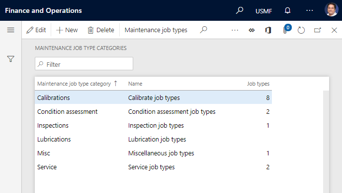
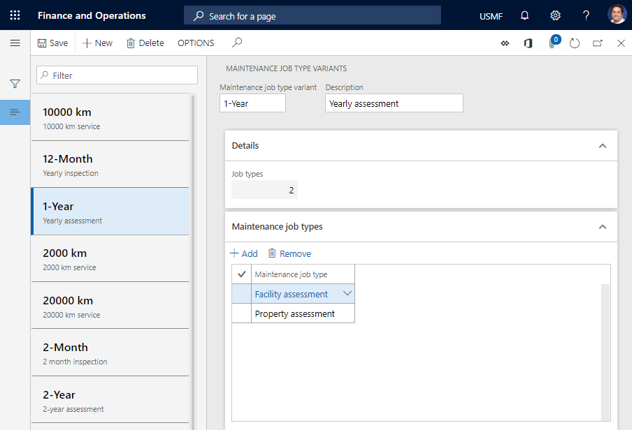
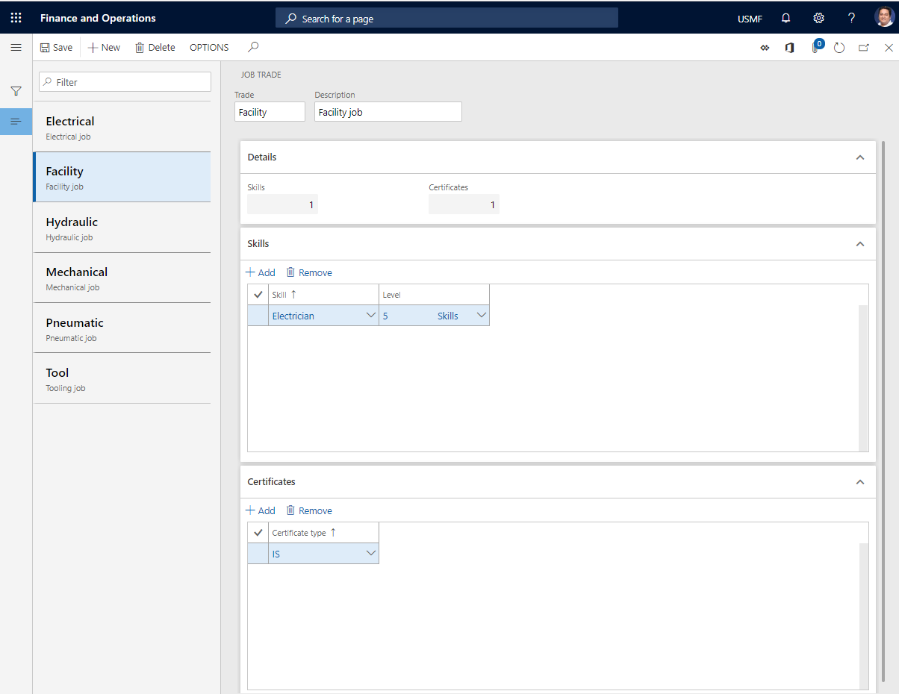
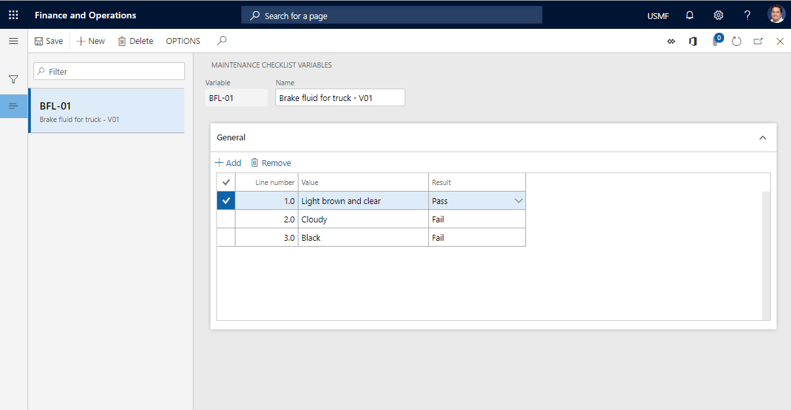
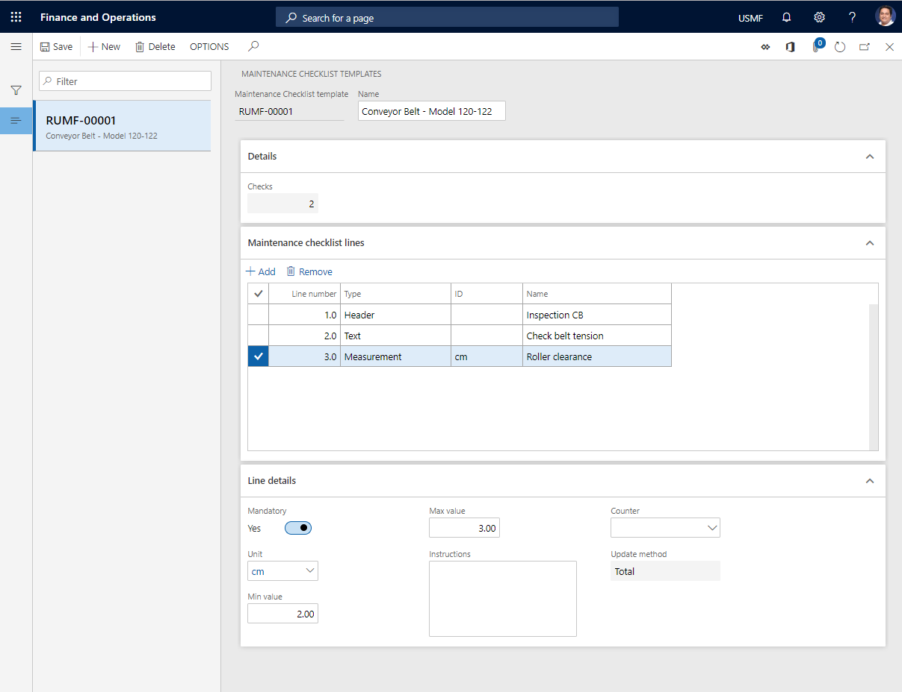
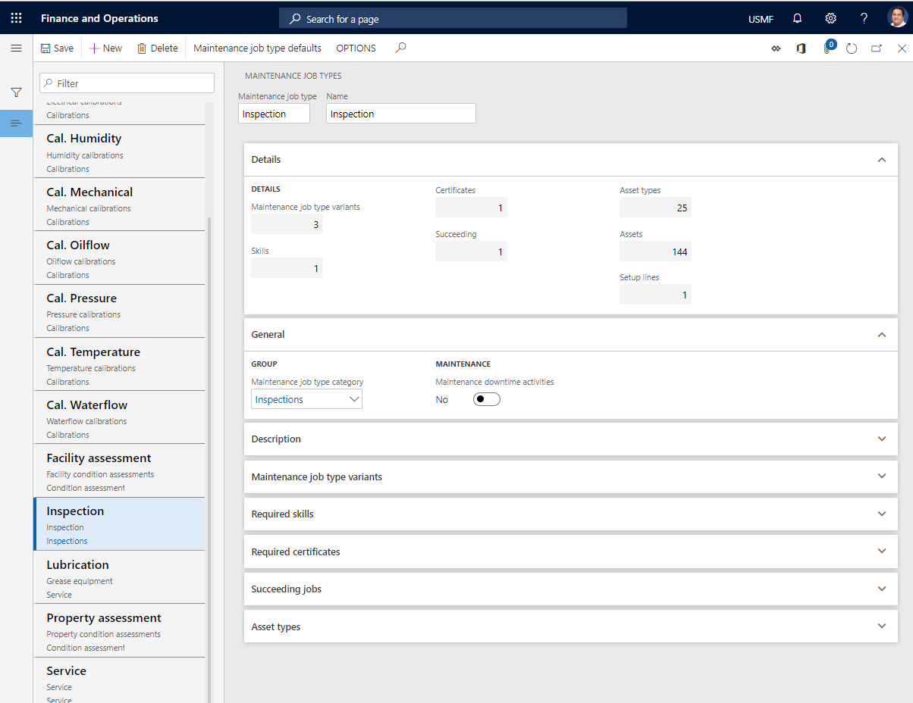
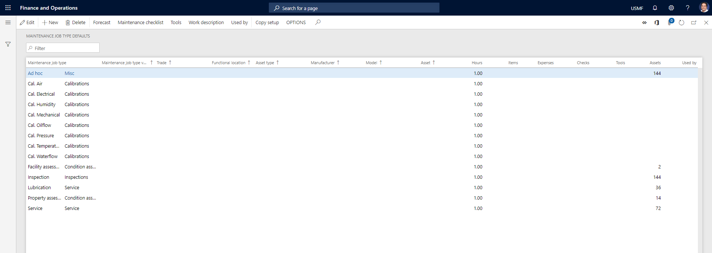
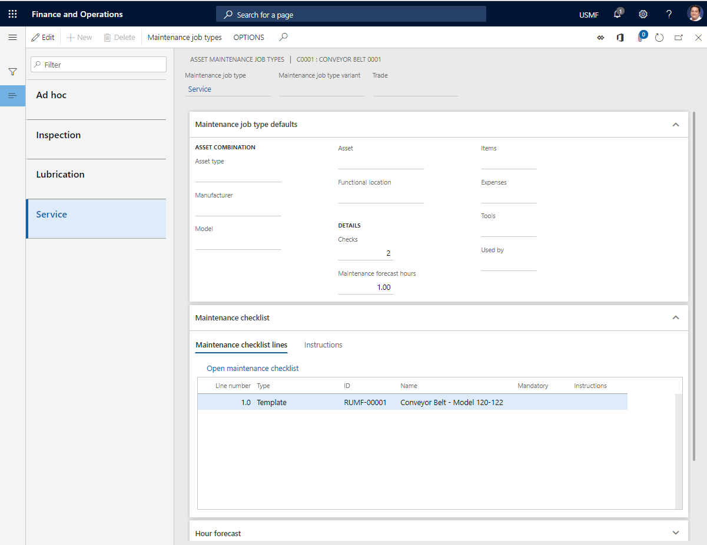

---
# required metadata

title: Maintenance job types, categories, variants, trades, and checklists
description: This topic describes maintenance job type categories and maintenance job types, maintenance job type variants, maintenance job trades, and maintenance checklists in Asset Management.
author: johanhoffmann
ms.date: 08/13/2019
ms.topic: article
ms.prod: 
ms.technology: 

# optional metadata

ms.search.form: EntAssetJobTypeDefaultForecast, EntAssetJobTrade, EntAssetJobTypeDefaultCopy, EntAssetChecklistVariableValueLookup, EntAssetChecklistTemplateCreate, EntAssetJobVariant, EntAssetJobTypeDefaultReference, EntAssetJobTypeDefaultChecklist, EntAssetJobTypeDefault, EntAssetJobType, EntAssetJobTypeDefaultChecklistCopy, EntAssetChecklistTemplate, EntAssetJobTypeDefaultDescription, EntAssetJobTypeLookup, EntAssetJobTypeDefaultToolCopy, EntAssetJobTypePreviewPart, EntAssetJobTypeDefaultTool, EntAssetJobTypeDefaultForecastCopy, EntAssetChecklistTemplateLookup, EntAssetJobGroup, EntAssetChecklistVariable
# ROBOTS: 
audience: Application User
# ms.devlang: 
ms.reviewer: kamaybac
# ms.tgt_pltfrm: 
ms.custom: 
ms.assetid: 
ms.search.region: Global
# ms.search.industry: 
ms.author: johanho
ms.search.validFrom: 2018-08-30
ms.dyn365.ops.version: 10.0.5

---

# Maintenance job types, categories, variants, trades, and checklists

[!include [banner](../../includes/banner.md)]

An asset type is attached to every asset. Asset types define the maintenance job types (and therefore, the maintenance jobs) that can be performed on assets. When you create a work order, you must select a maintenance job type. You can select only the maintenance job types that are related to the setup of the asset type that is used for the asset.

For a graphical overview of assets and maintenance job types, and their connection to work orders, see [Functional locations and assets](../overview/functional-locations-and-objects.md).

Maintenance job type variants can be set up on a maintenance job type. Maintenance job type variants define variations of a job type, such as sizes (small, medium, or large), periods (weekly, biweekly, one month, or three months), and configurations (low standard, flexible, or high performance).

Maintenance job trades provide information about professional trades, such as mechanical, electrical, and hydraulic trades. Competency requirements can be set up on a maintenance job trade. All maintenance job trades can be used in relation to all maintenance job types. Selection of a maintenance job type variant and/or maintenance job trade on a work order is optional.

For each maintenance job type, variations of the maintenance job type setup can be created. For example, if you have a maintenance job type that is named **Service**, you can create the following variations for that maintenance job type: **Trucks 30,000 km**, **Cars 30,000 km**, and **Vans 30,000 km**.

Maintenance job type categories are used to collect a group of maintenance job types for overview purposes. Examples of maintenance job type categories might include **Calibration**, **Inspection**, **Overhaul**, and **Instrumentation**.

Maintenance checklist templates and maintenance checklist variables are used to set up maintenance checklists. Maintenance checklists are set up on maintenance job types and used on work orders.

You first set up the required maintenance job type categories, maintenance job type variants, and maintenance job trades. You then create maintenance job types. Finally, on the **Maintenance job type defaults** page, you create all the variations of maintenance job types that are required for your equipment. On that page, you can also set up forecasts, maintenance checklists, and tools for a combination of maintenance job types.

> [!NOTE]
> A maintenance job type can be related to only one maintenance job type category.

## Create a maintenance job type category

1. Select **Asset management** \> **Setup** \> **Jobs** \> **Maintenance job type categories**.
2. Select **New**.
3. In the **Maintenance job type category** field, enter an ID for the maintenance job type category.
4. In the **Name** field, enter a name.

    After you relate maintenance job type categories to maintenance job types, the **Job types** field shows the number of maintenance job types that are related to this maintenance job type category.

## Create a maintenance job type variant

1. Select **Asset management** \> **Setup** \> **Jobs** \> **Maintenance job type variants**.
2. Select **New**.
3. In the **Maintenance job type variant** field, enter an ID for the maintenance job type variant.
4. In the **Description** field, enter a description.
5. On the **Maintenance job types** FastTab, select **Add** to add a maintenance job type.
6. In the **Maintenance job type** field, select the maintenance job type.
7. Repeat steps 5 through 6 to add more maintenance job types to the maintenance job type variant.

    On the **Details** FastTab, the **Job types** field shows the number of maintenance job types that have been added to this maintenance job type variant.

## Create a maintenance job trade

1. Select **Asset management** \> **Setup** \> **Jobs** \> **Maintenance job trade**.
2. Select **New**.
3. In the **Trade** field, enter an ID for the maintenance job trade.
4. In the **Description** field, enter a description.
5. On the **Skills** FastTab, select **Add** to add a new skill that should be related to the maintenance job trade.
6. In the **Skill** field, select the skill.
7. In the **Level** field, select the skill level.
8. Repeat steps 5 through 7 to add more skills to the maintenance job trade.

    On the **Details** FastTab, the **Skills** field shows the number of skills that have been added to this maintenance job trade.

9. On the **Certificates** FastTab, select **Add** to add a certificate to the maintenance job trade.
10. In the **Certificate type** field, select the certificate.
11. Repeat steps 9 through 10 to add more certificates to the maintenance job trade.

    On the **Details** FastTab, the **Certificates** field shows the number of certificates that have been added to this maintenance job trade.

## Create a maintenance checklist variable

When you create maintenance checklist lines in the maintenance job type default, you must select a maintenance checklist type. **Variable** is one maintenance checklist type. It's used to define a possible result in a range on a maintenance checklist line that is related to a work order line. A variable lets you create a set of predefined outcomes without having to make an exact measurement.

**Example 1:** You can measure oil level by defining three values: **Level too high**, **Level too low**, and **Level within range**. For each value, you define whether the value result is **Pass**, **Fail**, or **None**.

**Example 2:** You make a visual inspection of a piece of equipment to assess wear and tear.

1. Select **Asset management** \> **Setup** \> **Maintenance checklists** \> **Maintenance checklist variables**.
2. Select **New**.
3. In the **Variable** field, enter an ID for the maintenance checklist variable.
4. In the **Name** field, enter a name.
5. On the **General** FastTab, select **Add** to add a line for a variable.

    A sequential line number is automatically entered in the **Line number** field. After you've added all the lines, you can change the line numbers as you require. When you select line and then press the **Down arrow** key, the next number in the sequence is automatically entered on the next line.

6. In the **Value** field, enter a value description.
7. In the **Result** field, select a result for the line.

## Create a maintenance checklist template

Maintenance checklist templates can be used as a common set of tasks that a worker must perform to complete a work order correctly. The templates are referenced from maintenance checklist lines on the maintenance job type default. Templates can be referenced across multiple maintenance job type default lines. Therefore, you can easily reuse a set of common maintenance checklist tasks. Examples of maintenance checklist templates include general safety instructions, and a list of items and conditions that must be checked on a specific pump or similar models of a conveyor belt.

1. Select **Asset management** \> **Setup** \> **Maintenance checklists** \> **Maintenance checklist templates**.
2. Select **New**.

    A template ID is automatically entered in the **Maintenance checklist template** field.

3. In the **Name** field, enter a name for the maintenance checklist template.
4. On the **Maintenance checklist lines** FastTab, select **Add** to add a template line.

    A sequential line number is automatically entered in the **Line number** field. After you've added all the lines, you can change the line numbers as you require. When you select line and then press the **Down arrow** key, the next number in the sequence is automatically entered on the next line.

5. In the **Type** field, select a type for the maintenance checklist line. For each maintenance checklist type, the **Line details** FastTab shows related fields. The following values are available:

    - **Text** – The line has text that describes what to do. Use this maintenance checklist type if you want a worker to check or inspect something, but you don't expect a specific (measurable) result. After you select this type, enter a name or heading in the **Name** field. In the **Instructions** field, enter a description of what must be done. If the step is mandatory for the maintenance checklist, set the **Mandatory** option to **Yes**.
    - **Header** – The line is used as a heading to group the maintenance checklist lines that appear below it. This type is useful if you have several maintenance checklist lines that can be divided into specific areas. Headers provide an overview for the worker who will complete a maintenance checklist that has many maintenance checklist lines. After you select this type, enter a descriptive name in the **Name** field.
    - **Template** – The line is used to make a reference to an existing template. After you select this type, enter a name for the template in the **Name** field. In the **Template** field, select the template.
    - **Variable** – The line is used to define a possible result in a range. For information about how to set up maintenance checklist variables, see the [Create a maintenance checklist variable](#create-a-maintenance-checklist-variable) section. After you select this type, enter a descriptive name for the variable in the **Name** field. In the **Variable** field, select the variable. In the **Instructions** field, enter a description of what must be done. If the step is mandatory for the maintenance checklist, set the **Mandatory** option to **Yes**.
    - **Measurement** – The line is used to record a specific measurement. You can set up the measurement that should be related to a predefined counter. After you select this type, enter a name for the template in the **Name** field. If this step is mandatory for the maintenance checklist, set the **Mandatory** option to **Yes**. If you want to use the measurement line as a counter registration, select the counter in the **Counter** field. The related **Unit** field is then automatically updated. If you've selected a counter, select the update method in the **Value** field. In the **Min. value** and **Max. value** fields, enter the allowed value range. In the **Instructions** field, enter a description of what must be done.

        > [!NOTE]
        > Any line of the **Measurement** type that doesn't have a counter setup is treated as an independent measurement registration that there is no automatic follow-up for in Asset Management. Likewise, if the selected counter type isn't present on the asset that is related to the work order, the maintenance checklist task is treated as an independent measurement. The counter value can be changed multiple times. It isn't posted until the [work order lifecycle state](work-order-lifecycle-states.md) is changed to a state where the **Process maintenance checklist** option is set to **Yes**.

    On the **Details** FastTab, the **Checks** field shows the total number of checklist lines in your template. This number includes the nested lines in any existing template that you've referenced in your template.

## Create a maintenance job type

1. Select **Asset management** \> **Setup** \> **Jobs** \> **Maintenance job types**.
2. Select **New**.
3. In the **Maintenance job type** field, enter an ID for the maintenance job type.
4. In the **Name** field, enter a name.

    The **Details** FastTab shows an overview of the number of maintenance job type variants, skills, certificates, succeeding jobs, and asset types that have been created on this maintenance job type. The **Setup lines** field shows the number of maintenance job type default lines that have been set up on this maintenance job type. The **Assets** field shows the number of active assets that currently use this maintenance job type.

5. On the **General** FastTab, in the **Maintenance job type category** field, select a maintenance job type category.
6. Set the **Maintenance downtime activities** option to **Yes** if the maintenance job type requires a maintenance stop of the equipment before the job can be performed.
7. On the **Description** FastTab, enter a description of the maintenance job type.
8. On the **Maintenance job type variants** FastTab, you can add variants to the maintenance job type.
9. On the **Required skills** and **Required certificates** FastTabs, you can add skills and certificate requirements to the maintenance job type.
10. If a specific maintenance job type must be performed next, add it on the **Succeeding jobs** FastTab. You can also set up a maintenance job type variant and trade that are related to the maintenance job type. If the succeeding job should start a specific number of days before or after the job that uses this maintenance job type has started, enter the number of days in the **Delay by days** field. Positive numbers represent days after the start of the related job, and negative numbers represent days before the scheduled start of the related job. For example, if you enter **5**, the succeeding job will start five days after the start of the job that is related to the maintenance job type. If you enter **-3**, the succeeding job will start three days before the scheduled start of the job that is related to the maintenance job type.

    > [!NOTE]
    > If you add more than one maintenance job type line, the sequence of the lines indicates the order that they should be performed in. The sequence starts at the top of the list.

11. On the **Asset types** FastTab, you can add asset types to the maintenance job type.

## Create maintenance job type default lines and related forecasts, maintenance checklists, tools, description, and attachments

1. Select **Asset management** \> **Setup** \> **Jobs** \> **Maintenance job type defaults**.

    –or–

    Select **Asset management** \> **Setup** \> **Jobs** \> **Maintenance job types**, select a maintenance job type, and then select **Maintenance job type defaults**.

2. Select **New**.
3. In the **Functional location**, **Asset type**, **Manufacturer**, **Model**, and **Asset** fields, select appropriate values, depending on how specific the maintenance job type default should be.
4. In the **Maintenance job type** field, select a maintenance job type if it wasn't automatically selected.
5. In the **Maintenance job type variant** and **Trade** fields, select a maintenance job type variant and a maintenance job trade as you require.
6. Select **Forecast**.
7. On the **Maintenance job type default forecast** page, you can make forecasts on hours, items, and expenses. On the relevant tabs, select **Add**, and make selections to create the required forecasts for the maintenance job type.
8. On the **Item forecast** tab, you can select inventory dimensions that should be shown on the item line. Select **Inventory** \> **Dimensions**, select the dimensions to show, set the **Save setup** option to **Yes**, and then select **OK**.
9. On the **Item forecast** tab, select **Item where used** to see an overview of where the item on the selected line is used in Asset Management in relation to assets, maintenance job type default, spare parts, and work orders. 

    The **Maintenance forecast totals** FastTab shows an overview of forecast totals. This overview includes the total number of hours and forecast lines that have been created.

    > [!NOTE]
    > To copy the forecast setup from another maintenance job type, select **Copy forecast**, and then select the maintenance job type to copy the setup from.

11. Select **Save** to save your changes.
12. Close the **Maintenance job type default forecast** page to return to the **Maintenance job type defaults** page.
13. Select **Maintenance checklist**.
14. On the **Maintenance job type defaults checklist** page, you can add maintenance checklist lines to the selected maintenance job type default. On the **Maintenance check lines** FastTab, select **New** to add a maintenance checklist line.

    Line numbers are automatically entered in the **Line number** field to indicate the sequence of the maintenance checklist lines. You can edit line numbers as you require. After you've created the first maintenance checklist line, select the line, and then press the **Down arrow** key to add a line below it. Alternatively, you can select a maintenance checklist line and then select **New**. In this case, a new line is added above the selected maintenance checklist line.

15. In the **Type** field, select the line type, and then add information that is related to the maintenance checklist type. For a description of the available types and related fields, see the [Create a maintenance checklist template](#create-a-maintenance-checklist-template) section.

    > [!NOTE]
    > To copy the maintenance checklist setup from another maintenance job type, select **Copy maintenance checklist**, and then select the maintenance job type to copy the setup from.
    >
    > You can easily create a template from an existing maintenance checklist. You can then reuse the template across multiple maintenance checklists. The new template will be an exact copy of the active maintenance checklist. Select **Create template**, and then enter a name for the template. To replace the existing maintenance checklist with a single line that references the new template, set the **Replace** option to **Yes**. You can view the contents of the template in the **Maintenance checklist templates** details page.

16. Select **Save** to save your changes.
17. Return to the **Maintenance job type defaults** page.
18. Select **Tools**.
19. On the **Maintenance job type default tools** page, you can add the tools (resources) that should be used for the maintenance job type. Select **New**, and then select the tool in the **Resource** field.

    > [!NOTE]
    > To copy the tool setup from another maintenance job type, select **Copy tools**, and then select the maintenance job type to copy the setup from.

20. Select **Save** to save your changes.
21. Return to the **Maintenance job type defaults** page.
22. Select **Work description**.
23. On the **Work description** page, select **Edit**, and then add a description that is related to the selected maintenance job type default, as you require.
24. Select **Save** to save the description.

    If you add a work description here, it overrides any description that is set up for the maintenance job type on the **Maintenance job types** page. If you don't add a work description here, any description that is set up for the maintenance job type is used. Descriptions are automatically transferred to work orders that use the maintenance job type or maintenance job type default.

25. Return to the **Maintenance job type defaults** page.
26. To set up attachments on a selected maintenance job type default line, select **Attach documents**. Attachments that are set up on a maintenance job type default line are automatically included on work order lines that use that maintenance job type default line.
27. Select **New**, and then select a document type.
28. Upload the document or file.
29. Set the fields on the **Attachments** page. The attachment setup uses standard document setup functionality.
30. Select **Save** to save the attachment.

    > [!NOTE]
    > Attachments on a maintenance job type default line are printed together with a work order report only if the document types of the attachments are selected on the **Document types** tab of the **Asset management parameters** page (**Asset management** \> **Setup** \> **Asset management parameters**). Examples of attachments include guidelines that explain how to complete a specific job or a predefined maintenance checklist (if you don't use the maintenance checklist functionality for maintenance job type default lines).

    On the **Maintenance job type defaults** page, each line shows the number of forecasted hours, and also the number of lines that have been created for items, expenses, maintenance checklists, and tools. The **Assets** field shows the number of active assets that are related to the maintenance job type default line.

31. To copy a maintenance job type default to another maintenance job type default, select the maintenance job type default line to copy another setup to, select **Copy setup**, and then select the maintenance job type default to copy.
32. To view a list of the assets, maintenance plans, or maintenance rounds that currently use a maintenance job type default line, select the line, and then select **Used by**.

When the system selects the available maintenance job type default that should be used on a work order line, the selection is based on the asset and the related asset type setup. Asset Management goes through all maintenance job type default records that are related to the maintenance job type that is related to the asset type to check for a possible match. It always checks the most specific combination first. In other words, to find the most specific combination, Asset Management first checks for a possible match for the **Trade** field. If no match is found, it checks for a match for the **Maintenance job type variant** field. If no match is found, it checks for a match for the **Maintenance job type** field, and so on (**Trade**, then **Maintenance job type variant**, then **Maintenance job type**, then **Asset**, then **Model**, then **Manufacturer**, and then **Asset type**). If no match is found, the default record where only the maintenance job type is selected is used.

A project activity ID is automatically related to each maintenance job type default line that you create. The project activity is created on the forecast project that is selected in the **Maintenance forecast project** field on the **Assets** tab of the **Asset management parameters** page. The purpose of the project activity is to manage forecasts on hours, items, and expenses in relation to work orders. Maintenance job type forecasts are automatically transferred to the work order line, and they are copied from the forecast project to the work order project that is created for the work order line. The purpose of the project activity is to manage forecasts in relation to work orders.

You can set up a batch job to update maintenance job type default references at regular intervals, or you can manually run the job. To create a batch job or run a manual update, select **Asset management** \> **Periodic** \> **Preventive maintenance** \> **Update maintenance job type default references**.

## Overview of maintenance job types that are related to assets

After you've created the required maintenance job type default combinations, you can use the **All assets** page to get an overview of the current maintenance job type default that is related to a specific asset. The overview shows all maintenance job type default combinations that can be used on the asset type that is selected for the asset. These combinations include combinations that have variations of maintenance job type variants and maintenance job trades.

1. Select **Asset management** \> **Common** \> **Assets** \> **All assets** or **Active assets**.
2. In the list, select the asset to see an overview of maintenance job type combinations for.
3. On the Action Pane, on the **General** tab, in the **Related information** group, select **Maintenance job types**.

    The left pane of the **Asset maintenance job types** page shows a list of all the maintenance job type combinations that are related to the selected asset.

4. Select a maintenance job type combination to see the related setup for maintenance checklists, forecasts, and tools. The **Details** section on the **Maintenance job type defaults** FastTab shows the number of related maintenance checklists, forecasted hours, items, and so on, that are related to the selected maintenance job type combination.
5. To view details for the selected maintenance job type, select **Maintenance job types**.

## Automatic update of maintenance job type forecasts

In Asset Management, you can automatically update any changes to maintenance job type forecasts for hour costs, item costs, and expenses that have been updated in other modules. In this way, you help guarantee that your maintenance job type forecasts always use the latest cost prices.

1. Select **Asset management** \> **Periodic** \> **Forecast** \> **Update maintenance job type forecast**.
2. In the **Update maintenance job type forecast** dialog box, on the **Records to include** FastTab, you can add selections for specific maintenance job types as you require. Select **Filter**, and then select **Select** to make the selections.
3. On the **Run in the background** FastTab, you can set up the automatic update as a batch job, as you require.
4. Select **OK** to start the forecast update.

[!INCLUDE[footer-include](../../../includes/footer-banner.md)]