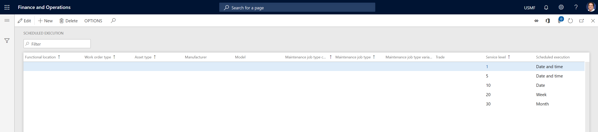

---
# required metadata

title: Scheduled execution
description: This topic explains scheduled execution in Asset Management.
author: johanhoffmann
ms.date: 08/13/2019
ms.topic: article
ms.prod: 
ms.technology: 

# optional metadata

ms.search.form: 
# ROBOTS: 
audience: Application User
# ms.devlang: 
ms.reviewer: kamaybac
# ms.tgt_pltfrm: 
ms.custom: 
ms.assetid: 
ms.search.region: Global
# ms.search.industry: 
ms.author: johanho
ms.search.validFrom: 2019-08-30
ms.dyn365.ops.version: 10.0.5

---

# Scheduled execution

[!include [banner](../../includes/banner.md)]

 

You can use work order service levels to set up scheduled execution. (For more information about work order service levels, see [Service level and description](service-level-and-description.md).) Scheduled execution provides flexibility in work planning for maintenance workers, because you can set up more detailed or less detailed requirements for the interval that a work order should be completed during. For example, a maintenance worker who completes a job faster than expected in a production facility might be able to move on to another nearby job that was planned for the current week but not necessarily for the current day. This approach allows for optimization of worker planning and job completion.

Scheduled execution setup, which is related to work orders, can be generic or specific. You can set up generic lines that aren't limited to specific work order types, asset types, and so on. Alternatively, you can create scheduled execution lines that apply to a specific work order type, asset type, maintenance job type, and so on.

1. Select **Asset management** \> **Setup** \> **Work orders** \> **Scheduled execution**.
2. Select **New** to create a scheduled execution line.
3. In the **Functional location**, **Work order type**, **Asset type**, **Manufacturer**, **Model**, **Maintenance job type category**, **Maintenance job type**, **Maintenance job type variant**, and **Trade** fields, select values as you require.
4. In the **Service level** field, select a work order service level. If you leave this field blank, you make the most generic type of scheduled execution line. For an example of a generic line, see the first record in the illustration that follows. That line enables all work orders that have no work order service level to be scheduled for a specific date and time.
5. In the **Scheduled execution** field, select the time interval.
6. Select **Save**.

[!INCLUDE[footer-include](../../../includes/footer-banner.md)]