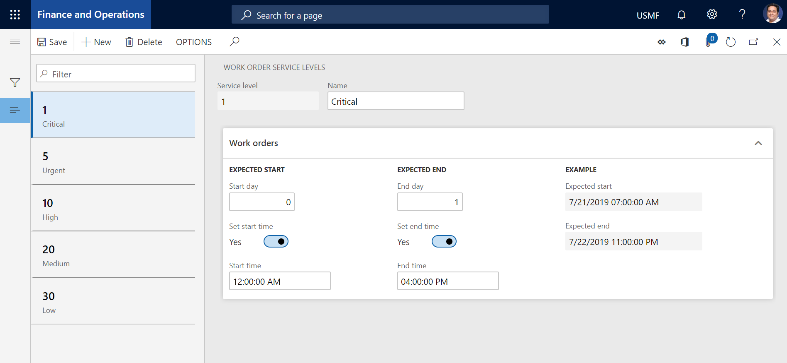

# Service level and description

[!include [banner](../../includes/banner.md)]

 

When you create a work order, you might want to define the service levels for it and add a general description to it. You can create work order service levels on the **Work order service levels** page and descriptions on the **Work order description** page.

## Create a service level

1. Select **Asset management** \> **Setup** \> **Work orders** \> **Service level**.
2. Select **New**.
3. In the **Service level** field, enter the service level (for example, a number).
4. In the **Name** field, enter a name.

    On the **Work orders** FastTab, you can define expected start and end dates and times. The fields on this FastTab define the period that work orders should be started and ended during. They are used for work orders that are manually created and work orders that are created based on maintenance requests. 

5. In the **Start day** field, enter a number of days to define the period that the work order should start during. The number of days is calculated from the creation date of the work order. For example, if the work order should start when it's created, enter **0**. If the work order should start within one week after it's created, enter **7**.
6. To set a start time for the work order, in addition to a start date, set the **Set start time** option to **Yes**. Then enter the start time in the **Start time** field. If you set the option to **No**, the current time of day is used.
7. In the **End day** field, enter a number of days to define the period that the work order should end during. The number of days is calculated from the start date of the work order. For example, if the work order should end within one week of its start date, enter **7**.
8. To set an end time for the work order, in addition to an end date, set the **Set end time** option to **Yes**. Then enter the end time in the **End time** field. If you set the option to **No**, the current time of day is used.
9. Select **Save**.

## Create a description

1. Select **Asset management** \> **Setup** \> **Work orders** \> **Descriptions**.
2. Select **New**.
3. In the **Description** field, enter the description.
4. Select **Save**.

[!INCLUDE[footer-include](../../../includes/footer-banner.md)]