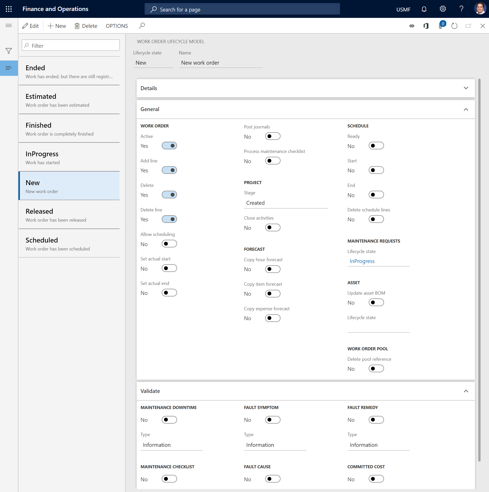
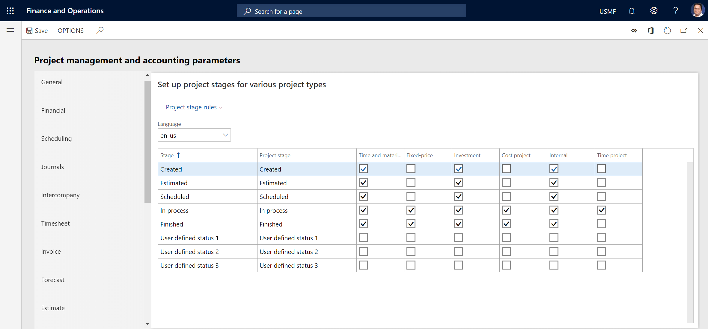
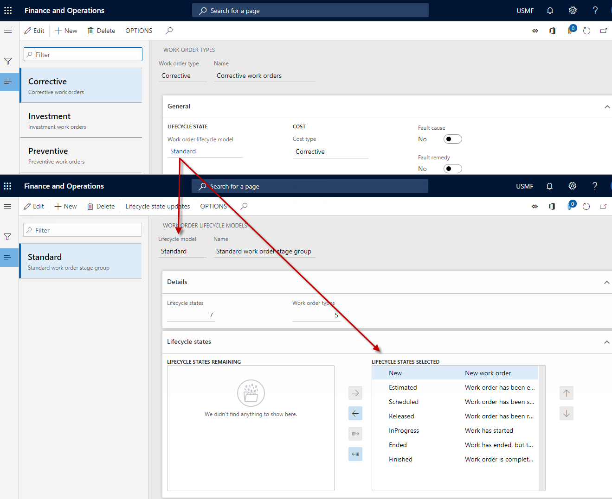
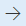
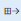
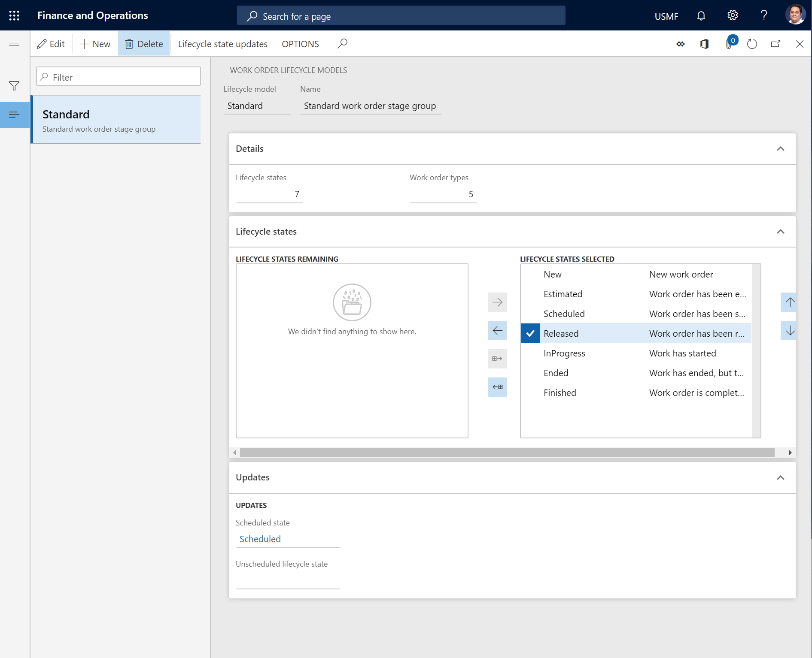

# Work order lifecycle states

[!include [banner](../../includes/banner.md)]

Work order lifecycle states define the states that a work order can go through. Examples include **Created**, **Scheduled**, **In progress**, and **Ended**. Work order lifecycle states can be manually updated on a work order, or they can be automatically updated (for example, during work order scheduling).

The work order lifecycle states that are required for your work orders must be attached to matching project stages on the **Project management and accounting parameters** page (**Project management and accounting** \> **Project management and accounting parameters**). You first set up project stages in Project management and accounting. You then set up work order lifecycle states and work order lifecycle models in Asset Management.

The following table describes the options in the **Work order** and **Schedule** sections on the **General** FastTab of the **Work order lifecycle state** page (**Asset management** \> **Setup** \> **Work orders** \> **Lifecycle states**).

| Option name | Description |
|--|--|
| Active | Set this option to *Yes* if the work order should be active while it's in this lifecycle state. |
| Add line | Set this option to *Yes* if work order jobs can be added to a work order that is in this lifecycle state. |
| Delete | Set this option to *Yes* if a work order can be deleted while it's in this lifecycle state. |
| Delete line | Set this option to *Yes* if work order jobs can be deleted from a work order that is in this lifecycle state. |
| Allow scheduling | Set this option to *Yes* if a work order can be scheduled while it's in this lifecycle state. |
| Set actual start | Set this option to *Yes* if the user should be prompted to select an actual start date and time for a work order when it's updated to this lifecycle state. |
| Set actual end | Set this option to *Yes* if the user should be prompted to select an actual end date and time for a work order when it's updated to this lifecycle state. |
| Post journals | Set this option to *Yes* if work order journals should be automatically posted when a work order is updated to this lifecycle state. If an error occurs during journal posting, a message is shown, and the update of the work order lifecycle state is canceled. To view the journal lines for a work order, select **Asset management** \> **Work orders** \> **All work orders**, **Active work orders**, or **My active work orders**, select the work order in the list, and then select **Journals**. This setup of automatic work order journal posting at a specific lifecycle state is the same as when you select **Post journals** on the **Work order journals** page.
**Note:** If you set this option to *Yes*, journals are automatically posted if no approval workflow has been set up. If your company uses the journal approval setup that is configured on the **Journal approval** page (**Project management and accounting** \> **Setup** \> **Journals** \> **Journal approval**), a manager or clerk must validate and post consumption registrations.
 |
| Process maintenance checklist | Set this option to *Yes* if all attached maintenance checklists should be processed when a work order is updated to this lifecycle state. As part of this processing, any counter registrations that were made on a maintenance checklist are posted, and the result of the whole maintenance checklist is evaluated. Maintenance checklist lines that have *Pass* and *Fail* results are evaluated, and if at least one line fails, the whole maintenance checklist is marked as *Failed* in Asset Management. |
| Ready | Set this option to *Yes* if the work order job schedule status for all work order jobs that are created on a work order should automatically be updated to **Ready** when the work order is updated to this lifecycle state. |
| Start | Set this option to *Yes* if the work order job schedule status for all work order jobs that are created on a work order should automatically be updated to **Started** when the work order is updated to this lifecycle state. |
| End | Set this option to *Yes* if the work order job schedule status for all work order jobs that are created on a work order should automatically be updated to **Ended** when the work order is updated to this lifecycle state. |
| Delete schedule lines | Set this option to *Yes* if scheduling on all work order jobs that are created on a work order that has already been scheduled should be deleted when the work order is updated to this lifecycle state. In other words, capacity reservations on the asset, the related maintenance worker, and related tools will be deleted. For example, you set this option to *Yes* on a work order lifecycle state that is named **Estimated**. Then, when a work order is rolled back to this lifecycle state because rescheduling is required, scheduling can be deleted on that work order. |

## Prerequisites for the role-based access feature (preview)

[!INCLUDE [preview-banner-section](~/../shared-content/shared/preview-includes/preview-banner-section.md)]
<!-- KFM: Preview until 10.0.43 GA -->

To use the role-based access feature (on the **Security roles** FastTab), as described later in this article, your system must meet the following requirements:

- You must be running Microsoft Dynamics 365 Supply Chain Management 10.0.43 or later.
- The feature that's named *Role-based access control for work order lifecycle stages* must be turned on in [Feature management](../../../fin-ops-core/fin-ops/get-started/feature-management/feature-management-overview.md).

[!INCLUDE [preview-note](~/../shared-content/shared/preview-includes/preview-note-d365.md)]

## Set up project stages and work order lifecycle states

1. Select **Project management and accounting** \> **Setup** \> **Project management and accounting parameters**.
2. On the **Project stage** tab, for each stage that you want to use, select the check box for every project type that is required for your work orders. The project types define rules about the financial tasks that are allowed. Examples of financial tasks include creating a forecast, creating estimates, and creating beginning balances.

    > [!IMPORTANT]
    > If a project stage isn't selected for a project type, but the project stage is used for a work order lifecycle state, the work order projects won't be updated in the appropriate manner.

3. Close the **Project management and accounting parameters** page.
4. Select **Asset management** \> **Setup** \> **Work orders** \> **Lifecycle states**.
5. Select **New** to create a work order lifecycle state.
6. In the **Lifecycle state** field, enter an ID for the lifecycle state.
7. In the **Name** field, enter a name.

    On the **Details** FastTab, the **Lifecycle models** field shows the number of work order lifecycle models that use this lifecycle state.

8. On the **General** FastTab, in the **Work order** section, select the functions that should be available for this lifecycle state by setting the relevant options to *Yes*. For descriptions of the options, see the table earlier in this article.
9. In the **Project** section, in the **Stage** field, select the project stage that should be related to this lifecycle state.
10. In the **Project** section, set the **Close activities** option to *Yes* if project activities that are related to each work order job should be automatically closed when the work order is in this lifecycle state.

    > [!NOTE]
    > To find the number of the project activity that is related to a work order job, select **Asset management** \> **Work orders** \> **All work orders**, **Active work orders**, or **My active work orders**. Open the work order, and then select the work order job. The activity number is shown in the **Activity number** field in the **Project** section on the **General** tab of the **Line details** FastTab.

11. In the **Forecast** section, set the **Copy hour forecast**, **Copy item forecast**, and/or **Copy expense forecast** option to *Yes* if work order project forecasts should automatically be copied to work order journals when the work order is in this lifecycle state.
12. In the **Schedule** section, set one of the options to *Yes* if the schedule status for work order jobs should be updated when the work order is in this lifecycle state. For descriptions of the **Ready**, **Start**, **End**, and **Delete schedule lines** options, see the table earlier in this article.

    > [!NOTE]
    > To view schedule lines that are related to work order jobs, select **Asset management** \> **Work orders** \> **All work orders**, **Active work orders**, or **My active work orders**. Open the work order, select the work order job on the **Work order jobs** FastTab, and view related information on the **Line details** FastTab. The **Status** field on the **Schedule** tab shows the status of the work order job. The **Status** field can be set to the following values: *Scheduled*, *Ready*, *Started*, *Stopped*, and *Ended*.

13. In the **Maintenance requests** section, in the **Lifecycle state** field, select the maintenance request lifecycle state that related maintenance requests should be updated to. This update occurs automatically. It can be done only if the maintenance request lifecycle state is selected in the maintenance request lifecycle model that is used for the maintenance request.
14. In the **Asset** section, set the **Update asset BOM** option to *Yes* if all items that are used on a work order should automatically be updated on the **Asset BOM** page when the work order is updated to this lifecycle state. This setting might be relevant if, for example, the work order lifecycle state defines the work order as completed or ended.
15. In the **Work order pool** section, set the **Delete pool reference** option to *Yes* if work orders that are in this lifecycle state should automatically be deleted from work order pools.
16. On the **Validate** FastTab, select the validation types that should be activated in this lifecycle state by setting the relevant options to *Yes*. Then, in the **Type** field for each validation type that you select, select the type of message that should be shown if mandatory fields that are related to the validation type haven't been validated. If you select **Error**, the update of the work order lifecycle state is canceled until the related mandatory fields have been updated on the work order.

    - The **Maintenance downtime**, **Maintenance checklist**, **Fault symptom**, **Fault cause**, and **Fault remedy** options are related to the options in the **Mandatory** section on the **Work order types** page (**Asset management** \> **Setup** \> **Work orders** \> **Work order types**). To activate these validations, the related options must also be set to *Yes* on the work order type that is used for the work order.
    - If the **Maintenance checklist** option is set to *Yes* for the lifecycle state that a work order is updated to, validation is done to verify that maintenance checklist lines that are marked as **Mandatory** have been registered as either **Checked** or **Not applicable**. If neither of those registrations has been made on the mandatory lines, an informational, error, or warning message is shown when the work order is updated to this lifecycle state.
    - If the **Committed cost** option is set to *Yes* for the lifecycle state that a work order is updated to, total amount of committed costs (that is, the total amount of expenses that the legal entity has committed to pay) are calculated for each work order job. A message is shown if the committed cost amount is more than 0 (zero). You select the types of cost commitment that are included on the **Cost commitments** FastTab on the **Cost control** tab of the **Project management and accounting parameters** page (**Project management and accounting** \> **Setup** \> **Project management and accounting parameters**).
    - If the **Maintenance downtime** option is set to *Yes* for the lifecycle state that a work order is updated to, maintenance downtime validation is done on the asset that is related to the work order. If a maintenance downtime registration has been made, but there is no **Ended** registration, a message is shown when the work order is updated to this lifecycle state.
    - If the standard project setup doesn't include all the stages that you require for your Asset Management setup, you can set up user-defined project stages on the **Project stage** tab of the **Project management and accounting parameters** page. The following illustration shows the **Project stage** tab on the **Project management and accounting parameters** page.

    

17. On the **Security roles** FastTab, select the security roles that are allowed to change to this lifecycle state. If no roles are selected, then all users that have access to work order lifecycle states are able to change to this lifecycle state.
  
> [!NOTE]
> If the lifecycle state that you update a work order to is inactive, journals that are related to the work order but that haven't yet been posted are automatically deleted. This behavior helps guarantee automatic cleanup of unused data. (A lifecycle state is inactive if the **Active** option for it is set to *No* on the **General** FastTab of the **Work order lifecycle state** page.)
>
> However, if you manually set a work order so that it's inactive, journals that are related to the work order but that haven't yet been posted are *not* automatically deleted. (To manually inactivate a work order, select **Asset management** \> **Work orders** \> **All work orders** or **Active work orders**. Open the work order, and switch to the **Header** view. On the **General** FastTab, select **Edit**, and then set the **Active** option to *No*.)

## Relations among work order lifecycle models, work order types, and work order lifecycle states

Lifecycle models refer to workflows, and lifecycle states are selected in a lifecycle model in sequential order. Lifecycle models are set up on work order types. Work order types determine the size or extent of workflows and work processes. For example, *Maintenance*, which is a standard work order type, might be related to a work order lifecycle model that has many lifecycle states. By contrast, you might have a *Corrective* work order type that is used for work orders that haven't been scheduled, or for work orders where the job is completed before the work order is made because of an urgent situation. This work order type might be related to a work order lifecycle model that has only a few lifecycle states.

The reason for using types is that when a type is defined on, for example, a work order or an asset, the related work processes (lifecycle states) are automatically defined. For more information about how to set up work order types, see [Work order types](../setup-for-work-orders/work-order-types.md).

> [!NOTE]
> Lifecycle states, lifecycle models, and types apply to functional locations, assets, and maintenance requests, in addition to work orders.

The following illustration shows the relation between work order types, lifecycle models, and lifecycle states.

## Work order lifecycle models

After you've created the work order lifecycle states that are required for your work orders, they can be divided into work order lifecycle models. At a minimum, you should create one standard lifecycle model.

1. Select **Asset management** \> **Setup** \> **Work orders** \> **Lifecycle models**.
2. Select **New** to create a work order lifecycle model.
3. In the **Lifecycle model** field, enter an ID for the lifecycle model.
4. In the **Name** field, enter a name.

    On the **Details** FastTab, the **Lifecycle states** field shows the number of lifecycle states that are selected in this lifecycle model. The **Work order types** field shows the number of work order types that use this lifecycle model.

5. On the **Lifecycle states** FastTab, select the lifecycle states that should be included in the lifecycle model:

    - To include a lifecycle state in the lifecycle model, select it in the **Lifecycle states remaining** section, and then select the right arrow button  to move it to the **Lifecycle states selected** section.
    - To include all the available lifecycle states in the lifecycle model, select the **Select all available stages** button . All lifecycle states are moved to the **Lifecycle states selected** section.
    - To remove a lifecycle state from the lifecycle model, select it in the **Lifecycle states selected** section, and then select the left arrow button  to move it to the **Lifecycle states remaining** section.

6. Select **Lifecycle state updates** to define the lifecycle states that can follow a selected lifecycle state.
7. On the **Updates** FastTab, in the **Scheduled state** field, select the lifecycle state that should always be selected for a work order that you've completed work order scheduling for, regardless of the previous lifecycle state of the work order.
8. In the **Unscheduled lifecycle state** field, select the lifecycle state that should always be selected for a work order if work order scheduling is deleted.
9. Save the work order lifecycle model.

[!INCLUDE[footer-include](../../../includes/footer-banner.md)]
