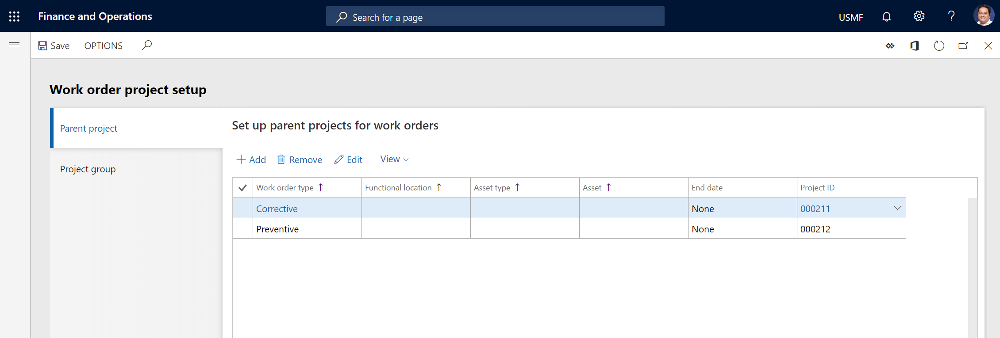
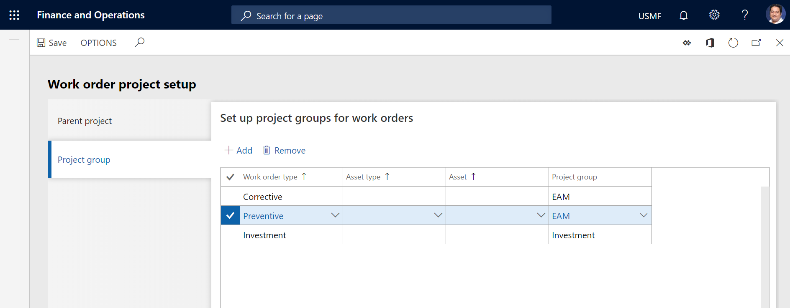

# Work order project setup

[!include [banner](../../includes/banner.md)]

 

In the **Asset management** module, a project relation is required for every work order job. The project that is associated with a work order job lets you track costs on various projects that are related to Asset Management, such as internal maintenance projects, service management projects, and investment projects. 

## Project setup for a work order job

When you create a work order job on a work order, the project setup in the **Project management and accounting** module and the work order project setup in the **Asset management** module determine how projects can be used for cost control on the asset that is selected on that work order job. This section describes the following parts of the project setup that is used for a work order: the parent project (project ID), project type, project activities, and financial dimensions:

- When you create a work order job on a work order, a unique project ID and a related project activity are automatically created for it. However, if several work order jobs on a work order include the same asset, the same project ID is used for them. In other words, one project ID is created for every asset on a work order.

    - The parent project (project ID) for a work order job is found in the parent project setup. (For more information about the parent project setup, see the next section.) For example, if you associate a customer or a functional location with a specific parent project, the parent project is used every time that you create work orders for that customer or that functional location. If you don't relate a specific project ID to, for example, a functional location, the next relevant parent project in the work order project setup is used.
    - A project type is required for every project ID. The project type is found in the setup of the project group setup. (For more information about the project group setup, see the next section.) If no match is found in the project group setup, the project group setup on the parent project is used.
    - The setup for requiring project activities on forecasts and journals is copied from the parent project to the work order project. If the **Hour**, **Expense**, and **Item** options are set to **Yes** for the project that is used as a parent project, a project activity is mandatory on forecasts and journals. (To access these options, select **Project management and accounting** \> **Projects** \> **All Projects**, and then select the project that is used as a parent project. The options are in the **Require activity on journals** section on the **Setup** FastTab.)

- Financial dimensions are copied from the asset and merged with the parent project.

The next section explains how to set up parent projects and project groups. Parent project and parent groups are used to control work orders. They are also used for reporting about work orders.

## Set up work order projects

Before you start to create work orders, you must set up work order projects. The **Work order project setup** page (**Asset management** \> **Setup** \> **Work orders** \> **Project setup**) contains two tabs: **Parent project** and **Project group**.

On the **Parent project** tab, you can set up project relations that can be used if no project is set up on the asset that is selected on the work order job. A parent project setup isn't required if your company uses asset projects. It's relevant only if you want to use work order projects instead of asset projects. In that case, you must set up at least one parent project.

On the **Project group** tab, you can set up project groups that can be associated with work order types, asset types, and assets.

Project groups can be used to create specific categories (groups) that are used for cost control. For example, by creating project groups for specific asset types or work order types, you can do detailed tracking of maintenance costs by type.

Project groups aren't mandatory. If you don't set up project groups, the parent project is used to determine the project group, and a child project is created from the parent project's project group.

The setup allows for complete integration with the **Project management and accounting** module. Therefore, you can track the costs that are related to work orders in the related projects. The following procedure describes the setup for work order projects.

1. Select **Asset management** \> **Setup** \> **Work orders** \> **Project setup**.
2. On the **Parent project** tab, select **Add**.
3. In the **Work order type**, **Functional location**, **Asset type**, and **Asset** fields, select values as you require. For each line that you add, you can set just one field or multiple fields. The number of fields that you set determines the combination that is used when a project ID is selected in Asset Management. 

    If you select a functional location, the related child locations are automatically included. If you select an asset, you can create more work order project setup lines for the same asset, but you can select different projects for that asset.

4. In the **Project ID** field, select the project that should be related to the setup that you created in step 3.
5. If the project setup should be valid for only a limited period, select an end date in the **End date** field. Otherwise, select **None**.

    By default, the start date is the date when you add the work order project to the page. It's controlled by the **Valid from** field, which is hidden by default. To show the **Valid from** field, select **View** \> **All**. You can then use the **Valid from** field together with the **End date** field to set up a limited period of validity for the work order project.

    

6. On the **Project group** tab, select **Add**.
7. In the **Work order type** field, select a work order type.
8. If you want the project group association to be more specific, select an asset type in the **Asset type** field or an asset in the **Asset** field.
9. In the **Project group** field, select the project group that should be related to the work order type. For example, a work order type that is named **Preventive maintenance** might be associated with a project group that is named **Prev Maint** or **Internal**. Alternatively, an **Investment** work order type that is used for work orders that are related to investments and fixed assets might be associated with a project group that is named **Invest** or **Investment**.
10. Select **Save**.

> [!NOTE]
> Every time that a work order line is created, Asset Management searches for a project group that should be related to the work order job project. The search is based on the setup that is described in this article. Every project group has a related project type. Project groups that have the **Time and material** or **Fixed-price** project type are valid only for assets that are related to a customer account.
>
> For parent projects and project groups, when the system selects the available work order project or project group, the selection is based on the records that you created by using the preceding procedure. Asset Management goes through records that are related to the work order project to check for a possible match. It always checks the most specific combination first. In other words, for the work order parent project, Asset Management first checks for a possible match for the **Asset** field. If no match is found, it checks for a match for the **Asset type** field. If no match is found, it checks for a match for the **Functional location** field, and so on. As you can see in the layout of the **Work order project setup** page, this behavior means that, to find the most specific combination, Asset Management checks each record from right to left for a match. If no match is found, the default record where only a project ID is selected is used. The process for finding the related project group is similar. Asset Management first checks for a possible match for the **Asset** field, then the **Asset type** field, and then the **Work order type** field. If no match is found, the default record where only a project group is selected is used.

[!INCLUDE[footer-include](../../../includes/footer-banner.md)]