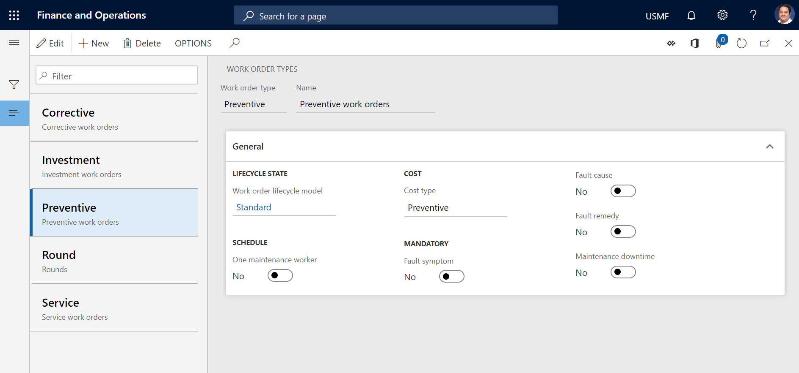

---
# required metadata

title: Work order types
description: This topic explains work order types in Asset Management.
author: johanhoffmann
ms.date: 08/13/2019
ms.topic: article
ms.prod: 
ms.technology: 

# optional metadata

ms.search.form: EntAssetWorkOrderType 
# ROBOTS: 
audience: Application User
# ms.devlang: 
ms.reviewer: kamaybac
# ms.tgt_pltfrm: 
ms.custom: 
ms.assetid: 
ms.search.region: Global
# ms.search.industry: 
ms.author: johanho
ms.search.validFrom: 2019-08-30
ms.dyn365.ops.version: 10.0.5

---

# Work order types

[!include [banner](../../includes/banner.md)]

 

Work order types are used to categorize work orders. For example, you might have work orders that are related to preventive maintenance or corrective maintenance.

A work order type defines an affiliation with a work order lifecycle model. A work order lifecycle model defines the work order lifecycle states that can be set on a work order. (Examples of work order lifecycle states include **Created**, **In Process**, and **Finished**.)

For more information about work order lifecycle states and project stages, see [Work order lifecycle states](work-order-lifecycle-states.md).

1. Select **Asset management** \> **Setup** \> **Work orders** \> **Work order types**.
2. Select **New** to create a work order type.
3. In the **Work order type** field, enter an ID for the work order type.
4. In the **Name** field, enter a name.
5. In the **Work order lifecycle model** field, select a lifecycle model.
5. Set the **One maintenance worker** option to **Yes** if all work order jobs that are related to a work order of this type should be scheduled to the same maintenance worker.
6. In the **Cost type** field, select **Corrective**, **Preventive**, or **Investment**, as appropriate. All work order jobs on a work order must have the same cost type.
7. In the **Mandatory** section, set the relevant options to **Yes** to specify which fault-related or maintenance downtime–related information is added to a work order of this type.

    > [!NOTE]
    > The options in the **Mandatory** section are related to the options on the **Validate** FastTab of the **Work order lifecycle states** page (**Asset management** \> **Setup** \> **Work orders** \> **Lifecycle states**).

8. Select **Save**.

[!INCLUDE[footer-include](../../../includes/footer-banner.md)]