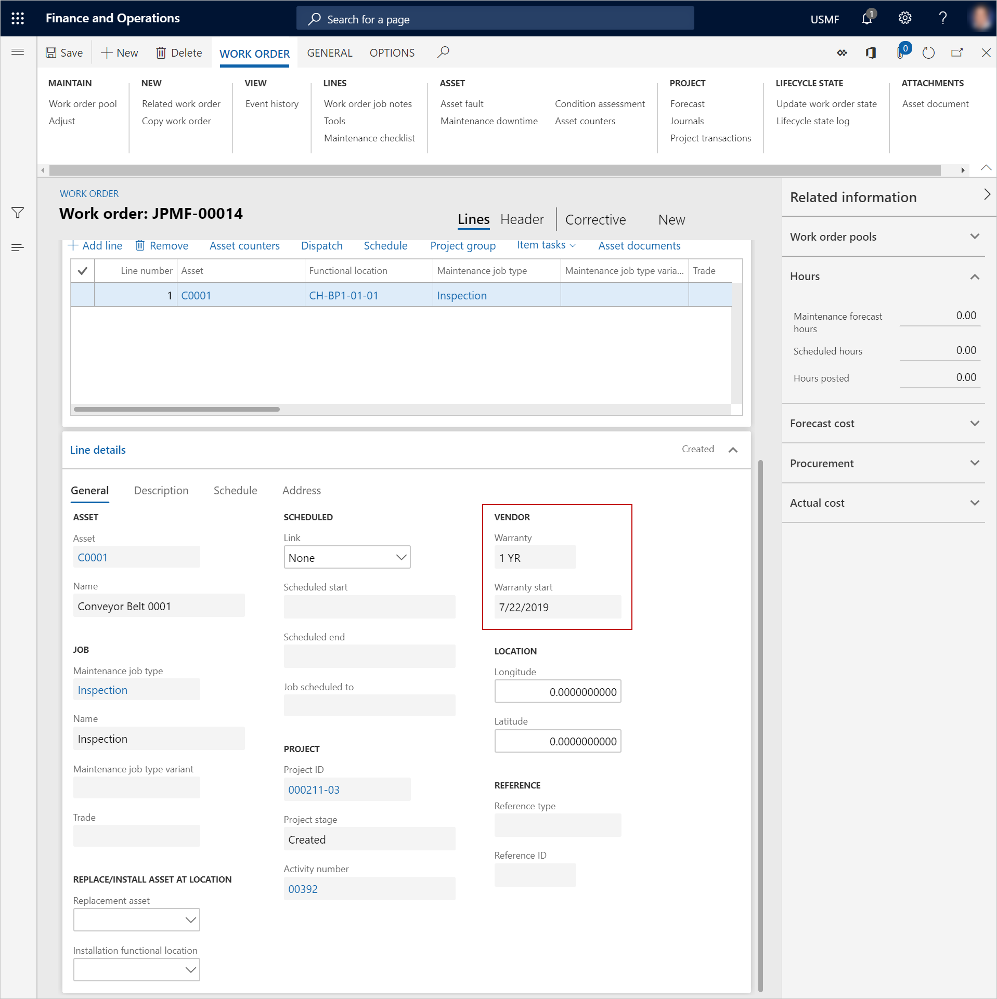

# Warranties on assets and asset types

[!include [banner](../../includes/banner.md)]

 

This article explains how to set up warranties on assets and asset types in Asset Management.

## Set up a warranty on an asset type

1. Select **Asset management** \> **Setup** \> **Asset types** \> **Asset types**.
2. In the left pane, select the asset type to attach a vendor warranty agreement to, and then select **Asset type defaults**.
3. On the **General** FastTab, in the **Vendor warranty** field, select the agreement.

## Set up a warranty on an asset

1. Select **Asset management** \> **Assets** \> **All assets**.
2. Select the asset, and then select **Edit**.
3. On the **Vendor** FastTab, in the **Vendor warranty** section, in the **Warranty** field, select the warranty agreement.
4. In the **Warranty start** and **Warranty end** fields, select the start and end dates.

    > [!IMPORTANT]
    > If a date is selected in the **Warranty start** field on a work order, the warranty becomes valid for the work order on that date. When you create a work order, the **Warranty start** field is automatically set to the date of creation. However, you can change the date so that it corresponds to, for example, the start date of a warranty agreement.
    >
    > 

> [!NOTE]
> When you create a work order for an asset that is covered by a vendor warranty, if the work order has an expected start date during the warranty period, you receive a notification about the warranty agreement. You can then cancel the work order, as you require.

[!INCLUDE[footer-include](../../../includes/footer-banner.md)]