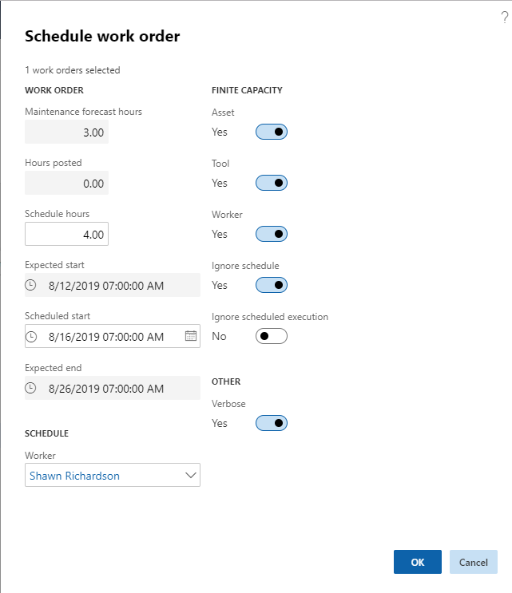

---
# required metadata

title: Dispatch work order
description: This article explains how to dispatch a work order in Asset Management.
author: johanhoffmann
ms.date: 08/19/2019
ms.topic: article
ms.prod: 
ms.technology: 

# optional metadata

ms.search.form: EntAssetScheduledExecution 
# ROBOTS: 
audience: Application User
# ms.devlang: 
ms.reviewer: kamaybac
# ms.tgt_pltfrm: 
ms.custom: 
ms.assetid: 
ms.search.region: Global
# ms.search.industry: 
ms.author: johanho
ms.search.validFrom: 2019-08-31
ms.dyn365.ops.version: 10.0.5

---

# Dispatch work order

[!include [banner](../../includes/banner.md)]

 

You can schedule one work order or work order jobs to one worker using the **Dispatch** functionality.

1. Click **Asset management** > **Work orders** > **All Work orders** or **Active work orders**.

2. Select the work order in the list.

3. On the **General** tab, click **Dispatch**.

4. In the **Schedule work order** dialog, select the worker in the **Worker** field.

5. In the **Schedule hours** field, you can insert expected work hours in case expected work hours differ from forecast hours.

6. In the **Scheduled start** field, you can edit start date and time, if required.

7. If the scheduling process should observe capacity limitations regarding resources already scheduled on other jobs, make sure that the **Asset**, **Tool**, and **Worker** toggle buttons are set to **Yes**. If you want to see detailed information about the scheduling process, select **Yes** on the **Verbose** toggle button. This means detailed information about the calculated scores on the work order is shown in the Action center.

8. Select **Yes** on the **Ignore schedule** toggle button to ignore closed days in the calendar (applies to asset, worker, and tools). Select **Yes** on the **Ignore scheduled execution** toggle button to ignore limitations that may have been selected on the work order regarding scheduling. 

    For information on the setup of scheduled execution, see the [Scheduled execution](../setup-for-work-orders/scheduled-execution.md) section.

9. Click **OK**. The work order lifecycle state is automatically updated to the **Scheduled** lifecycle state specified **Asset management** > **Setup** > **Work orders** > **Lifecycle models**.

The figure below shows an example of dispatch selections in the **Schedule work order** dialog.

[!NOTE]
If you want to delete the schedule on a work order, select the work order in **All work orders**, and then click **Delete schedule** on the **General** tab. Remember to manually update the work order lifecycle state if you delete the schedule.

[!INCLUDE[footer-include](../../../includes/footer-banner.md)]