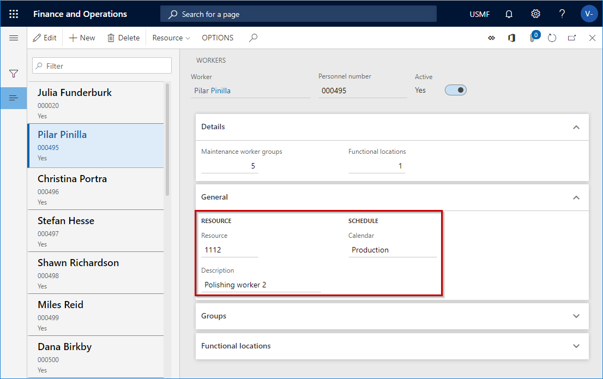

# Maintenance worker calendar and scheduling

[!include [banner](../../includes/banner.md)]

 

When you schedule work orders, you create a schedule for maintenance workers, tools, and assets. In order to schedule maintenance workers, a calendar must be set up for each maintenance worker. Maintenance workers are related to a resource, and working time calendars are set up for resources. You set up the resource and calendar in **Asset management** > **Setup** > **Workers** > **Workers**, which is described in [Maintenance workers and worker groups](../setup-for-objects/workers-and-worker-groups.md).

The screenshot below shows an example of a maintenance worker who is related to a resource that uses the working time calendar "Production".

Calendar setup for tools and assets is not needed in relation to work order scheduling. The assumption is that tools and assets are available 24 hours a day for maintenance.

[!INCLUDE[footer-include](../../../includes/footer-banner.md)]