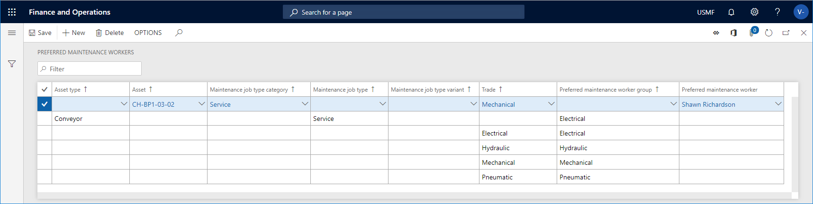

---
# required metadata

title: Set up preferred maintenance workers
description: This article explains how to set up preferred maintenance workers in Asset Management.
author: johanhoffmann
ms.date: 08/19/2019
ms.topic: article
ms.prod: 
ms.technology: 

# optional metadata

ms.search.form: EntAssetWorkerPreferred 
# ROBOTS: 
audience: Application User
# ms.devlang: 
ms.reviewer: kamaybac
# ms.tgt_pltfrm: 
ms.custom: 
ms.assetid: 
ms.search.region: Global
# ms.search.industry: 
ms.author: johanho
ms.search.validFrom: 2019-08-31
ms.dyn365.ops.version: 10.0.5

---

# Set up preferred maintenance workers

[!include [banner](../../includes/banner.md)]

During work order scheduling, you can make a preference regarding which maintenance worker or worker group is allocated to complete the work order. The use of this functionality is optional, but it can help you make a choice for the most qualified maintenance worker to complete a job, based on worker skills and competencies. Only maintenance workers that are available at scheduling time will be scheduled. If a preferred maintenance worker setup matches a work order during scheduling, but the maintenance worker is allocated to other jobs, the work order will be scheduled to another available maintenance worker.

Before you can set up preferred maintenance workers, you must first set up the maintenance workers and worker groups. For a description about how to set up maintenance workers and worker groups, see to [Maintenance workers and worker groups](../setup-for-objects/workers-and-worker-groups.md).

## Set up preferred workers

A preferred maintenance worker or worker group can be related to one or more of the following:

- trade  
- maintenance job type variant  
- maintenance job type  
- maintenance job type category  
- asset  
- asset type  

The more selections you make for the same record, the more specific your setup will be.

1. Click **Asset management** > **Setup** > **Workers** > **Preferred maintenance workers**.

2. Click **New** to create a new record.

3. Start by creating a "default" maintenance worker or worker group. This means that you only make a selection in the **Preferred maintenance worker group** field or the **Preferred maintenance worker** field. In the screenshot below, you see an example in the first record in which "Requests" is selected as **Preferred maintenance worker group**.

    > [!NOTE]
    > The default setup will be used during work order scheduling if no other, more specific, combination matches the contents of the work order.

4. Repeat step 2 to create a new record. Make the required selections, depending on the detail level for the preferred worker or worker group. 

    *Example:* In the screenshot below, in the sixth record, the maintenance worker Shawn Richardson is selected as preferred worker. Shawn will automatically be selected during scheduling of a work order that includes the asset "CH-BP1-03-02 and the maintenance job type "Facility assessment", if Shawn is available at the scheduled time.

    > [!NOTE]
    > Generally, when a preferred maintenance worker is selected during work order scheduling, Asset Management goes through all **Preferred maintenance workers** records to check for a possible match, always checking the most specific combination first. If no match is found, the "default" record with a selection in either the **Preferred maintenance worker group** field or the **Preferred maintenance worker** field is used.

You can also set up *responsible* maintenance workers who can be selected when a maintenance request or a work order is created. You can edit the selection in **All work orders** and **All maintenance requests**, if required. For more information, see [Responsible maintenance workers](../setup-for-maintenance-requests/responsible-workers.md).

During work order scheduling, different scores are calculated to determine which workers should complete the jobs related to a work order (those scores are set up in **Asset management parameters** > **Work order scheduling** link). If two or more preferred maintenance workers or responsible maintenance workers get the same score during work order scheduling, one worker is randomly selected. Otherwise, it is always the worker with the highest score who is allocated to complete a work order.

[!INCLUDE[footer-include](../../../includes/footer-banner.md)]
