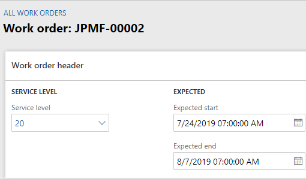
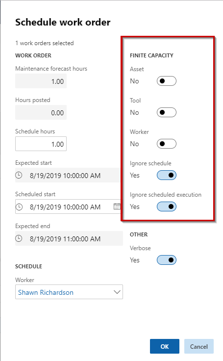

---
# required metadata

title: Schedule work order on specific date and time
description: This topic explains how to schedule a work order on a specific date and time in Asset Management.
author: johanhoffmann
ms.date: 08/19/2019
ms.topic: article
ms.prod: 
ms.technology: 

# optional metadata

ms.search.form: 
# ROBOTS: 
audience: Application User
# ms.devlang: 
ms.reviewer: kamaybac
# ms.tgt_pltfrm: 
ms.custom: 
ms.assetid: 
ms.search.region: Global
# ms.search.industry: 
ms.author: johanho
ms.search.validFrom: 2019-08-31
ms.dyn365.ops.version: 10.0.5

---

# Schedule work order on specific date and time

[!include [banner](../../includes/banner.md)]

 

If a work order must be scheduled on a specific date *and* time, you can override the standard scheduling process in Asset Management and create a specific schedule for a work order.

1. Click **Asset management** > **Common** > **Work orders** > **All Work orders** or **Active work orders**.

2. In the work order list, click on the Work order ID in the **Work order** column.

3. Click **Edit**.

4. On the **Work order header** FastTab, insert start and end dates and times in the **Expected start** and **Expected end** fields.

    

5. On the **General** tab, click **Schedule** to use the standard scheduling process, or click **Dispatch** if you want to assign the work order to a specific worker.

6. In order to override any existing capacity reservations to ensure that the work order is scheduled in the expected period, make the selections as shown in the figure below in the **Schedule work order** dialog > **Finite capacity** section. This means that the scheduling process will ignore existing capacity reservations because the work order must start on the expected start time.

    

7. Click **OK** to start scheduling.

8. If the scheduling process results in double bookings, you will see a message on the screen, and you can adjust the related work orders.

>[!NOTE]
>In order to schedule a maintenance worker for the work order, that maintenance worker must be available at the expected start date and time. Worker availability is set up in the [worker calendar](../work-order-scheduling/maintenance-worker-calendar-and-scheduling.md). 

[!INCLUDE[footer-include](../../../includes/footer-banner.md)]