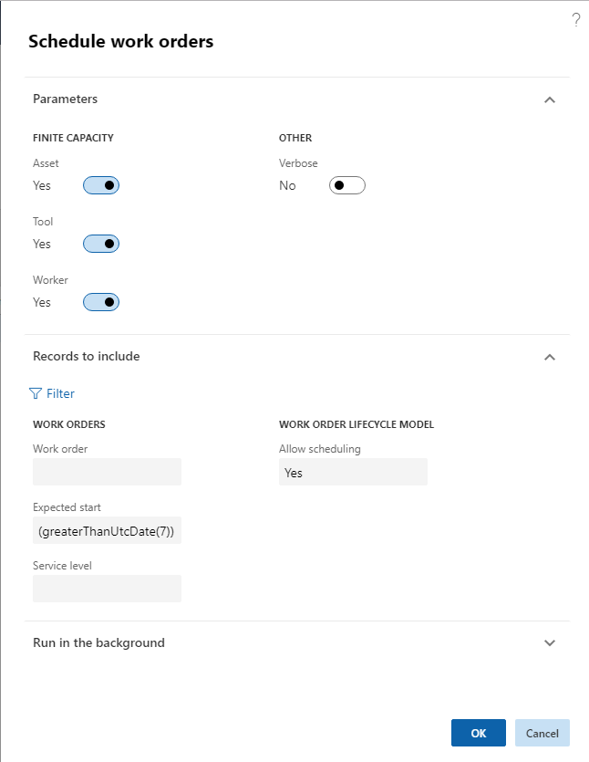

---
# required metadata

title: Schedule work orders
description: This article explains how to schedule work orders in Asset Management.
author: johanhoffmann
ms.date: 08/19/2019
ms.topic: article
ms.prod: 
ms.technology: 

# optional metadata

ms.search.form: EntAssetWorkOrderSchdulePreviewPart, EntAssetWorkOrderScheduleExclusively, EntAssetWorkOrderSchduleInfoPart, EntAssetWorkOrderScheduleListPage, EntAssetWorkOrderSchedule, EntAssetWorkOrderScheduleDelete 
# ROBOTS: 
audience: Application User
# ms.devlang: 
ms.reviewer: kamaybac
# ms.tgt_pltfrm: 
ms.custom: 
ms.assetid: 
ms.search.region: Global
# ms.search.industry: 
ms.author: johanho
ms.search.validFrom: 2019-08-31
ms.dyn365.ops.version: 10.0.5

---

# Schedule work orders

[!include [banner](../../includes/banner.md)]

 

This article explains how to schedule work orders in Asset Management. 

The required number of hours for a work order is defined by the sum of forecasted hours minus posted hours. If more time is required, the forecast must be adjusted accordingly. In **Asset management** > **Work orders** > **All work orders** or **Active work orders**, you can view or edit forecasts on a work order by selecting the work order and clicking **Forecast** on the **Work order** tab. When work orders have been created and estimated, the next step complete the work orders is to allocate the required maintenance workers and tools.

Only work orders with a work order lifecycle state that allows scheduling can be scheduled. Allow scheduling is set up in **Asset management** > **Setup** > **Work orders** > **Lifecycle states** > **General** FastTab > **Allow scheduling** toggle button.

1. Click **Asset management** > **Work orders** > **All work orders**.

2. Select the work orders you want to schedule in the list. For example, you can sort the list by **Current lifecycle state**.

3. On the **General** tab, click **Schedule**.

4. In the **Schedule work orders** dialog, you can add selections regarding expected start date and service level, if required. If the scheduling process should observe capacity limitations regarding resources already scheduled for other jobs, make sure that the **Asset**, **Tool**, and **Worker** toggle buttons are set to "Yes".

    [!NOTE]
    If you set the **Asset**, **Tool**, and **Worker** toggle buttons to "No", existing reservations will be ignored. In the Action center, a list of overlapping work order schedules will be shown, and you can click on the messages to open a work order and reschedule, if required.

5. To see detailed information about the scheduling process, select "Yes" on the **Verbose** toggle button. This means that detailed information about the calculated scores on the work orders and maintenance workers will be shown in the Action center.

6. Click **OK** to start the scheduling process.

7. When scheduling is completed, an Action center message shows the number of work orders scheduled, and also more detailed information if the **Verbose** toggle button was set to "Yes".

>[!NOTE]
>Work orders are scheduled in one cycle per work order, not per work order job. You can also open the **Schedule work orders** dialog directly in **Asset management** > **Periodic** > **Work orders** > **Schedule work orders**. Make your selections and click **OK** to start work order scheduling. It is possible to set up work order scheduling as a batch job in the **Schedule work orders** dialog > the **Run in the background** FastTab.

*Example:* In the figure below, the formula inserted in the **Expected start** field will generate work order scheduling for all work orders with expected start date a week from now and later. This formula may be useful when you run work order scheduling on an ongoing basis, but you want to make sure the work orders scheduled for the next 5-6 days are not rescheduled.

The work order type related to work orders may set up scheduling for one maintenance worker (**Asset management** > **Setup** > **Work orders** > **Work order types** > **One maintenance worker** toggle button set to "Yes"). This means that if the work order type is used on a work order, the **One maintenance worker** toggle button is automatically set to "Yes" on the **All work orders** details page > **Header** view > **Schedule** FastTab. During work order scheduling, all work order jobs created on the work order will subsequently be scheduled to the same maintenance worker. If required, you can edit the selection on the **One maintenance worker** toggle button in **All work orders** to allow scheduling of several workers or one worker on the work order jobs.

The scheduling process in Asset Management includes several factors in the scheduling calculation:

- Calculating scores for both work orders and maintenance workers. Scores for work orders and maintenance workers are set up in **Asset management parameters**. 
- Checking for matching competencies, meaning skills and certificates, required to perform the job. Skills and certificates are set up on maintenance workers in the **Human resources** module (**Human resources** > **Workers** > **Workers** > select worker in the list > **Worker** tab > **Competencies** section > **Skills** and **Certificates** buttons). Also, skills and certificates can be added to maintenance job types and maintenance job trades. Read more about competencies and maintenance job types in [Maintenance job type categories and maintenance job types, maintenance job type variants, maintenance job trades, and maintenance checklists](../setup-for-work-orders/job-groups-and-job-types-variants-trades-and-checklists.md).  

## Scores used in work order scheduling

Calculating scores for a work order job is based on expected start date and the service level of the work order.

**Start date** calculation: For every future date calculated from the expected start date, the start date score is subtracted and multiplied by the score, which is "10" in the examples below.

**Criticality** calculation: Criticality score multiplied by the criticality on the work order.

**Service level** calculation: Service level score divided by the service level on the work order.

In the examples below, the criticality score is "2", and the service level scores are "5" and "100".

**Example 1:**

| Work order ID | Expected start date | Work order criticality | Work order service level | Calculation               | Score      |
|---------------|---------------------|------------------------|--------------------------|---------------------------|------------|
| WO-00010816   | Tomorrow            | 2                      | 20              | (-1 \* 10) + (2 \* 2) + 5 / 20     | \- 5.75    |
| WO-00010817   | Two days from now   | 2                      | 20              | (-2 \* 10) + (2 \* 2) + 5 / 20     | \- 15.75   |
| WO-00010818   | Two days from now   | 3                      | 5               | (-2 \* 10) + (2 \* 3) + 5 / 5      | \- 13      |

The work orders will be scheduled in the following order: WO-000108**16**, WO-000108**18**, WO-000108**17**.

**Example 2:**

| Work order ID | Expected start date | Work order criticality | Work order service level | Calculation                 | Score    |
|---------------|---------------------|------------------------|---------------------|----------------------------------|----------|
| WO-00010816   | Tomorrow            | 2                      | 20                  | (-1 \* 10) + (2 \* 2) + 100 / 20 | \- 1     |
| WO-00010817   | Two days from now   | 2                      | 20                  | (-2 \* 10) + (2 \* 2) + 100 / 20 | \- 11    |
| WO-00010818   | Two days from now   | 3                      | 5                   | (-2 \* 10) + (2 \* 3) + 100 / 5  | 6        |

If the service level score is increased to '100' instead of '5', the scheduling order will be: WO-000108**18**, WO-000108**16**, WO-000108**17**.

The rating scores relating to calculating which maintenance workers should work on the work orders are all set up as numbers, which are added to each maintenance worker calculation during work order scheduling. The maintenance worker with the highest score is selected on the work order. Here is a short description of the maintenance worker scores:

| Maintenance worker score| Description |
|---|---|
| Responsible worker | If the maintenance worker is selected as responsible worker on the work order, the score is added. |
| Responsible maintenance worker group | If the maintenance worker is part of the responsible maintenance worker group on the work order, the score is added. |
| Preferred maintenance worker         | If the worker is selected as preferred maintenance worker on the asset, the score is added. |
| Preferred maintenance worker group   | If the worker is part of the preferred maintenance worker group on the asset, the score is added.  |
| Location  | If your company uses functional locations, maintenance workers get full score if they are located on the functional location related to the asset. If the functional location of the asset has a parent location, maintenance workers on that functional location get 1/2 score. If that location also has a parent, maintenance workers on that location get 1/3 score. If that location also has a parent, maintenance workers on that location get 1/4 score, and so on. If you company uses asset location, which we do not recommend, location, area, and zone are used to calculate location scores. Workers get full score if they are located in the location and area and zone related to the asset. If worker location only matches location and area, the rating score for the maintenance worker is 2/3 of the full score. If maintenance worker location only matches location, the rating score for the maintenance worker is 1/3 of the full score. |
| Worker's start date  | For every date that the scheduled start date is later than the expected start date, the score is subtracted.  |

>[!NOTE]
>If a score is set to "0", that score is not calculated. This is useful if, for example, you do not want to include a responsible worker in your scheduling.

## Competencies used in work order scheduling

Skills and certificate requirements can be set up on maintenance job types (**Asset management** > **Setup** > **Jobs** > **Maintenance job types**) and maintenance job trades (**Asset management** > **Setup** > **Jobs** > **Maintenance job trade**). 

Maintenance job types and maintenance job trades are selected on work order jobs. If skills or certificates have been selected on a maintenance job type or maintenance job trade, and that maintenance job type or maintenance job trade is used on a work order job, only maintenance workers with matching skills and certificates are scheduled to work on the work order.

## Work with scheduled work orders using a gantt chart

The **Scheduled work orders gantt chart** provides a graphical interface where you can view and reschedule your work orders.

To view and work with the gantt chart:

1. Go to **Asset management > Work orders > Scheduled work orders gantt chart**.

1. Use the drop-down lists and fields in the **Settings** section to set up which functional location, time span, and time scale to show in the gantt chart.

1. Select **Apply**.

    - The gantt chart updates to show the scheduled work orders that match your settings. Each work order is represented by a blue rectangle.
    - To reschedule a displayed work order, select and then drag it to the appropriate new date and time.

1. If you made any changes, select **Save** on the Action Pane to save them.

[!INCLUDE[footer-include](../../../includes/footer-banner.md)]