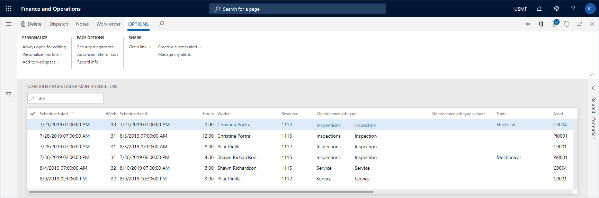

# Scheduled work order maintenance jobs

[!include [banner](../../includes/banner.md)]

 

The **Scheduled work order maintenance jobs** page shows an overview of the work orders allocated to a resource. Work orders using resource types "Human resources", "Tool", and "Machine" are shown. For example, if a maintenance worker calls in sick, you can use this page to quickly find work orders allocated to the worker, and then allocate another maintenance worker to the job.

## View scheduled work order maintenance jobs

1. Click **Asset management** > **Work orders** > **Scheduled work order maintenance jobs**. You see a list of all work orders set to work order lifecycle state "Scheduled" or "In progress".

2. You can sort the list, for example, by maintenance worker. You can also use the filter to limit the list to display work orders allocated to a specific resource or maintenance worker.

3. You can see notes on the work order and, if required, add new notes by selecting the work order job, and then click **Notes**.

4. If you want to allocate one maintenance worker to a work order, select the work order, and then click **Work order**.

5. The **Work order** page opens. Click **Dispatch** to schedule the work order to a specific maintenance worker.

>[!NOTE]
>Read more about scheduling several work orders or one work order in [Schedule work orders](../work-order-scheduling/schedule-work-orders.md) and [Dispatch work order](../work-order-scheduling/dispatch-work-order.md).

The following screenshot shows an example of the **Scheduled work order maintenance jobs** page.

[!INCLUDE[footer-include](../../../includes/footer-banner.md)]