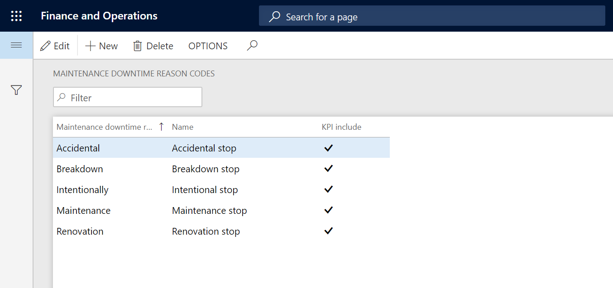
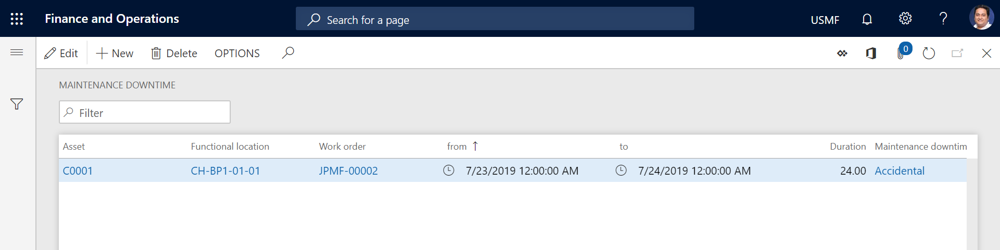
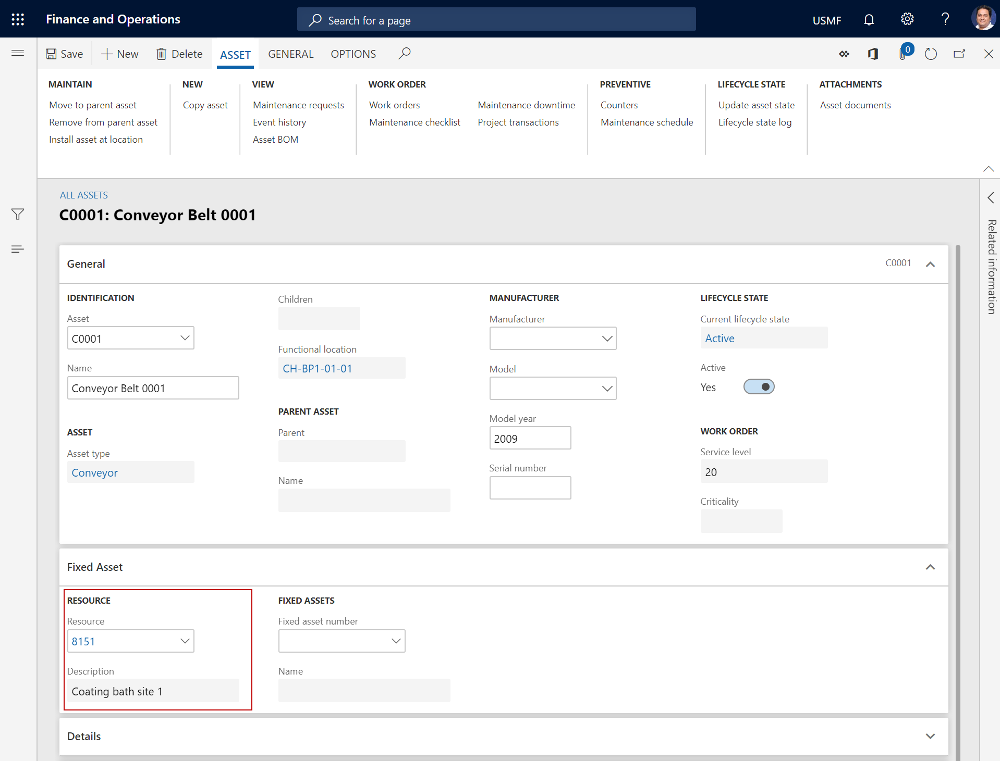
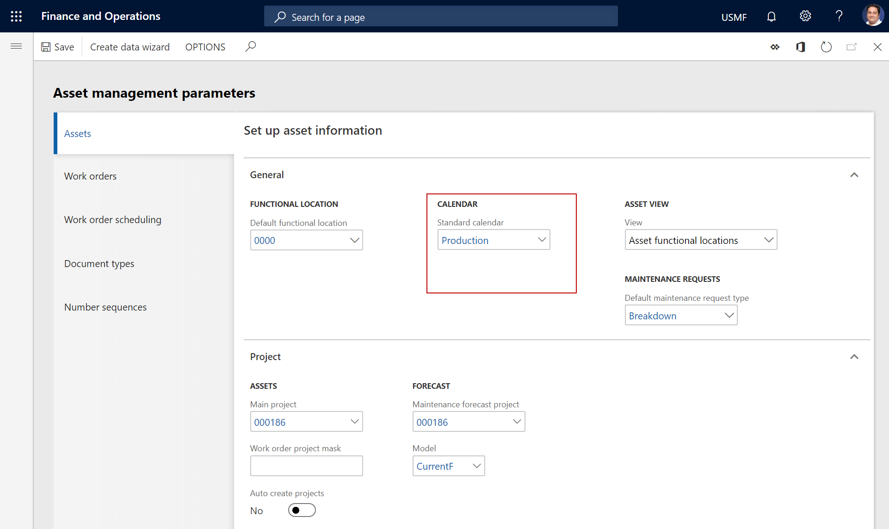

---
# required metadata

title: Maintenance availability check for work orders
description: This article describes how supervisors can conduct a material availability check on maintenance work orders.
author: johanhoffmann
ms.date: 08/28/2023
ms.topic: article
ms.prod: 
ms.technology: 

# optional metadata

ms.search.form: 
# ROBOTS: 
audience: Application User
# ms.devlang: 
ms.reviewer: kamaybac
# ms.tgt_pltfrm: 
ms.custom: 
ms.assetid: 
ms.search.region: Global
# ms.search.industry: 
ms.author: johanho
ms.search.validFrom: 2019-09-30
ms.dyn365.ops.version: 10.0.5

---

# Material availability check for work orders

[!include [banner](../../includes/banner.md)]

Supervisors can make a material availability check on work orders. This process is relevant for organizations that want to check if material for the work orders are available before workers start working on the work orders. Consider following scenario. A supervisor is responsible for all corrective maintenance on a manufacturing site. As a standard procedure, the supervisor will check all new work orders of type corrective, before releasing the orders to the maintenance workers. As part of this check, the supervisor will check that the required materials for the orders are available, preventing that workers are not starting up maintenance work where the necessary spare part are available.

## How does the material availability check work?

The check is using the planning optimization, to calculate how material for work orders are covered in inventory. The planning optimization is using the material demand from work orders to calculate how the material are covered in inventory. The material demand for work orders are 

Supervisors can setup a default forecast for material needed for the maintenance of assets. These default forecasts are setup. You can read more about how to setup default materials for work orders in this article: **Maintenance job type defaults**. When a work order is created, the 
The material availability check is based on the result of the last version of the master plan. 

Each morning the supervisor will check all the new work ordres that have been generated 

## Create maintenance downtime reason codes

1. Select **Asset management** > **Setup** > **Work orders** > **Maintenance downtime reason codes**.

2. Select **New**.

3. In the **Maintenance downtime reason code** field, enter an ID for the maintenance downtime reason code.

4. In the **Name** field, enter a name.

5. Select the **KPI include** check box if the reason code should be included in calculations of key performance indicators (KPIs) for the asset. In general, planned production stops should not be included in KPI calculations, because they don't affect expected performance.

6. Select **Save**.

The illustration below shows an example of the **Maintenance downtime reason codes** page.

After you've created the maintenance downtime reason codes that you want to use, you can create maintenance downtime registrations for work orders and assets.

## Create maintenance downtime registrations

1. Click **Asset management** > **Work orders** > **All work orders** or **Active work orders**.

2. Select the work order, and then, on the **Work order** tab, in the **Asset** group, select **Maintenance downtime**.

3. Select **New**.

4. In the **From** and **To** fields, define the date and time interval for the maintenance downtime registration.

>[!NOTE]
>When you leave the **To** field, the duration in hours is automatically inserted in the **Duration** field.

5. In the **maintenance downtime reason code** field, select a reason code.

6. Repeat steps 3 through 5 to add more registrations.

7. Select **Save**.

The illustration below shows an example of maintenance downtime registration.

The calendar that is used to calculate a maintenance downtime registration depends on your selection in the setup of assets and parameters. If a resource is selected on an asset in the **Resource** field on the **Fixed asset** FastTab of the **All assets** page, the calendar that is set up for the associated resource group is used, as shown in the following illustration.

If no resource is selected on the asset, the standard calendar that is selected on the **Asset management parameters** page is used, as shown in the following illustration.

To see an overview of all maintenance downtime registrations, click **Asset management** > **Inquiries** > **Maintenance downtime**.

>[!NOTE]
>All calendars that are used in the **Asset Management** module are set up in **Organization administration** > **Setup** > **Calendars** > **Calendars**.

[!INCLUDE[footer-include](../../../includes/footer-banner.md)]