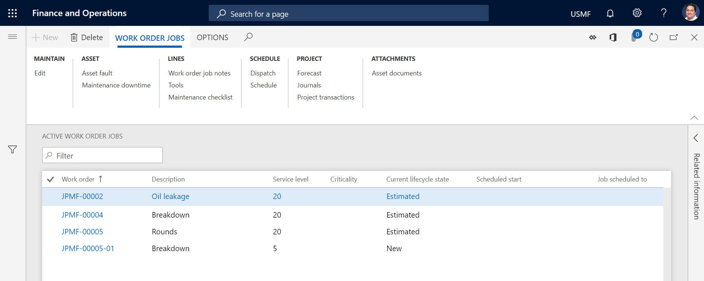

---
# required metadata

title: Active work order maintenance jobs overview
description: This topic explains active work order maintenance jobs overview in Asset Management.
author: johanhoffmann
ms.date: 10/15/2019
ms.topic: overview
ms.prod: 
ms.technology: 

# optional metadata

ms.search.form: 
# ROBOTS: 
audience: Application User
# ms.devlang: 
ms.reviewer: kamaybac
# ms.tgt_pltfrm: 

ms.assetid: 
ms.search.region: Global
# ms.search.industry: 
ms.author: johanho
ms.search.validFrom: 2019-09-30
ms.dyn365.ops.version: 10.0.5

---

# Active work order maintenance jobs overview

[!include [banner](../../includes/banner.md)]

On the **Active work order maintenance jobs** list page, you can get an overview of work orders, in terms of the number of work orders that have been created on specific assets, asset types, manufacturers, models, maintenance job types, and so on. By selecting a work order job and then selecting **Edit**, you can open the related work order. By selecting a work order job and then selecting one of the buttons on the **Work order maintenance jobs** tab of the Action Pane, you can view data for the work order that the work order job is related to.

To open the list page, select **Asset management** > **Common** > **Work orders** > **Active work order maintenance jobs**. The page lists all active work order jobs, and it also shows some of the information that is related to the work order or work order job.

In the **%** column, a number shows completion of the work order as a percentage. Completion is based on two calculations: posted hours compared to forecasted hours, and the number of maintenance checklists that have been completed.

The illustration below shows an example of the **Active work order maintenance jobs** list page.

For a short description of the buttons on the **Active work order maintenance jobs** list page, refer to [Introduction to work orders](../work-orders/introduction-to-work-orders.md) where identical buttons are described.

[!INCLUDE[footer-include](../../../includes/footer-banner.md)]