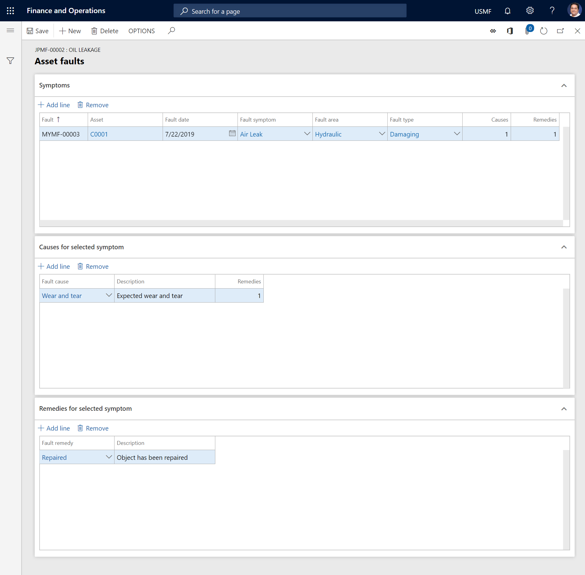

---

# required metadata

title: Add fault to work order
description: This topic describes how to add fault registrations to work orders in Asset Management.
author: johanhoffmann
ms.date: 10/15/2019
ms.topic: article
ms.prod: 
ms.technology: 

# optional metadata

ms.search.form: 
# ROBOTS: 
audience: Application User
# ms.devlang: 
ms.reviewer: kamaybac
# ms.tgt_pltfrm: 
ms.custom: 
ms.assetid: 
ms.search.region: Global
# ms.search.industry: 
ms.author: johanho
ms.search.validFrom: 2019-09-30
ms.dyn365.ops.version: 10.0.5

---

# Add fault to work order

[!include [banner](../../includes/banner.md)]

You can add faults that were set up in the fault designer to a work order. One or more fault records must be connected to the asset types that are used for the asset that is selected in the work order. For more information about the setup, see [Fault management](../setup-for-work-orders/fault-management.md).

1. Select **Asset management** > **Common** > **Work orders** > **All Work orders** or **Active work orders**.

2. Select the work order to make a fault registration on, and then, on the Action Pane, on the **Work order** tab, in the **Asset** group, select **Asset fault**.

3. On the **Symptoms** FastTab, select **Add line**. A sequential fault number is automatically entered in the **Fault** field.

4. In the **Fault symptom** field, select the relevant symptom.

5. In the **Fault area** and **Fault type** fields, select the appropriate values.

6. In the **Fault date** field, the current date is automatically inserted. You can select a different date as you require.

7. On the **Causes for selected symptom** FastTab, add a line to describe the cause of the issue.

8. On the **Remedies for selected symptom** FastTab, add a line to describe a possible solution to the issue.

9. Select **Save**.

The illustration below shows an example of a fault registration.

## View asset faults

In the **Asset faults** list, you can get an overview of all faults registered on assets.

On the **Asset faults** list page, you can get an overview of all faults that have been registered on assets. To open the page, select **Asset management** > **Inquiries** > **Asset fault** > **Asset faults**.

## Print asset fault report

From the **All assets** list page, you can print an asset fault report that shows all fault registrations and a graphical overview of fault statistics.

1. Select **Asset management** > **Common** > **Assets** > **All assets**.

2. Select the asset to print a fault report for.

3. On the Action Pane, on the **General** tab, in the **Reports** group, select **Asset fault**.

4. Enter a specific period, or select a fault type.

5. Select **OK** to print the report.

>[!NOTE]
>To print a fault report for several assets or asset types, select **Asset management** > **Reports** > **Assets** > **Asset fault**.

[!INCLUDE[footer-include](../../../includes/footer-banner.md)]