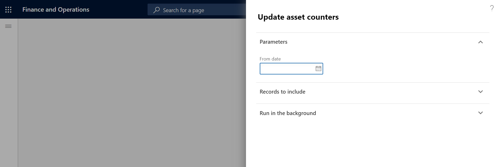
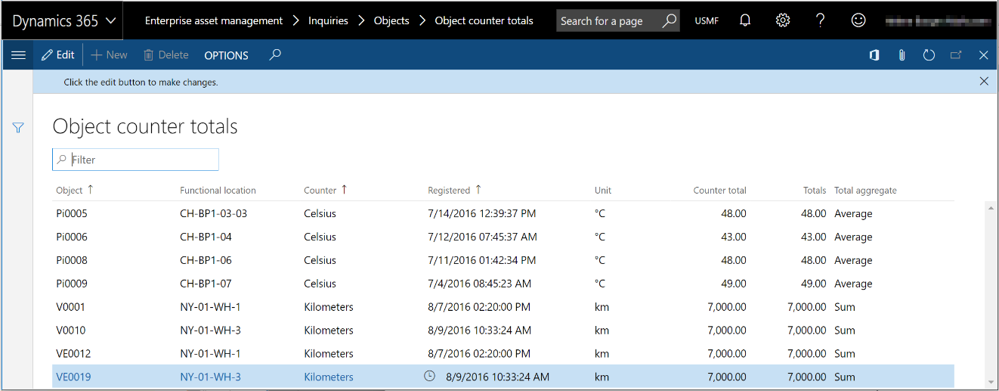

# Automatic update of asset counters

[!include [banner](../../includes/banner.md)]

For information about manual registration of asset counters, see [Manual update of asset counters](../work-orders/manual-update-of-asset-counters.md). For information on how to set up asset counters, see [Counters](../setup-for-objects/counters.md).

Counter values can also be automatically updated from production registrations, based on the production hours or production quantity (that is, the quantity that is produced). This update is done on the **Update asset counters** page. You can update one or several assets by setting one parameter, **From date**. This parameter specifies the start date for production registrations (production hours or production quantities). In other words, it specifies the date that counter values should be updated from.

All assets that are related to a resource, *and* that have asset counters that are set up to be updated based on the production hours or production quantity, will be included in an automatic update. New counter values will be created.

For counters that are based on the production quantity, the count includes both the good quantity and the error quantity that are registered. If the unit that is used for production quantity registration differs from the unit that is used for the counter, the quantity is converted so that it corresponds to the counter unit.

As mentioned above, automatic counters can be updated from production registrations. Therefore, the asset for which you want to automatically update counters must be related to a resource (machine). When produced quantities or production hours have been registered on the resource, you can update the related asset counters.

1. Select **Asset management** > **Periodic** > **Assets** > **Update asset counters**.

2. In the **From date** field, select the start date of the automatic update.

    >[!NOTE]
    >The date in this field is the "work in progress" date from **Route transactions** (**Production control** > **Inquiries and reports** > **Production** > **Route transactions** > **Physical date** field).

3. On the **Records to include** FastTab, you can select specific assets, asset types, or resources for the automatic update. Select **Filter**, and make the relevant selections.

4. On the **Run in the background** FastTab, you can set up the automatic update as a batch job, as you require.

    The illustration below shows an example of the **Update asset counters** dialog.

    

5. Select **OK**. 

After the automatic asset counter update is done, you can view the counter registrations that are related to the asset on the **Asset counters** page. Select **Asset management** > **Assets** > **All assets**, select the asset, and then, on the Action Pane, on the **Asset** tab, in the **Preventive** group, select **Counters**.

On the **Asset aggregated value** page, you can get an overview of the latest registration that have been made on all counter types on all assets. Select **Asset management** > **Inquiries** > **Assets** > **Asset aggregated value**. This page resembles the **Asset counters** page, but you can't add or edit registrations. It's for overview only.

The illustration below shows an example of the **Asset aggregated value** page.

Note the following points:

- You can still create manual counter value registrations for counter types that are automatically updated. Learn more in [Manual update of asset counters](../work-orders/manual-update-of-asset-counters.md).

- You can set up counters that are related to another counter. In this case, when a counter is updated, related counters are automatically updated at the same time. For more information about how to set up related counters, see [Counters](../setup-for-objects/counters.md).

[!INCLUDE[footer-include](../../../includes/footer-banner.md)]