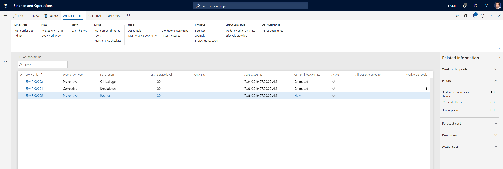
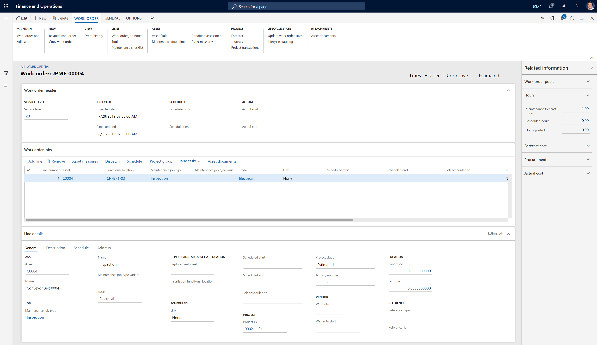

---
# required metadata

title: Introduction to work orders
description: This article provides an overview of work orders in Asset Management.
author: johanhoffmann
ms.date: 10/15/2019
ms.topic: article
ms.prod: 
ms.technology: 

# optional metadata

ms.search.form: EntAssetWorkOrderLineNote, EntAssetWorkOrderTable, EntAssetWorkOrderActive, EntAssetWorkOrderHoursInfoPart, EntAssetWorkOrderLineListPage, EntAssetWorkOrderAddObjectBOMItem, EntAssetWorkOrderTablePoolAdd, EntAssetWorkOrderPurchReqListPagePreviewPane, EntAssetWorkOrderPoolReferenceAdd, EntAssetWorkOrderWorkspace, EntAssetWorkOrderTableAdjust, EntAssetWorkOrderGantt, EntAssetWorkOrderNotes, EntAssetWorkOrderActivePart, EntAssetWorkOrderTableInfoPart, EntAssetWorkOrderLineListPagePreviewPane, EntAssetWorkOrderTool, EntAssetMobileWorkOrderLineDetails, EntAssetMobileWorkOrderLineList, EntAssetMobileWorkOrderDetails 
# ROBOTS: 
audience: Application User
# ms.devlang: 
ms.reviewer: kamaybac
# ms.tgt_pltfrm: 
ms.collection: get-started
ms.assetid: 
ms.search.region: Global
# ms.search.industry: 
ms.author: johanho
ms.search.validFrom: 2019-09-30
ms.dyn365.ops.version: 10.0.5

---

# Introduction to work orders

[!include [banner](../../includes/banner.md)]

Work orders are used to manage maintenance jobs, provide required information for them, and register consumption on them. Each work order can contain one or more work order jobs, and one or more assets can be connected to each work order. Each work order job defines a maintenance job that is scheduled on the asset.

Work orders can be created in the following ways:

- For  calendar-based maintenance plans where the "Auto create" setting is turned on, automatically by using [Schedule maintenance plans](../preventive-and-reactive-maintenance/schedule-maintenance-plans.md).

- For maintenance rounds where the "Auto create" setting is turned on, automatically by using [Schedule maintenance rounds](../preventive-and-reactive-maintenance/maintenance-rounds.md).

- For preventive maintenance jobs or maintenance requests, from [Maintenance schedule](../preventive-and-reactive-maintenance/maintenance-schedule.md).

- Manually

- From the **All maintenance requests**, **Active maintenance requests**, or **My functional location maintenance requests** page.

>[!NOTE]
>Work order jobs that are related to the same asset are related to the same project ID.

## All work orders

Select **Asset management** > **Work orders** > **All work orders** to open the **All work orders** list page. This page shows all work orders and some of the information that is related to each.

The illustration below shows an example of the **All work orders** list page.

To view a list of only active work orders, select **Asset management** > **Work orders** > **Active work orders**. 

To view a list of work order jobs that contain assets that are installed on functional locations that you're related to as a worker, select **Asset management** > **Work orders** > **My functional location work order maintenance jobs**. (The relation between workers and functional locations is set up on the **Workers** page. For more information, see [Maintenance workers and worker groups](../setup-for-objects/workers-and-worker-groups.md).)

Here are some ways that you can use the **All work orders** page:

- In the grid view, select a link in the **Work order** column to show the details view for the selected record. You can then select **Edit** to open the record for editing.

- In the details view, you view detailed information that is related to the work order.  

- In the details view, select the **Lines** tab to view details of the work order job, or select the **Header** tab to view details of the work order.  

- Expand the **Related information** pane on the right side of the page to view additional information that is related to the selected work order.

The illustration below shows an example of the **All work orders** details view.

The buttons on the Action Pane are organized on tabs. The following table briefly describes the buttons that are related to Asset Management:

| Button name                     | Description                                                                                                                                                                                                                                                             |
|---------------------------------|-------------------------------------------------------------------------------------------------------------------------------------------------------------------------------------------------------------------------------------------------------------------------|
| Edit                            | Edit the selected work order.                                                                                                                                                                                                                                           |
| New                             | Create new work order.                                                                                                                                                                                                                                                  |
| Delete                          | Delete the selected work order.                                                                                                                                                                                                                                         |
| Work order pool                 | Add the selected work order to a work order pool, or remove it from work order pool.                                                                                                                                                                                           |
| Adjust                          | Adjust information about expected start and end, service level, responsible maintenance worker, or responsible maintenance worker group on selected work orders.                                                                                                                                     |
| Related work order              | Create a new work order related to the selected work order job. This is useful if you want to register primary and secondary work orders.                                                                                                                              |
| Copy work order                 | Create a new work order that is based on an existing work order.                                                                                                                                                                                                               |
| Event history                   | View the registration history for the work order.                                                                                                                                                                                                                |
| Work order maintenance job notes                           | Create a description on a work order, or insert notes or remarks about it. First, select **Add timestamp** to add your user name and a timestamp to the note. Notes are shown on the **Description** tab on the **Line details** FastTab of the **Work order** page.         |
| Tools                           | Create a list of required tools on a work order. Tools are set up as resources in **Organization administration** > **Resources** > **Resources**.                                                                                                      |
| Maintenance checklist           | View the checklist for the asset that is connected to the work order.                                                                                                                                                                                                              |
| Asset fault                     | View or register fault information on an asset. This information is used for fault management.                                                                                                                                                                                      |
| Maintenance downtime            | Specify maintenance downtime for a work order.                                                                                                                                                                                                                               |
| Condition assessment            | Register condition assessment measurements on a work order.                                                                                                                                                                                                             |
| Asset counters                 | Create or view counter registrations on the asset.                                                                                                                                                                                                                     |
| Forecast                        | View or create forecasts on a work order.                                                                                                                                                                                                                               |
| Journals                        | View or create work order journals. Journal lines can be copied from forecasts.                                                                                                                                                                                         |
| Project transactions            | View all posted transactions that are related to work orders created for the asset.                                                                                                                                                                                             |
| Update Work order state           | Update the work order lifecycle state.                                                                                                                                                                                                                                                |
| Lifecycle state log                      | View a log that shows the lifecycle states of the selected work order.                                                                                                                                                                                                                   |
| Asset documents                | View the list of documents attached to assets that are related to a work order. These documents are set up in **Asset management** > **Setup** > **Asset documents**.                                                                                                 |
| Schedule                        | Schedule the selected work orders.                                                                                                                                                                                                                                      |
| Dispatch            | Schedule the selected work order for one worker.                                                                                                                                                                                                                        |
| Delete schedule                 | Delete the scheduling for the selected work order.                                                                                                                                                                                                                          |
| Scheduled work order maintenance jobs             | Open the **Scheduled work order maintenance jobs** list page.                                                                                                                                                                                                                             |
| Work order purchase requisition | Open the **Work order purchase requisition** list page.                                                                                                                                                                                                                 |
| Work order purchase             | Open the **Work order purchase** list page.                                                                                                                                                                                                                             |
| Cost control                    | Compare budget costs and actual costs on the work order.                                                                                                                                                                                                                |
| Hour control                    | Compare forecasted hours and actual hours on the work order.                                                                                                                                                                                                                |
| Work order report               | Print a work order report.                                                                                                                                                                                                                                                |
| Work order consumption          | Print a consumption report.                                                                                                                                                                                                                                               |

The buttons in the **Project** group on the **Work order** tab of the Action Pane are related to the functionality for forecasts, journals, and invoicing in the **Project management and accounting** module.

>[!NOTE]
>To include forecasts that have been created on a work order when you run master scheduling, use the forecast model that is selected on the **Asset management parameters** page.

[!INCLUDE[footer-include](../../../includes/footer-banner.md)]