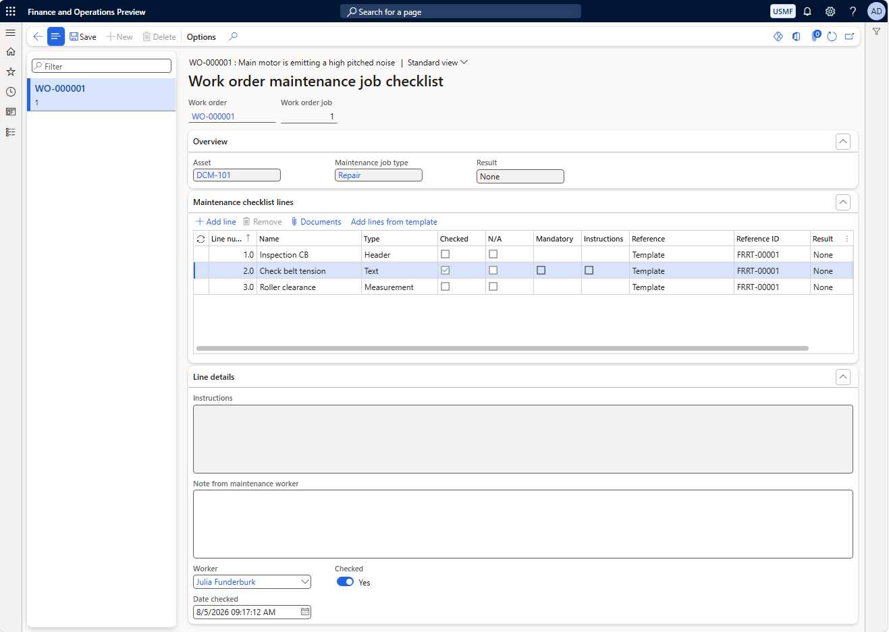

# Maintenance checklists

[!include [banner](../../includes/banner.md)]

Set up maintenance checklists on maintenance job types. Fill in maintenance checklists as part of the process of completing a work order. For more information about how to set up maintenance checklists on maintenance job types, see [Maintenance job type categories and maintenance job types, maintenance job type variants, maintenance job trades, and maintenance checklists](../setup-for-work-orders/job-groups-and-job-types-variants-trades-and-checklists.md).

When you work with maintenance checklists on a work order, you can fill in the predefined maintenance checklists that are related to maintenance job types. You can also add more maintenance checklist lines manually or from a maintenance checklist template.

## Fill in a maintenance checklist

1. Go to **Asset management** > **Work orders** > **All work orders** or **Active work orders**.

1. Select the work order. On the Action Pane, open the **Work order** tab and, in the **Lines** group, select **Maintenance checklist**.

1. The **Work order maintenance job checklist** page shows the checklists for all work order jobs. If the work order jobs have different maintenance job types, the maintenance checklists might differ for each work order job. Select a work order job to work with the related maintenance checklist. The **Line details** FastTab shows details of the selected maintenance checklist line.

1. Complete all the maintenance checklist lines, one at a time, in the order that they appear. You complete a maintenance checklist line by filling in the fields on the **Line details** FastTab. The information that is required to complete a line can vary, depending on the line type. For example, on a line of the *Text* type, you add a note that explains the result of your check. On a line of the *Measurement* type, you enter the counter value that you read on the equipment, and you can also add a note as you require. A maintenance checklist line of the *Header* type is used as a heading to group the maintenance checklist lines that appear below it. You don't have to fill in a header. As for all other types of maintenance checklist lines, you can add a note to a line of the *Header* type.

1. If instructions are related to a maintenance checklist line, the **Instructions** check box is selected. Read instructions for the selected maintenance checklist line in the **Instructions** field on the **Line details** FastTab.

1. When you complete a maintenance checklist line, select the **Checked** check box on that line to mark it as completed. To discard a maintenance checklist line because it isn't relevant to the work order job, select the **N/A** check box on the line. If the **Mandatory** check box is selected on a maintenance checklist line, you must select either the **Checked** check box or the **N/A** check box.

>[!NOTE]
>You can only update maintenance checklist registrations if the work order is in an [Active](../setup-for-work-orders/work-order-lifecycle-states.md) lifecycle state.  

## Add a maintenance checklist line

Create maintenance checklists from the definition on the maintenance job type default. The system transfers these checklists to a work order job. Add maintenance checklist lines to a work order job as needed. Maintenance checklist lines that you manually add get the **Manual** reference.

1. On the **Work order maintenance job checklist** page, select the work order job to add a maintenance checklist for.

1. On the **Maintenance checklist lines** FastTab, select a maintenance checklist line. To insert a new line after the selected line, press the **Down arrow** key. The next number in the sequence is automatically entered in the **Line number** field. To insert a new line before the selected line, select **Add line**.

1. On the **Name** field, enter a name for the maintenance checklist line.

1. In the **Type** field, select a type for the maintenance checklist line. The **Line details** FastTab contains related fields for each maintenance checklist type.
    - *Text* – Use this type to add a maintenance checklist line that has text that describes what must be done. For example, use this type if you want a worker to check or inspect something, but you're not expecting a specific (measurable) result. After you select this type, on the **Lines details** FastTab, in the **Instructions** field, enter text that describes what must be done.
    - *Header* – Use this type as a heading to group the maintenance checklist lines that appear below it. This type is useful if you have several maintenance checklist lines that you can divide into specific areas. After you select this type, in the **Name** field, enter a descriptive name.
    - *Template* – This type isn't applicable when you manually add a maintenance checklist line on a work order job.  
    - *Variable* – Use this type to define a possible result in a range on the maintenance checklist line. For information about how to set up maintenance checklist variables, see [Maintenance job type categories and maintenance job types, maintenance job type variants, maintenance job trades, and maintenance checklists](../setup-for-work-orders/job-groups-and-job-types-variants-trades-and-checklists.md). After you select this type, in the **Name** field, enter a name to describe the variable. On the **Line details** FastTab, in the **Variable** field, select the variable. In the **Instructions** field, enter text that describes what must be done.
    - *Measurement* – Use this type to record a specific measurement on the maintenance checklist line. After you select this type, in the **Name** field, enter a name for the measurement. On the **Line details** FastTab, in the **Counter** and **Unit** fields, select appropriate values. In the **Instructions** field, enter text that describes what must be done.

1. When you finish manually adding maintenance checklist lines, fill in the lines as described in the previous section.

## Add maintenance checklist lines from a template

In addition to the maintenance checklist lines that the maintenance job type provides, you can add maintenance checklist lines directly to a work order job from a maintenance checklist template. This capability is useful when a work order requires a standard set of tasks that the maintenance job type doesn't already include. Learn more about how to create maintenance checklist templates in [Maintenance job type categories and maintenance job types, maintenance job type variants, maintenance job trades, and maintenance checklists](../setup-for-work-orders/job-groups-and-job-types-variants-trades-and-checklists.md#create-a-maintenance-checklist-template).

1. On the **Work order maintenance job checklist** page, select the work order job to add maintenance checklist lines to.

1. On the **Maintenance checklist lines** FastTab toolbar, select **Add lines from template**.

1. In the dialog box, in the **Maintenance checklist template** field, select the template that contains the lines you want to add.

1. Select **OK**. The lines from the template are appended after any existing maintenance checklist lines on the work order job, and they're assigned a **Reference** of *Template*. A message shows how many lines were added from the template.

You can add lines from more than one template, and you can combine template lines with manually added lines. The template governs maintenance checklist lines that you add from a template. As with lines that have the *Job type* reference, you can't delete template lines individually on the work order job. If a template line doesn't apply to the current work order job, select the **N/A** check box on the line to exclude it.

> [!NOTE]
> On the **Work order maintenance job checklist** page, you can only delete maintenance checklist lines that you or other maintenance workers created manually, and that have the *Manual* reference. You can't delete maintenance checklist lines that have the *Job type* reference or the *Template* reference. If one of those lines doesn't apply to the work order job, select the **N/A** check box on the line to exclude it. When you select **N/A**, the line remains on the work order for traceability, but it's excluded from the mandatory maintenance checklist validation.

The following illustration shows an example of a maintenance checklist.

[!INCLUDE[footer-include](../../../includes/footer-banner.md)]
