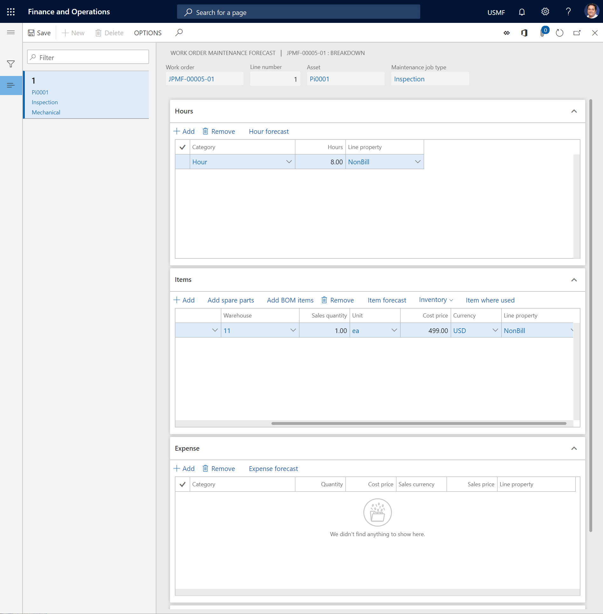
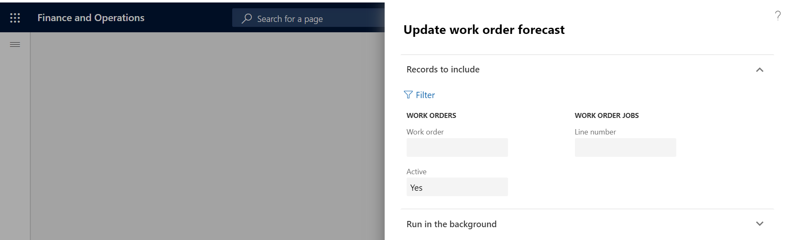

# Maintenance forecasts

[!include [banner](../../includes/banner.md)]

When you create a work order, you create work order jobs that have related assets and maintenance job types. When you select a maintenance job type that contains maintenance forecasts, the forecasts are automatically copied to the work order.

You might be able to add forecast lines to a work order or delete them from a work order. The setup of the work order lifecycle state, the related project type, and the stage rules that are related to the project type determine whether you can add or edit forecast lines. For more information about work order lifecycle states and related project stages, see [Forecasts, work orders, and projects](../integration-to-project-management-and-accounting/forecasts-work-orders-and-projects.md).

1. Select **Asset management** > **Work orders** > **All work orders** or **Active work orders**.

2. Select the work order in the list, and then, on the Action Pane > **Work order** tab > the **Project** group, select **Forecast**. The **Work order maintenance forecast** page shows forecast lines from the maintenance job type that is selected on the work order job.

## Add an hours forecast to a work order

1. On the **Work order maintenance forecast** page, select the work order job to add a forecast to.

2. On the **Hours** FastTab, select **Add** to create a new line.

3. In the **Category** field, select a category.

4. In the **Hours** field, enter the number of forecasted hours.

5. In the **Line property** field, select the type of charge that should be used on the line.

## Add an items forecast to a work order

There are three ways to add items to a work order maintenance forecast. You can create lines for items (spare parts) that aren't included on the spare parts list or the asset bill of materials (BOM), you can select spare parts from the approved spare parts list, or you can select items from the asset BOM.

- On the **Work order maintenance forecast** page, select the work order job to add a forecast to.

- On the **Items** FastTab, add items to the maintenance forecast by using the appropriate method.

To create a line for a spare part that isn't on the spare parts list or the asset BOM, follow these steps:

1. Select **Add**.
2. In the **Item number** field, select the item.
3. In the **Sales quantity** field, enter the quantity.
4. In the **Unit** field, select the unit of measure for the quantity.
5. In the **Cost price** and **Currency** fields, enter appropriate values.
6. In the **Line property** field, select a line property.
7. To change the list of dimensions that is shown on the item lines, select **Inventory** > **Display dimensions**, select the dimensions, and then set the **Save setup** option to **Yes**.

To add a spare part from an approved spare parts list, follow these steps:

1. Select **Add spare parts**.
2. Select the spare part, and edit the related information as you require.
3. Select **OK**.

To add an item from the asset BOM, follow these steps:

1. Select **Add BOM items**.
2. Select the item, and edit the related information as you require.
3. Select **OK**.

To get an overview that shows where the item on the selected line is used in relation to assets, maintenance job type defaults, spare parts, and work orders in Asset Management, select **Item where used**. For more information about this overview, see [Item where used](../controlling-and-reporting/item-where-used.md).

## Add an expense forecast to a work order

1. On the **Work order maintenance forecast** page, select the work order job to add a forecast to.

2. On the **Expense** FastTab, select **Add** to create a line.

3. In the **Category** field, select a category.

4. In the **Quantity** field, enter the quantity.

5. In the **Cost price**, **Sales currency**, and **Sales price** fields, enter appropriate values.

6. In the **Line property** field, select the type of charge that should be used on the line.

>[!NOTE]
>The **Maintenance forecast totals** FastTab shows an overview of the number of lines that have been created, for the selected work order job and for the work order, on each FastTab. It also shows the total forecasted work hours for the work order job and the work order.

The illustration below shows an example of the **Work order maintenance forecast** page.

## Automatic update of work order forecasts

If hour costs, item costs, and expenses are updated in other modules, work order forecasts in Asset Management can automatically be updated to reflect those changes. This capability helps guarantee that the latest cost prices are always used in your work order forecasts. You can also do similar updates for [maintenance job type forecasts](../setup-for-work-orders/job-groups-and-job-types-variants-trades-and-checklists.md).

1. Select **Asset management** > **Periodic** > **Forecast** > **Update work order forecast**.

2. In the **Update work order forecast** dialog, on the **Records to include** FastTab, you can add selections regarding specific work orders or work order jobs, as you require. Click **Filter** to make the relevant selections.

3. On the **Run in the background** FastTab, you can set up the automatic update as a batch job, as you require.

4. Select **OK** to start the forecast update.

The illustration below shows an example of the **Update work order forecast** dialog.

If the toggle **Update forecast** is toggled to yes when dispatching a work order, the forecast is updated with any manual changes that were made to the hours.

[!INCLUDE[footer-include](../../../includes/footer-banner.md)]
