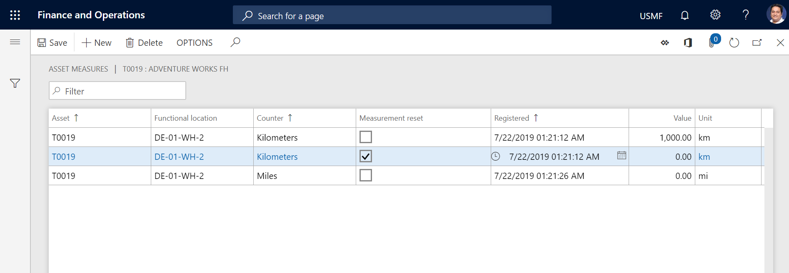

---
# required metadata

title: Manual update of asset counters
description: This topic describes manual update of asset counters in Asset Management.
author: johanhoffmann
ms.date: 10/15/2019
ms.topic: article
ms.prod: 
ms.technology: 

# optional metadata

ms.search.form: EntAssetCounter 
# ROBOTS: 
audience: Application User
# ms.devlang: 
ms.reviewer: kamaybac
# ms.tgt_pltfrm: 
ms.custom: 
ms.assetid: 
ms.search.region: Global
# ms.search.industry: 
ms.author: johanho
ms.search.validFrom: 2019-09-30
ms.dyn365.ops.version: 10.0.5

---

# Manual update of asset counters

[!include [banner](../../includes/banner.md)]

Counters are used to create registrations on an asset, such as registrations about the number of hours that the asset has been in operation or the quantity that has been produced.

The counter type that is selected for a counter might be set to inherit counter values. In other words, the **Inherit asset counter values** option is set to **Yes** on the **General** FastTab of the **Counters** page (**Asset management** > **Setup** > **Asset types** > **Counters**). In this case, when you create a new counter line of that type, every child asset that uses the same counter type is automatically updated.

On the **All assets** page, you create hours or quantity counter registrations on an asset, based on your readings on the asset.

1. Select **Asset management** > **Common** > **Assets** > **All assets**.

2. Select the asset, and then, on the Action Pane, on the **Asset** tab, in the **Preventive** group, select **Counters**. The **Asset counters** page shows a list of all previous counter registrations that have been made on the selected asset.

3. Select **New** to create a registration. The asset ID is automatically entered in the **Asset** field.

4. In the **Counter** field, select the relevant counter. Only counters that are related to the asset type selected on the asset are available for selection. The related unit is automatically entered in the **Unit** field.

5. In the **Registered** field, select the date and time for the counter registration.

6. In the **Value** field, enter the number since the last counter registration. Alternatively, in the **Aggregated value** field, enter the total count number.

Note the following points:

- If you physically install a new counter on an asset, you must register the change on the asset on the **Asset counters** page. Next, you must create two registration lines that have identical timestamps. The first line must be for the counter that you're replacing. On the line that is related to the new counter, select the **Counter reset** check box. In the **Totals** field, the total count number is the sum of the counter totals of all registered values on that counter type.

- If the **Counter reset** check box is selected on an asset using a maintenance plan that has a "Once from..." or "Once reached..." interval type, the counter is still active on the new counter line, because you create a separate counter line and start over with a new counter.

The illustration below shows an example of the **Asset counters** page.

On the **Asset counters** page (**Asset management** > **Inquiries** > **Assets** > **Asset counters**), you can make counter registrations on several assets at the same time, as you require.

>[!NOTE]
>You can set up a range to define deviations in manual counter registrations. You can also specify the type of message that is shown if registrations are outside the defined range. For more information about how to set up counters, see [Counters](../setup-for-objects/counters.md).

[!INCLUDE[footer-include](../../../includes/footer-banner.md)]