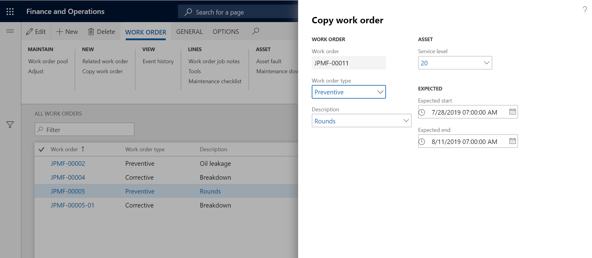
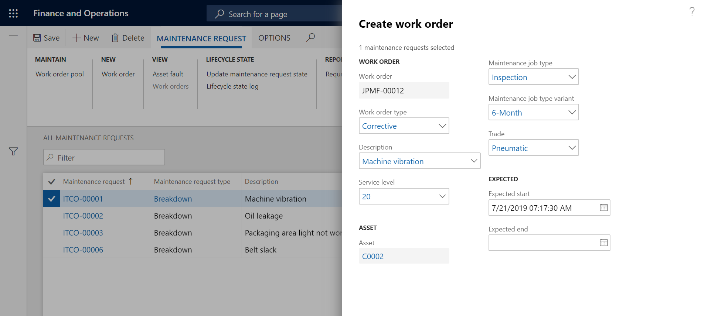

# Manually created work orders

[!include [banner](../../includes/banner.md)]

You can create work orders manually in two ways:

- On the **All work orders** or **Active work orders** page 
- On the **All maintenance requests** or **Active maintenance requests** or **My functional location maintenance requests** page 

## Create work order

1. Selece **Asset management** > **Work orders** > **All work orders** or **Active work orders**.

2. Select **New**.

3. In the **Create work order** dialog, select a work order type in the **Work order type** field.

4. If required, select a **Description**.

5. In the **Asset** field, select the asset.

>[!NOTE]
>When you select an asset, three tabs might be available in the **Asset** drop-down: 

- **Active assets** - This tab contains a list of all assets that have an "Active" asset lifecycle state. 
- **Asset view** - This tab displays a tree view of functional locations and the assets installed on them.
- **My assets** - This tab contains assets that are related to the functional locations that you (the worker who is signed in to the system) may be allocated to. (For information about the setup, see [Maintenance workers and worker groups](../setup-for-objects/workers-and-worker-groups.md).) If no functional locations are set up on a worker in [Maintenance workers and worker groups](../setup-for-objects/workers-and-worker-groups.md), the **My assets** tab isn't available. 

6. In the **Maintenance job type** field, select a maintenance job type for the work order.

7. If required, select **Maintenance job type variant** and **Trade**.

8. If required, you can change the work order service level in the **Service level** field.

9. Select **Expected start** and **Expected end** dates in the related fields.

10. Click **OK** to create the work order.

11. On the **All work orders** list page, you can edit the work order as you require.

Note the following points:

- In the details view on the **All work orders** list page, you can add several assets to a work order by adding lines on the **Work order maintenance jobs** FastTab. On an asset, you can select only the maintenance job types that are defined on the asset type that is selected on the asset.  

- If you change an asset service level or an asset criticality after you've used the asset on a work order, the service level or criticality on the work order isn't updated accordingly. For more information about service levels and criticalities, see [Asset service levels](../setup-for-objects/object-priorities.md) and [Asset criticality types](../setup-for-objects/object-criticalities.md).

- Criticality on a work order is recalculated every time a work order job is added to or deleted from the work order.

- In the **All work orders** details view > **Header** tab > **Schedule** FastTab, in the **Responsible group** or **Responsible** field, you can select a responsible maintenance worker group or a responsible maintenance worker. These settings can be changed while the work order is active. For example, they can be changed when the work order lifecycle state changes. The automatic selection that is made during work order creation is based on the setup on the **Responsible maintenance workers** page. If you add or remove work order jobs after you've created a work order, and if the **Responsible group** and **Responsible** fields are blank when you update the work order, Asset Management tries to find a responsible maintenance worker group or a responsible maintenance worker for a possible match on the setup page. If the **Responsible group** or **Responsible** field is already set when you update the work order, no changes are made. For more information about responsible maintenance workers and worker groups, see [Responsible maintenance workers](../setup-for-maintenance-requests/responsible-workers.md).

- From the [Maintenance status](../controlling-and-reporting/maintenance-status.md) page, you can do a calculation to get an overview of the workload for incoming and completed work orders.  

- In the details view of the **All work orders** page, on the **Line details** FastTab, you can use the **Latitude** and **Longitude** fields to add geographic coordinates for the asset that is selected on the work order job.  

## Create related work order

You can create a work order that is related to an existing work order. This capability is useful if, for example, you want to work with primary and secondary work orders. A new work order is based on a work order job from an existing work order.

1. Select **Asset management** > **Work orders** > **All work orders** or **Active work orders**.

2. Select the work order to create a related work order for.

3. On the Action Pane, on the **Work order** tab, in the **New** group, select **Related work order**.

4. In the **Create related work order** dialog, in the **Work order job** field, select the work order job to create a related work order for.

5. Select a maintenance job type in the **Maintenance job type** field.

6. Select a related maintenance job type variant and trade in the **Maintenance job type variant** and **Trade** fields, as you require.

7. If this work order is the first related work order that has been created for the selected work order, follow these steps:
    1. Select the **New work order** option.
    2. In  the **Work order type** field, select a work order type.
    3. In the **Description**, enter a description.
    4. In the **Service level** field, change the work order service level as you require.
    5. In the **Expected start** and **Expected end** fields, select the expected start and end dates.
    6. Select **OK**. The new related work order is shown on the **All work orders** list page.  

8. If the work order that you're creating this related work order for already has related work orders, follow these steps to add a new work order job to an existing related work order:
    1. Select the **Add to related work order** option.
    2. In the **Work order** field, select the related work order to add a new work order job to.
    3. In the **Service level** field, change the work order service level as you require.
    4. In the **Expected start** and **Expected end** fields, change the expected start and end dates as you require.
    5. Select **OK**. The work order job is added to the existing related work order.

The illustration below shows an example of the **Create related work order** dialog.

>[!NOTE]
>If you've set up a related work order mask in **Asset management parameters** > **Work orders** tab > **Related work order mask** field, work order IDs are created according to the mask setup. If no related work order mask is set up, the next available work order ID is used for related work orders.

## Copy a work order

You can quickly create a new work order from an existing work order. This way of working with work orders differs from the creation of work orders based on [maintenance plans](../preventive-and-reactive-maintenance/maintenance-plans.md). It's useful if, for example, a work order contains many work order jobs, and the various jobs should be completed on different assets at regular intervals.

1. Select **Asset management** > **Work orders** > **All work orders** or **Active work orders**.

2. Select the work order to copy content from.

3. On the Action Pane > **Work order** tab > **New** group, select **Copy work order**.

4. The work order setup from the selected work order is shown. You can edit some of the fields as you require.

5. Select **OK** to create the new work order.

6. On the **All work orders** list page, you can edit the work order as you require.

>[!NOTE]
>When the new work order is created, some information is copied directly from the existing work order. Information about forecasts, tools, maintenance checklists, functional location, addresses, and scheduling isn't copied. Instead, it's initialized from the current setup in Asset Management. Therefore, if that information was changed between the time when the first work order was created and the time when you made a copy of the work order, the changes are included in the new work order. Examples include changes to forecasts and updates to maintenance checklists.

The illustration below shows an example of the **Copy work order** dialog.

## Create a work order based on a maintenance request

1. Select **Asset management** > **Maintenance requests** > **All maintenance requests** or **Active maintenance requests**.

2. Select the maintenance request to create a work order for, and click **Edit**.

3. On the Action Pane > **Maintenance request** tab > **New** group, select **Work order**.

4. In the **Work order** dialog, set the fields. If a maintenance job type has been selected in the maintenance request, you can select a different maintenance job type when you create the work order, as you require.

5. Select **OK**. A message notifies you that the work order has been created.

6. To view the work orders that are connected to a maintenance request, on the **All maintenance requests** or **Active maintenance requests** list page, select the maintenance request. Then, on the Action Pane, on the **Maintenance request** tab, in the **View** group, select **Work orders**.

The illustration below shows an example of the **Create work order** dialog.

>[!NOTE]
>If you want work orders to be created automatically, you can schedule maintenance plan jobs, or you can set up "Auto create" [maintenance plans](../preventive-and-reactive-maintenance/maintenance-plans.md) or [maintenance rounds](../preventive-and-reactive-maintenance/maintenance-rounds.md) on an asset. Work orders that are created from maintenance requests on the **All maintenance schedule** list page have the maintenance job types that are selected on the maintenance requests.

[!INCLUDE[footer-include](../../../includes/footer-banner.md)]