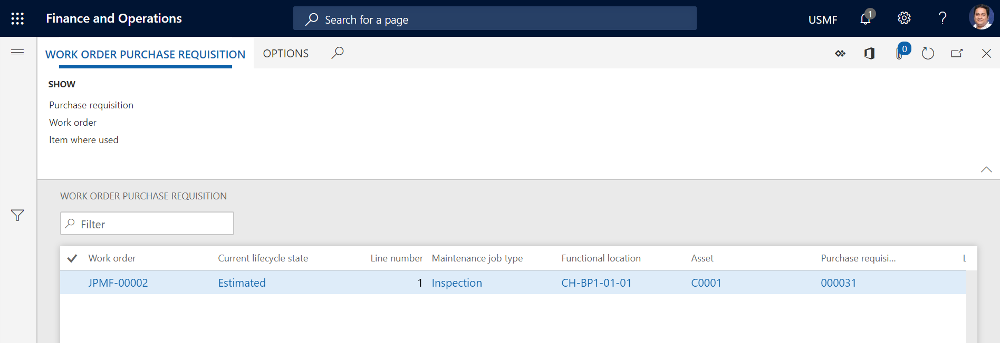
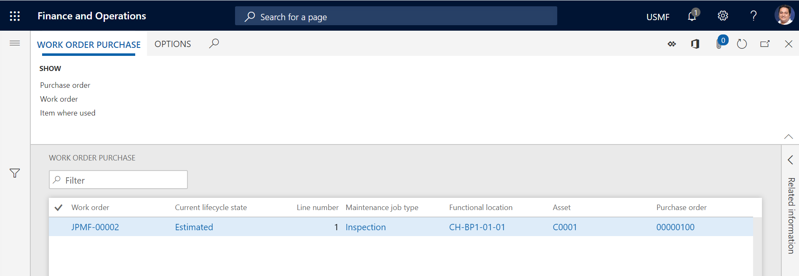
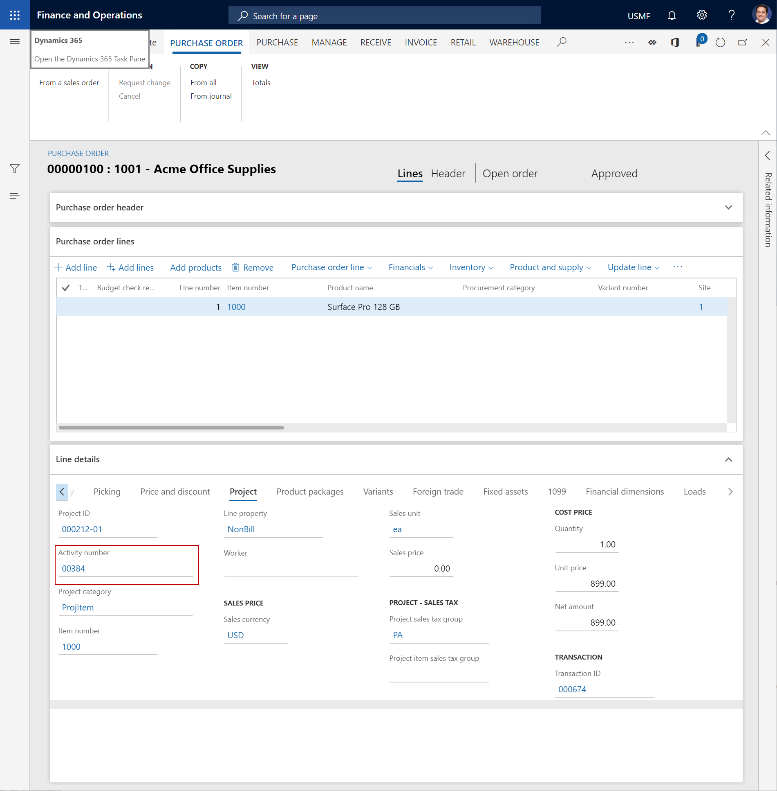

# Procurement

[!include [banner](../../includes/banner.md)]

In Asset Management, you can get an overview of purchase requisitions and purchase orders that are related to work orders. You can also create a purchase order or a purchase requisition from a work order.

The **Work order purchase requisition** list page (**Asset management** > **Procurement** > **Work order purchase requisition**) shows a list of purchase requisitions that are related to work orders. When you select a work order job on this page, you can use the buttons in the **Show** group on the **Work order purchase requisition** Action Pane tab to perform various actions:

- To open the related purchase requisition, select **Purchase requisition**. 
- To open the related work order, select **Work order**.
- To get an overview that shows where the item on the selected line is used in relation to assets, maintenance job type defaults, spare parts, and work orders in Asset Management, select **Item where used**. For more information about this overview, see [Item where used](../controlling-and-reporting/item-where-used.md).

The illustration below shows an example of the **Work order purchase requisition** list page.

The **Work order purchase** list page (**Asset management** > **Procurement** > **Work order purchase**) shows a list of purchase orders that are related to work orders. When you select a work order job on this page, you can use the buttons in the **Show** group on the **Work order purchase** tab of the Action Pane to perform various actions:

- To open the related purchase order, select **Purchase order**. 
- To open the related work order, select **Work order**.
- To get an overview that shows where the item on the selected line is used in relation to assets, maintenance job type defaults, spare parts, and work orders in Asset Management, select **Item where used**. For more information about this overview, see [Item where used](../controlling-and-reporting/item-where-used.md).

The illustration below shows an example of the **Work order purchase** list page.

On both the **Work order purchase** list page and the **Work order purchase requisition** list page, a symbol that is related to delivery date control appears on the right side of each line. If the symbol is an exclamation point in a red circle, delivery of the related purchase order or purchase requisition might be delayed.

For a purchase order, the date that is related to the purchase order line is used to calculate a possible delay. To view this date, on the **Purchase order** page, select the purchase order line. The date is shown in the **Confirmed delivery date** field on the **Setup** tab of the **Line details** FastTab. If the **Confirmed delivery date** field isn't set, the date in the **Delivery date** field on the **Purchase order header** FastTab is used for the calculation. One of those dates is compared to the available date on the work order or work order job, in the following order:

1. Actual start date on the work order  

2. Scheduled start date on the related work order job 

3. Scheduled start date on the work order 

4. Expected start date on the work order 

For a purchase requisition, the date in the **Requested date** field on the **Purchase requisition header** FastTab of the **Purchase requisitions** page is used to calculate a possible delay. The date in that field is compared to the available date on the work order or work order job, in the same order that is used for a purchase order.

## Create a purchase order from a work order

On the **All work orders** list page, you can select a work order job, and then create a related purchase order or a related purchase requisition. In this way, you help guarantee that project relations exist between the purchase order or purchase requisition and the work order.

1. Select **Asset management** > **Work orders** > **All work orders** or **Active work orders**.

2. Select the work order to create a purchase order for, and then select **Edit**.

3. On the **Work order maintenance jobs** FastTab, select the work order job to create the purchase order for.

4. Select **Item tasks** > **Purchase order from work order job**.

5. On the **Project purchase orders** list page, click **New**.

6. Create the purchase order.

>[!NOTE]
>To create a related purchase requisition, follow the same steps. However, select **Item tasks** > **Purchase requisition from work order job** in step 4.

## Project relation between work order and purchase order or purchase requisition

A purchase order line or purchase requisition line is related to a work order job via the work order project and the related project activity number. When you create a purchase order or purchase requisition from a work order job, the related project activity number is mandatory. If all the work order jobs in the related work order have the same maintenance job type, the project activity number is automatically entered on the purchase order or purchase requisition. If the work order jobs have different maintenance job types, you must manually enter the project activity number on the purchase order or purchase requisition.

To view or enter the activity number that is related to a purchase order line, on the **Work order purchase** list page, select the purchase order record, and then, in the **Purchase order** column, select the link for the purchase order. You can find the **Activity number** field on the **Project** tab of the **Line details** FastTab.

The illustration below shows an example of the **Purchase order** page, with focus on the **Activity number**.

Likewise, to view or enter the activity number that is related to a work order purchase requisition line, on the **Work order purchase requisition** list page, select the purchase requisition record, and then, in the **Purchase requisition** column, select the link for the purchase requisition. You can find the **Activity number** field on the **Project** tab of the **Line details** FastTab.

[!INCLUDE[footer-include](../../../includes/footer-banner.md)]