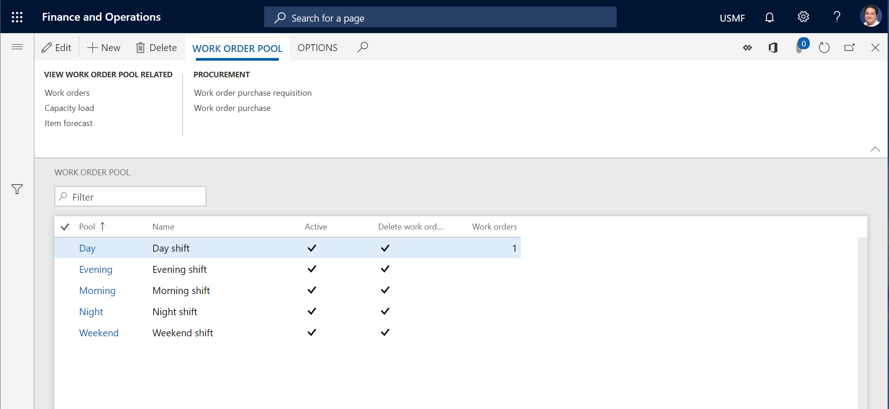

# Work order pools

[!include [banner](../../includes/banner.md)]

You can use work order pools to group work orders that have something in common. Here are some examples of things that you can create  work order pools for:

- Work crews, for example, Maintenance Crew A or Maintenance Crew B  

- Professional skills, such as electricians or plumbers  

- Physical locations  

- Time schedules, such as weeks or other periods  

As you require, you can put one work order in multiple work order pools.

## Create a work order pool

On the **All work order pools** or **Active work order pools** list page, you can get an overview of your work order pools and create new pools.

1. Select **Asset management** > **Work order pools** > **All work order pools** or **Active work order pools**.

2. Select **New**.

3. In the **Pool** field, enter an ID for the work order pool.

4. the **Name** field, enter a name.

5. Set the **Active** option to **Yes** to indicate that the work order pool is active.

6. Set the **Delete work order relations** option to **Yes** if work orders should automatically be removed from the work order pool.

7. In the **Delete lifecycle state** field, select the work order lifecycle state. For example, the work order lifecycle state for completing a work order could be set to automatically delete relations to work order pools.

    You can start adding work orders to your work order pool right away.

8. On the **Work orders** FastTab, select **Add line**.

9. In the **Work order** field, select a work order. The related fields are automatically updated.

10. Repeat steps 8 through 9 to add more work orders.

11. If the work orders that you added should be done in a specific order, in the **Sort order** field, you can enter the numbers **1**, **2**, **3**, and so on, to specify that order.

12. To view a list of all the work orders that are included in the work order pool, on the Action Pane, on the **Work order pool** tab, in the **View work order pool related** group, select **Work orders** to open the **All work orders** list page.

13. To calculate and view capacity load for the maintenance schedule, unscheduled work orders, and scheduled work orders, on the Action Pane, on the **Work order pool** tab, in the **View work order pool related** group, select **Capacity load** to open the **Calculate capacity load** dialog.

14. To calculate and view forecasts for items (spare parts and other required items) that are related to maintenance schedule, unscheduled work orders, and scheduled work orders, on the Action Pane, on the **Work order pool** tab, in the **View work order pool related** group, select **Item forecast** to open the **Calculate item forecast** dialog.

15. To view a list of purchase requisitions that are related to the work orders in the work order pool, on the Action Pane, on the **Work order pool** tab, in the **Procurement** group, select **Work order purchase requisition** to open the **Work order purchase requisition** list page.

16. To view a list of purchase orders that are related to the work orders in the work order pool, on the Action Pane, on the **Work order pool** tab, in the **Procurement** group, select **Work order purchase** to open the **Work order purchase** list page.

>[!NOTE]
>When a work order pool is no longer relevant to your work planning, set the **Active** option for that pool to **No** in the list view of the **Work order pool** page.

To delete all worker order lines, set the **Delete work order relations** option to **Yes**. This option is useful if, for example, you want to create an empty pool that you can use later for other work orders. When you're ready to use the work order pool to create new work order relations later, remember to set the **Delete work order relations** option to **No**.

The illustration below shows an example of the **Work order pool** list page.

## Add a work order to a work order pool

As described in the previous section, you can add work orders to a work order pool when you create that pool. You can also add work orders to a work order pool on the **All work orders** or **Active work orders** list page.

1. Select the work order, and then, on the Action Pane, on the **Work order** tab, in the **Maintain** group, select **Work order pool**.

2. Select the work order in the list, and click **Work order pool**.

3. In the **Maintain work order pool** dialog, in the **Add/remove** field, select **Add**.

4. In the **Pool** field, select the work order pool.

5. Select **OK**.

6. To put the work order that you added in a specific order in the work order pool, on the **All work order pools** or **Active work order pools** list page, select the pool, and then select **Edit**. Then, on the **Work order pool** page, on the **Work orders** FastTab, use the **Sort order** field to adjust the sort order of the work orders that are included in pool.

To remove a work order from a work order pool, repeat these steps, but select **Remove** in step 3.

[!INCLUDE[footer-include](../../../includes/footer-banner.md)]