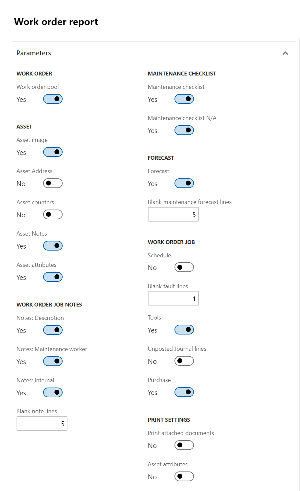
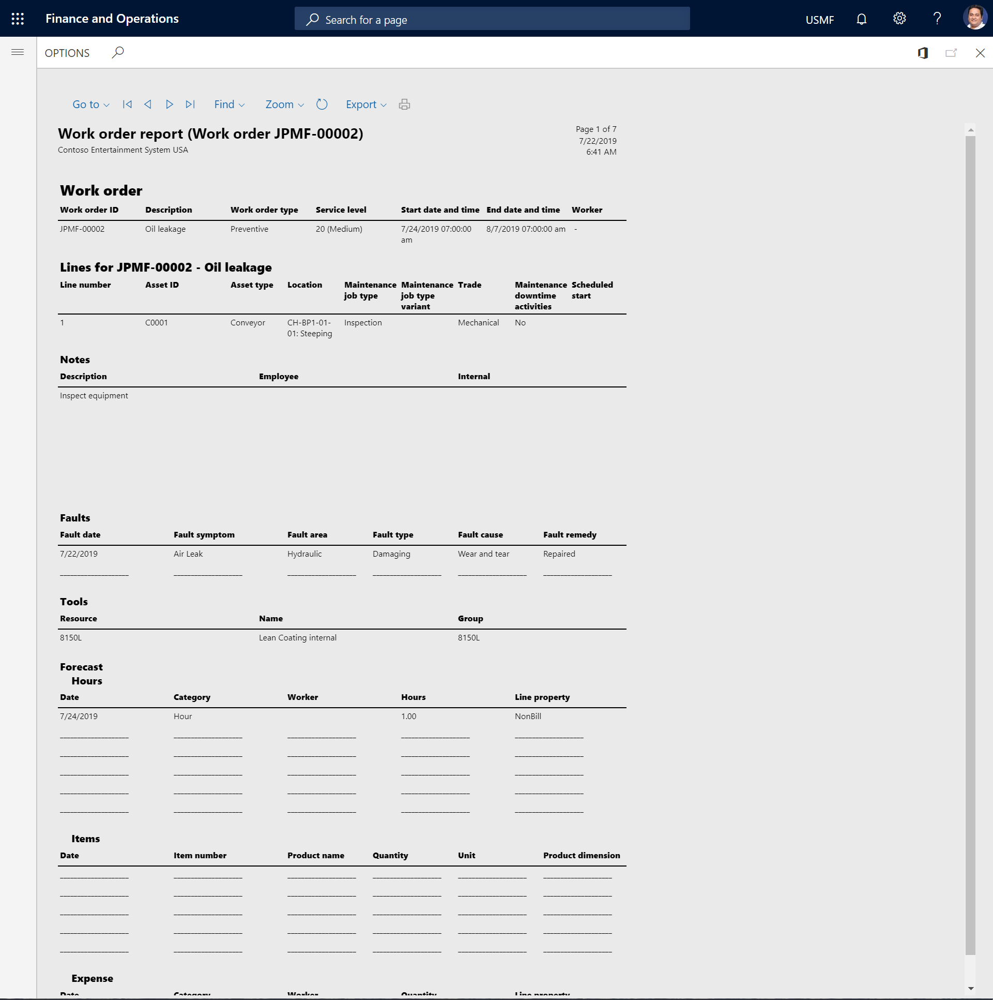

---
# required metadata

title: Work order report
description: This topic describes work order reports in Asset Management.
author: johanhoffmann
ms.date: 10/15/2019
ms.topic: article
ms.prod: 
ms.technology: 

# optional metadata

ms.search.form: 
# ROBOTS: 
audience: Application User
# ms.devlang: 
ms.reviewer: kamaybac
# ms.tgt_pltfrm: 
ms.custom: 
ms.assetid: 
ms.search.region: Global
# ms.search.industry: 
ms.author: johanho
ms.search.validFrom: 2019-09-30
ms.dyn365.ops.version: 10.0.5

---

# Work order report

[!include [banner](../../includes/banner.md)]

You can generate a work order report that shows detailed information about one or more work orders that you select.

1. Select **Asset management** > **Reports** > **Work orders** > **Work order report**.

2. Select "Yes"/"No" on the toggle buttons as you require, to determine the details to be included in the report.  
    - In the **Print settings** section, you can select whether to include attachments from the setup of the related maintenance job type.

3. On the **Records to include** FastTab, you can filter the contents of the report by **Work order**.

4. On the **Run in the background** FastTab, you can set up generation of the work order report as a batch job, as you require.

5. Select **OK** to generate the report.

The following illustration shows an example of how the report parameters can be set up.

The following illustration shows an example of a work order report that is generated based on that setup.

[!INCLUDE[footer-include](../../../includes/footer-banner.md)]