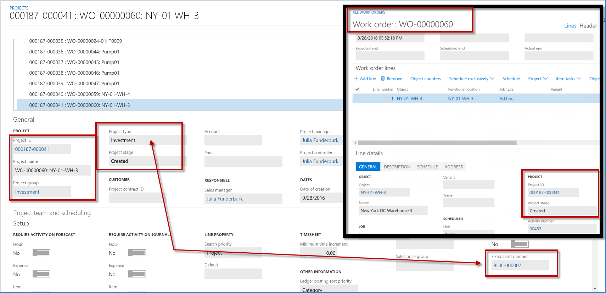
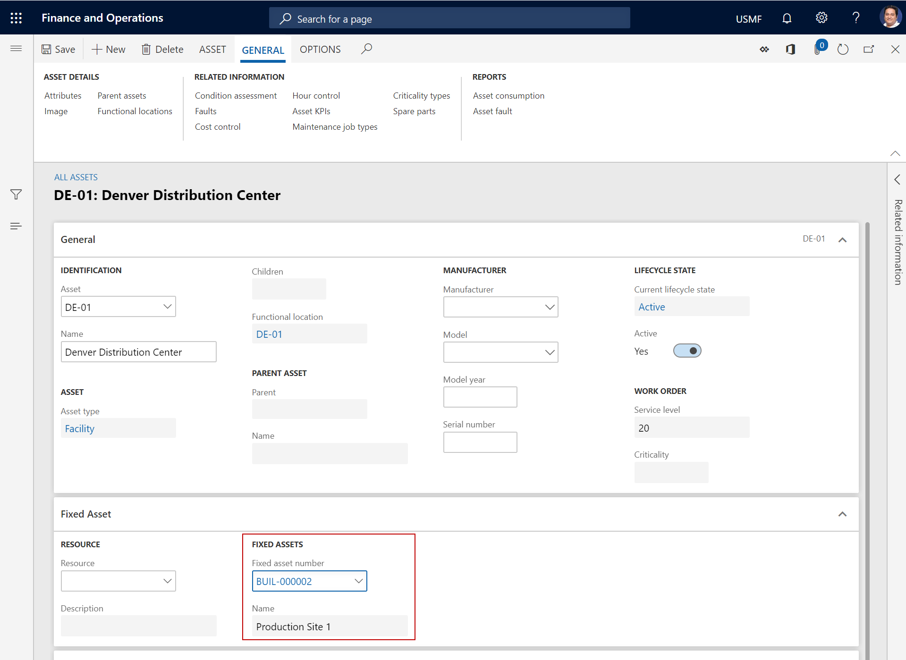
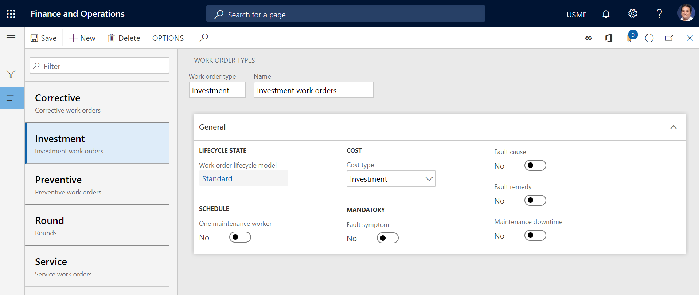
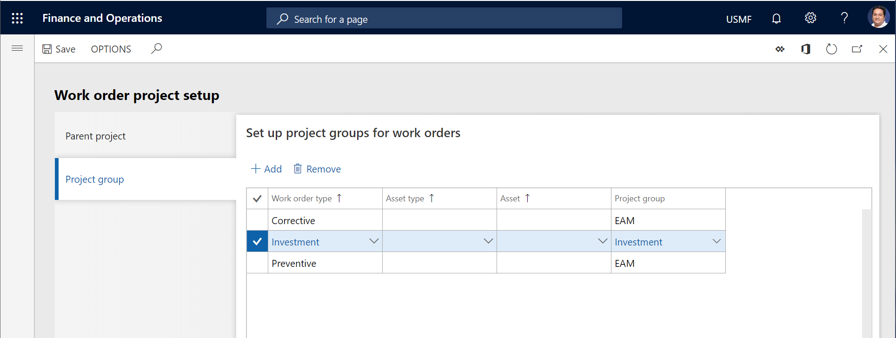
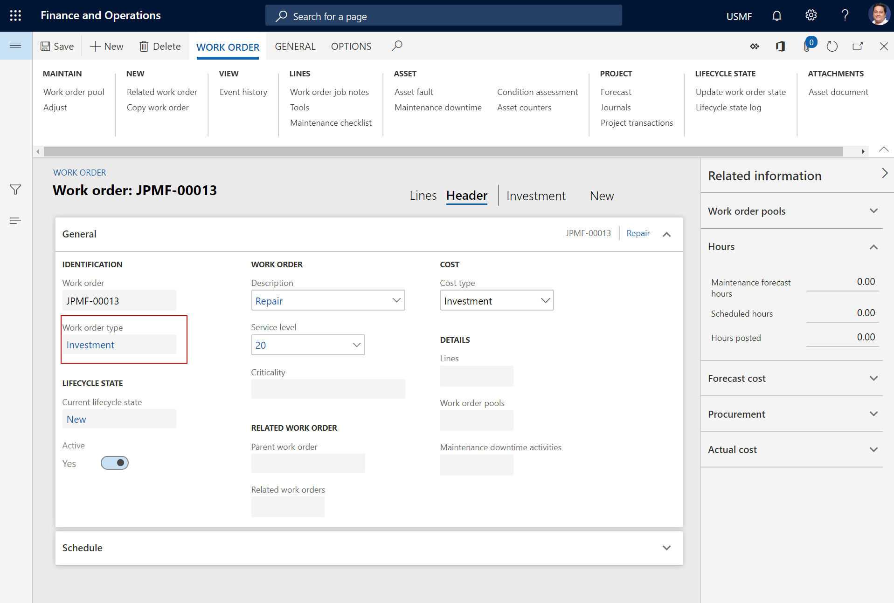
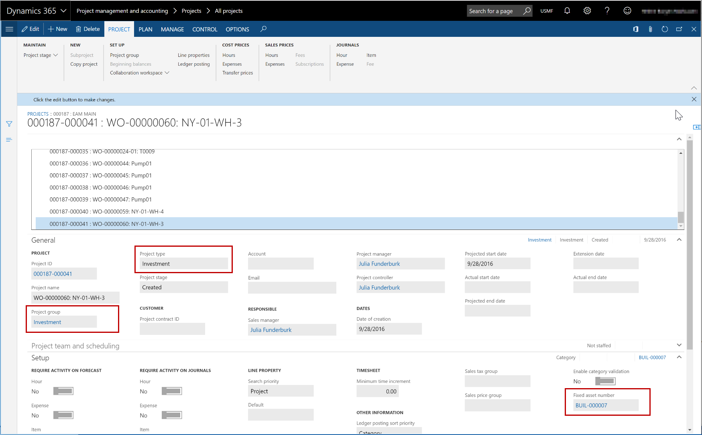

# Work orders and fixed assets

[!include [banner](../../includes/banner.md)]

In Asset Management, assets can be related to fixed assets, and you can create work orders for those assets. If you use this functionality, you can get a complete overview of fixed assets, related investment projects, and the costs that are registered on the investment projects in the **Project management and accounting** and **Fixed assets** modules in the finance and operations apps.

>[!NOTE]
>The **Fixed asset number** field on the work order job project is set only if **Investment** is selected as the project type on the work order job project.

The illustration below shows the relation between an investment project in the **Project management and accounting** module and a work order job project.

The following procedure describes the relation between assets, work orders, work order job projects, and fixed assets.

1. You create an asset that you relate to a fixed asset.

2. When you set up work order types on the **Work order types** page (**Asset management** > **Setup** > **Work orders** > **Work order types**), you create a work order type for handling investments. Learn more in [Work order types](../setup-for-work-orders/work-order-types.md).

3. When you set up work order project groups on the **Project group** tab of the **Work order project setup** page (**Asset management** > **Setup** > **Work orders** > **Project setup**), you create a relation between the work order type that is used for investments and the project group that was created for investments on the **Project groups** page in the **Project management and accounting** module (**Project management and accounting** > **Setup** > **Posting** > **Project groups**).

4. When you create a work order that is related to a fixed asset, you select the work order type that is used to handle investments, such as **Investment**.

5. When the work order is created, the related work order type is shown on the **All work orders** page.

6. When the work order is created, the project that is related to the work order is created on the **All projects** page in the **Project management and accounting** module (**Project management and accounting** > **Projects** > **All projects**). To view project-related information, select the link in the **Project ID** field on the **General** tab on the **Line details** FastTab in the details view of the **All work orders** page in the **Asset management** module (**Asset management** > **Commom** > **Work orders** > **All work orders**).

7. To see an overview of the projects associated with a fixed asset, select **Fixed assets** > **Fixed assets** > **Fixed assets**, and then, in the **Fixed asset number** field, select the link for the fixed asset to open the details view. Expand the **Related information** pane on the right side of the page, and select the **Associated projects** FastTab.

[!INCLUDE[footer-include](../../../includes/footer-banner.md)]
