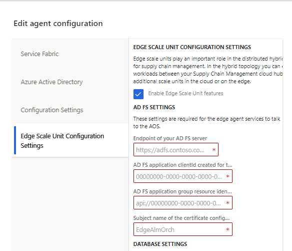
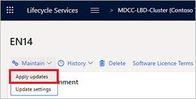
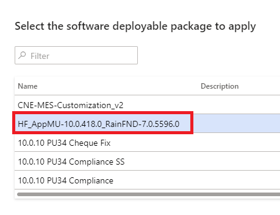

# Deploy edge scale units on custom hardware using LBD

[!include [banner](../includes/banner.md)]

Edge scale units play an important role in the distributed hybrid topology for supply chain management. In the hybrid topology you can distribute workloads between your Supply Chain Management cloud hub and additional scale units in the cloud or on the edge.

Edge scale units can be deployed by creating a local business data (LBD) [on-premises environment](../../fin-ops-core/dev-itpro/deployment/on-premises-deployment-landing-page.md) and then configuring it to function as a scale unit in your distributed hybrid topology for supply chain management. This is achieved by associating the on-premises LBD environment with a Supply Chain Management environment in the cloud, which has been configured to function as a hub.  

This topic describes how to set up an on-premises LBD environment as an edge scale unit and then associate it with a hub.

## Infrastructure considerations

Edge scale units run on on-premises environments, so the infrastructure requirements are quite similar. However, there are certain differences that should be noted:

- Edge scale units do not use Financial Reporting, so they do not require Financial Reporting nodes.
- The manufacturing and warehousing workloads are not compute-intensive, so consider sizing your compute power for AOS nodes accordingly.

## Deployment overview

Here is an overview of the deployment steps.

1. **Enable an LBD slot in your LBD project in Microsoft Dynamics Lifecycle Services (LCS).**

1. **Set up and deploy an LBD environment with an *empty* database.**

    Use LCS to deploy the LBD environment with the latest topology and an empty database. For more information, see the [Setup and deploy an LBD environment with empty database](#set-up-deploy) section later in this topic. You must use Supply Chain Management version 10.0.21 or later across hub and scale unit environments.

1. **Upload target packages into LBD project assets in LCS.**

    Prepare application, platform, and customization packages that you use across the hub and the edge scale unit. For more information, see the [Upload target packages into LBD project assets in LCS](#upload-packages) section later in this topic.

1. **Service the LBD environment with the target packages.**

    This step ensures that the same build and customizations are deployed on the hub and the spoke. For more information, see the [Service the LBD environment with target packages](#service-target-packages) section later in this topic.

1. **Complete the scale unit configuration and workload assignment.**

    For more information, see the [Assign your LBD edge scale unit to a hub](#assign-edge-to-hub) section later in this topic.

The remaining sections of this topic provide more details about how to complete these steps.

## <a name="set-up-deploy"></a>Set up and deploy an LBD environment with an empty database

This step creates a functional LBD environment. However, the environment doesn't necessarily have the same application and platform versions as the hub environment. Additionally, it's still missing the customizations, and it hasn't yet been enabled to work as a scale unit.

1. Follow the instructions in [Setup and deploy on-premises environments (Platform update 41 and later)](../../fin-ops-core/dev-itpro/deployment/setup-deploy-on-premises-pu41.md). You must use Supply Chain Management version 10.0.21 or later across hub and scale unit environments. Additionally, you must use version 2.12.0 or later of the infrastructure scripts. 

    > [!IMPORTANT]
    > Read the rest of this section **before** you complete the steps in that topic.

1. Before you describe your configuration in the infrastructure\\ConfigTemplate.xml file, run the following script:

    ```powershell
    .\Configure-ScriptsForEdgeScaleUnits.ps1 -ConfigurationFilePath .\ConfigTemplate.xml
    ```

    > [!NOTE]
    > This script will remove any configuration that is not needed for deploying edge scale units.

1. Set up a database that contains empty data, as described in [Configure databases](../../fin-ops-core/dev-itpro/deployment/setup-deploy-on-premises-pu41.md#configuredb). Use the empty data.bak file for this step.
1. After you've completed the [Configure databases](../../fin-ops-core/dev-itpro/deployment/setup-deploy-on-premises-pu41.md#configuredb) step, run the following script to configure the Scale Unit Alm Orchestrator database.

    > [!NOTE]
    > Don't configure the Financial Reporting database during the [Configure databases](../../fin-ops-core/dev-itpro/deployment/setup-deploy-on-premises-pu41.md#configuredb) step.

    ```powershell
    .\Initialize-Database.ps1 -ConfigurationFilePath .\ConfigTemplate.xml -ComponentName EdgeScaleUnit
    ```

    The Initialize-Database.ps1 script performs the following actions:

    1. Create an empty database that is named **ScaleUnitAlmDb**.
    2. Map the users to database roles, based on the following table.

        | User            | Type | Database role |
        |-----------------|------|---------------|
        | svc-LocalAgent$ | gMSA | db\_owner     |

1. Continue to follow the instructions in [Setup and deploy on-premises environments (Platform update 41 and later)](../../fin-ops-core/dev-itpro/deployment/setup-deploy-on-premises-pu41.md).
1. After you've completed the [Configure AD FS](../../fin-ops-core/dev-itpro/deployment/setup-deploy-on-premises-pu41.md#configuredb) step, follow these steps:

    1. Create a new Active Directory Federation Services (AD FS) application that will enable the Alm Orchestration service to communicate with your Application Object Server (AOS).

        ```powershell
        # Host URL is your DNS record\host name for accessing the AOS
        .\Create-ADFSServerApplicationForEdgeScaleUnits.ps1 -ConfigurationFilePath .\ConfigTemplate.xml -HostUrl 'https://ax.d365ffo.onprem.contoso.com'
        ```

    1. Create a new Azure Active Directory (Azure AD) application that will enable the Alm Orchestration service to communicate with the Scale Unit Management service.

        ```powershell
        # Example .\Create-SumAADApplication.ps1 -ConfigurationFilePath ..\ConfigTemplate.xml -TenantId '6240a19e-86f1-41af-91ab-dbe29dbcfb95' -ApplicationDisplayName 'EdgeAgent-SUMCommunication-EN01'
        .\Create-SumAADApplication.ps1 -ConfigurationFilePath '<Path of the ConfigTemplate.xml file>' `
                                       -TenantId '<ID of the tenant where your cloud hub is deployed>' `
                                       -ApplicationDisplayName '<Whichever name you want the Azure AD app to have>'
        ```

1. Continue to follow the instructions in [Setup and deploy on-premises environments (Platform update 41 and later)](../../fin-ops-core/dev-itpro/deployment/setup-deploy-on-premises-pu41.md). When you must enter the configuration for the local agent, make sure that you enable the Edge Scale Unit Features and provide all required parameters.

    

1. Before you deploy your environment from LCS, set up the pre-deployment script. For more information, see [Local agent pre-deployment and post-deployment scripts](../../fin-ops-core/dev-itpro/lifecycle-services/pre-post-scripts.md).

    1. Copy the Configure-CloudAndEdge.ps1 script from the **ScaleUnit** folder in **Infrastructure Scripts** to the **Scripts** folder in the agent file storage share that was set up in the environment. A typical path is \\\\lbdiscsi01\\agent\\Scripts.
    2. Create the **PreDeployment.ps1** script that will invoke the scripts by using the required parameters. The pre-deployment script must be put in the **Scripts** folder in the agent file storage share. Otherwise, it can't be run. A typical path is \\\\lbdiscsi01\\agent\\Scripts\\PreDeployment.ps1.

        The contents of the PreDeployment.ps1 script will resemble the following example.

        ```powershell
        $agentShare = '\\lbdiscsi01\agent'
        
        Write-Output "AgentShare is set to $agentShare" 
        . $PSScriptRoot\Configure-CloudAndEdge.ps1 -AgentShare $agentShare -InstanceId '@A'
        ```

        > [!NOTE]
        > The InstanceId parameter should be only two characters. The first character is @ and the second can be any capital letter in the English alphabet.
        >
        > - Valid values:
        >   - @D
        >   - @X
        > - Not valid values:
        >   - @a
        >   - @4
        >   - @#

1. Deploy the environment by using the latest base topology that is available.
1. After your environment is deployed, follow these steps:

    1. Run the following SQL commands on your business database (AXDB).

        ```sql
        ALTER TABLE dbo.NUMBERSEQUENCETABLE ENABLE CHANGE_TRACKING WITH (TRACK_COLUMNS_UPDATED = ON)
        delete from NumberSequenceTable
        delete from NumberSequenceReference
        delete from NumberSequenceScope
        delete from FeatureManagementMetadata
        delete from FeatureManagementState
        delete from SysFeatureStateV0
        ```

    1. Increase concurrent maximum batch session to a value that is more than 4.

        ```sql
        Update batchserverconfig set maxbatchsessions = '<Replace with number of concurrent batch tasks you want>'
        ```

    1. Verify that change tracking has been enabled on your business database (AXDB).

        1. Open SQL Server Management Studio (SSMS).
        1. Select and hold (or right-click) your business database (AXDB), and then select **Properties**.
        1. In the window that appears, select **Change Tracking**, and then set the following values:

            - **Change Tracking:** *True*
            - **Retention Period:** *7*
            - **Retention Units:** *Days*
            - **Auto Cleanup:** *True*

    1. Add the AD FS application ID that you created earlier (by using the Create-ADFSServerApplicationForEdgeScaleUnits.ps1 script) to the Azure AD applications table in your scale unit. You can manually complete this step through the user interface (UI). Alternatively, you can complete it through the database by using the following script.

        ```sql
        DECLARE @ALMOrchestratorId NVARCHAR(76) = '<Replace with the ADFS Application ID created in a previous step>';

        IF NOT EXISTS (SELECT TOP 1 1 FROM SysAADClientTable WHERE AADClientId = @ALMOrchestratorId)
        BEGIN
            INSERT INTO SysAADClientTable (AADClientId, UserId, Name, ModifiedBy, CreatedBy)
            VALUES (@ALMOrchestratorId, 'ScaleUnitManagement', 'Scale Unit Management', 'Admin', 'Admin');
        END
        ```

## <a name="set-up-keyvault"></a>Set up an Azure key vault and an Azure AD application to enable communication between scale units

1. After your environment is deployed, create an additional Azure AD application to enable trusted communication between your hub and scale unit.

    ```powershell
    .\Create-SpokeToHubAADApplication.ps1 -ConfigurationFilePath '<Path of the ConfigTemplate.xml file>' `
                                          -TenantId '<ID of the tenant where your cloud hub is deployed>' `
                                          -ApplicationDisplayName '<Whichever name you want the Azure AD app to have>'
    ```

1. After you create the application, you must create a client secret and save the information to an Azure key vault. Additionally, you must grant access to the Azure AD application that was created, so that it can retrieve the secrets that are stored in the key vault. For your convenience, the following script will automatically perform all the required actions.

    ```powershell
    .\Create-SpokeToHubAADAppSecrets.ps1 -ConfigurationFilePath '<Path of the ConfigTemplate.xml file>' `
                                         -TenantId '<ID of the tenant where your cloud hub is deployed>' `
                                         -SubscriptionName '<Any subscription within your tenant>' `
                                         -ResourceGroupName '<Any resource group within your subscription>' `
                                         -KeyVaultName '<Any key vault within your resource group>' `
                                         -Location '<Any Azure location where Azure Key Vault is available>' `
                                         -LCSEnvironmentId '<The LCS environment ID of your deployed scale unit>' `
    ```

    > [!NOTE]
    > If no key vault that has the specified **KeyVaultName** value exists, the script automatically creates one.

1. Add the Azure AD application ID that you just created (when using the Create-SpokeToHubAADApplication.ps1 script) to the Azure AD applications table in your hub. You can manually complete this step through the UI.

## <a name="upload-packages"></a>Upload target packages into LBD project assets in LCS

This step prepares the application version, platform version, and customizations that will be transitioned to your LBD scale unit environment.

1. Upload the same combined application/platform package that was applied to the hub environment into the asset library of the LCS on-premises project.
1. Get a copy of the custom deployable package that was applied to the hub environment, and upload it into the asset library of the LCS on-premises project.

## <a name="service-target-packages"></a>Service the LBD environment with target packages

This step aligns the application version, platform version, and customizations in your LBD scale unit environment with the hub.

1. Service the LBD environment with the combined application/platform package that you uploaded in the previous step.
1. Service the LBD environment with the custom deployable package that you uploaded in the previous step.

    

    

## <a name="assign-edge-to-hub"></a>Assign your LBD edge scale unit to a hub

You configure and manage your edge scale unit through the Scale Unit Management Portal. For more information, see [Manage scale units and workloads by using the Scale Unit Manager portal](./cloud-edge-landing-page.md#scale-unit-manager-portal).

[!INCLUDE [cloud-edge-privacy-notice](../../includes/cloud-edge-privacy-notice.md)]

[!INCLUDE[footer-include](../../includes/footer-banner.md)]
