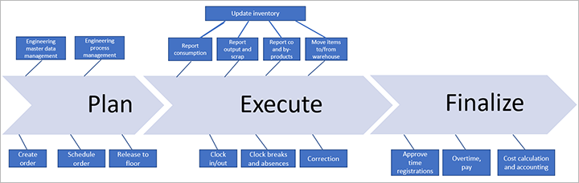
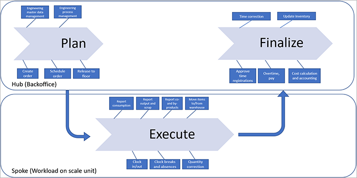
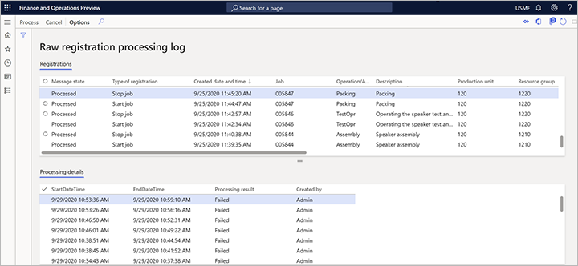

---
# required metadata

title: Manufacturing execution workloads for cloud and edge scale units
description: This topic describes how manufacturing execution workloads work with cloud and edge scale units.
author: johanhoffmann
ms.date: 10/06/2020
ms.topic: article
ms.prod: 
ms.technology: 

# optional metadata

ms.search.form:
# ROBOTS: 
audience: Application User
# ms.devlang: 
ms.reviewer: kamaybac
# ms.tgt_pltfrm: 
ms.custom: 
ms.assetid:
ms.search.region: global
ms.search.industry: SCM
ms.author: johanho
ms.search.validFrom: 2020-10-06
ms.dyn365.ops.version: 10.0.15
---

# Manufacturing execution workloads for cloud and edge scale units

[!include [banner](../includes/banner.md)]

> [!IMPORTANT]
> The manufacturing execution workload is currently available only in preview.
>
> Some business functionality isn't fully supported in the public preview when workload scale units are used.
>
> You can't run the preview manufacturing execution workload on a scale unit where the warehouse execution workload is also installed.

In manufacturing execution, scale units deliver the following capabilities:

- Machine operators and shop floor supervisors can access the operational production plan.
- Machine operators can keep the plan up to date by running discrete and process manufacturing jobs.
- The shop floor supervisor can adjust the operational plan.
- Workers can access time and attendance for clock-in and clock-out on the edge, to ensure correct worker pay calculation.

This topic describes how manufacturing execution workloads work with cloud and edge scale units.

## The manufacturing lifecycle

As the following illustration shows, the manufacturing lifecycle is divided into three phases: *Plan*, *Execute*, and *Finalize*.

The _Plan_ phase includes product definition, planning, order creation and scheduling, and release. The release step indicates the transition from the _Plan_ phase to the _Execute_ phase. When a production order is released, the production order jobs will be visible on the production floor and ready for execution.

When a production job is marked as completed, it moves from the _Execute_ phase to the _Finalize_ phase. In the _Finalize_ phase, the registrations from the *Execute* phase go through an approval workflow, where they are calculated, approved, and transferred. At that point, the production order is completed. Therefore, the basis for the workers' pay is generated.

## Splitting the Execute phase into a separate workload

As the following illustration shows, when scale units are used, the _Execute_ phase is split out as a separate workload.

The model now goes from a single-instance installation to a model that is based on the hub and scale units. The _Plan_ and _Finalize_ phases run as back-office operations on the hub, and the manufacturing execution workload runs on the scale units. Data is transferred asynchronously between the hub and scale units.

When a production order is released on the hub, all data that is required to process production jobs is transferred to the scale unit. This data includes production orders, production routes, bills of materials, and products. Data that isn't related to a production order (such as indirect activities, absence codes, and production parameters) is also transferred from the hub to the scale unit. As a rule, data that originates from the hub and that is transferred to the scale unit can be created or updated only on the hub. For example, a new absence code or indirect activity can't be created on the scale unit&mdash;they can be used only for registration. The registrations that are made on the scale unit during execution are then transferred to the hub, where time and attendance approval, inventory, and financial updates are processed.

## Manufacturing execution tasks that can be run on workloads

The following manufacturing execution tasks can currently be run on workloads when scale units are used:

- Clock-in, log-in, clock-out, and absence
- Start job
- Bundle jobs
- Report progress
- Report scrap
- Indirect activity
- Break
- Report as finished and putaway (requires that you also run the warehouse execution workload on your scale unit, see also [Report as finished and putaway on a scale unit](#RAF))

## Working with manufacturing execution workloads on the hub

Usually, the processes that are required to run manufacturing execution workloads run automatically to keep the hub and all the scale units in sync, as needed. However, if you're having trouble, you can manually trigger the processing of raw registrations that are received from workloads and/or check the registration processing log.

### Manually process raw registrations

A batch job in Supply Chain Management runs automatically to process all the registrations that have been received from the workloads. This job creates the required production journals and logbook entries when a registration is processed for a completed job on the workload.

Although the job usually runs automatically, you can run it manually at any time by signing in to the hub and going to **Production control \> Periodic tasks \> Backoffice workload management \> Process raw registrations**.

### Check the raw registration processing log

To review the registration processing log, sign in to the hub, and go to **Production control \> Periodic tasks \> Backoffice workload management \> Raw registration processing log**. The **Raw registration processing log** page shows a list of processed raw registrations and the status of each registration.

You can work on any registration in the list by selecting it and then selecting one of the following buttons on the Action Pane:

- **Process** – Manually process the selected registration. This action can be useful if the _Process raw registrations_ job hasn't run, or if it failed.
- **Cancel** – Cancel the selected registration.

## Working with manufacturing execution workloads on a scale unit

Usually, the processes that are required to run manufacturing execution workloads run automatically to keep the hub and all the scale units in sync, as needed. However, if you're having trouble, you can check the history of orders that have been processed on a scale unit or manually run the _Manufacturing hub to scale unit message processor_ job.

### View the history of manufacturing jobs that have been processed on a scale unit

To review the history of manufacturing jobs that have been processed on a scale unit, sign in to the scale unit machine, and go to **Production control \> Periodic tasks \> Backoffice workload management \> Manufacturing jobs processing history**. The **Manufacturing jobs processing history** page shows the processing history of the production orders on the scale unit. You can work on any production order in the list by selecting it and then selecting one of the following buttons on the Action Pane:

- **Process** – Manually process the selected production order.
- **Cancel** – Cancel the selected production order.

### Manufacturing hub to scale unit message processor job

The _Manufacturing hub to scale unit message processor_ job processes data from the hub to the scale unit. This job is automatically started when the manufacturing execution workload is deployed. However, you can run it manually at any time by going to **Production control \> Periodic tasks \> Backoffice workload management \> Manufacturing hub to scale unit message processor**.

## Report as finished and putaway on a scale unit

<!-- KFM: 
This section describes how to enable the abilities to report as finished and then putaway finished items when you are using to a scale unit.

### Enable and use report as finished and putaway on a scale unit -->

In the current release, report as finished and putaway operations (for finished products, co-products, and by-products) are supported by the [warehouse execution workload](cloud-edge-workload-warehousing.md) (not the manufacturing execution workload). Therefore, to use this functionality when connected to a scale unit, you must do the following:

- Install both the warehouse execution workload and the manufacturing execution workload on your scale unit.
- Use the Warehouse Management mobile app to report as finished and process the putaway work. The production floor execution interface does not currently support these processes.

<!-- KFM: API details needed

### Customize report as finished and putaway functionality

 -->

## Enable and use the start operation on a scale unit

In the current release, the start operation for production and batch orders is supported by the [warehouse execution workload](cloud-edge-workload-warehousing.md) (not the manufacturing execution workload). Therefore, to use this functionality when you're connected to a scale unit, you must complete these tasks:

- Install both the warehouse execution workload and the manufacturing execution workload on your scale unit.
- Enable the *Start production order on warehouse management workload for the cloud and edge scale unit* feature in [Feature management](../../fin-ops-core/fin-ops/get-started/feature-management/feature-management-overview.md).
- Use the Warehouse Management mobile app to start the production or batch order.

## Enable and use material consumption on a scale unit

In the current release, the flow in the Warehouse Management mobile app for registering material consumption is supported by the [warehouse execution workload](cloud-edge-workload-warehousing.md) (not the manufacturing execution workload). Therefore, to use this functionality when you're connected to a scale unit, you must complete these tasks:

- Install both the warehouse execution workload and the manufacturing execution workload on your scale unit.
- Enable the *Register material consumption on the mobile app on a scale unit* feature in [Feature management](../../fin-ops-core/fin-ops/get-started/feature-management/feature-management-overview.md).
- Use the Warehouse Management mobile app to register material consumption.

[!INCLUDE [cloud-edge-privacy-notice](../../includes/cloud-edge-privacy-notice.md)]

[!INCLUDE[footer-include](../../includes/footer-banner.md)]
