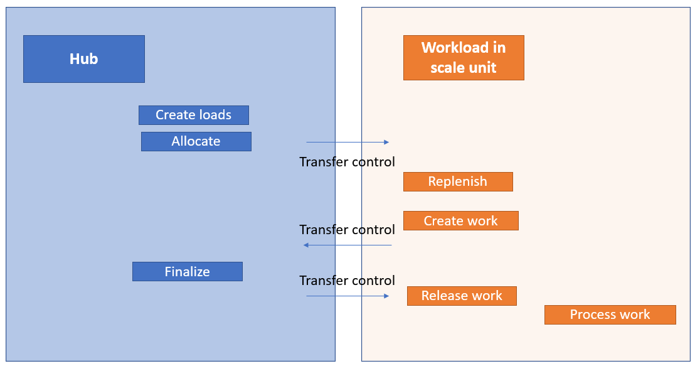

---
# required metadata

title: Warehouse management workloads for cloud and edge scale units
description: This feature allows scale units to run selected processes from your warehouse management workload. Cloud scale units run their workloads in the cloud using dedicated processing capacity in your selected Azure region. With edge scale units, you can run certain workloads independently on premises, even while temporarily disconnected from the cloud.
author: perlynne
manager: tfeyr
ms.date: 10/06/2020
ms.topic: article
ms.prod: 
ms.service: dynamics-ax-applications
ms.technology: 

# optional metadata

ms.search.form: PurchTable, SysSecRolesEditUsers
# ROBOTS: 
audience: Application User
# ms.devlang: 
ms.reviewer: kamaybac
ms.search.scope: Core, Operations
# ms.tgt_pltfrm: 
ms.custom: 
ms.assetid:
ms.search.region: global
ms.search.industry: SCM
ms.author: perlynne
ms.search.validFrom: 2020-10-06
ms.dyn365.ops.version: 10.0.15
---

# Warehouse management workloads for cloud and edge scale units

[!include [banner](../includes/banner.md)]
[!include [preview banner](../includes/preview-banner.md)]

> [!WARNING]
> Not all business functionality is fully supported in the public preview when using workload scale units. Be sure only to use the processes specifically described in this topic as being supported.  

## Warehouse execution on scale units

This feature allows scale units to run selected processes from the warehouse management capabilities. Cloud scale units run their workloads in the cloud using dedicated processing capacity in your selected Azure region. With edge scale units, you can run certain workloads independently on premises, even while temporarily disconnected from the cloud.

In this topic, warehouse management executions within a warehouse defined as a scale unit are called a *Warehouse execution system (WES)*.

## Prerequisites

You must have a Supply Chain Management hub and a scale unit deployed with the warehouse management workload. For more information about the architecture and deployment process, see [Cloud and Edge scale units for manufacturing and warehouse management workloads](cloud-edge-landing-page.md).

## How the WES edge scale unit functions

For the processes in the warehouse management workload, the data is synchronized between the hub and the scale units.

Only the data owned by a scale unit can be maintained by that scale unit. The data ownership concept with scale units prevent multi-master conflicts. Therefore, it is important to understand which processes are owned by the hub and which by scale units.

The following data are owned by the scale units:

- **Wave processing data** - Selected wave process methods are handled as part of the scale unit wave processing.

- **Work processing data** - The following types of work order processing are supported:
  - Inventory movements (manual and movement by template work)
  - Purchase orders (putaway work via a warehouse order)
  - Sales orders (simple picking and loading work)

- **Warehouse order receipt data** - Only used for purchase orders manually released to warehouse.

- **License plate data** -  License plates can be created on the hub and the scale unit. Dedicated conflict handling has been provided. Please note, this data isn't warehouse specific.

## Outbound process flow

The hub owns the following data:

- All source documents, such as sales and transfer orders
- Order allocation and outbound load processing
- The release to warehouse, shipment creation, and wave creation processes

The scale units own the actual wave processing (such as work allocation, replenishment work, and demand work creation) after the release of the wave. This lets warehouse workers process outbound work using a warehouse app connected to the scale unit.

## Inbound process flow

The hub owns the following data:

- All source documents, such as purchase and sales return orders
- Inbound load processing

> [!NOTE]
> The inbound purchase order flow is conceptually different from the outbound flow, where the scale unit doing the processing depends on whether the order has been released to a warehouse or not.

When using the *release to warehouse* process, warehouse orders are created and ownership of the related receiving flow is assigned to the scale unit and the hub will not be able to register inbound receiving.

The worker can run the receiving process using the warehouse app connected to the scale unit. The data is then recorded by the scale unit and reported against the inbound warehouse order. Creation and processing of the subsequent putaway will also be handled by the scale unit.

If you are not using the *release to warehouse* process&mdash;and therefore not using *warehouse orders*&mdash;the hub can process warehouse receiving and work processing independently from scale units.

## Supported processes and roles

Not all warehouse management processes are supported in a WES workload on a scale unit. Therefore, we recommend assigning roles that match the functionality available to each user.

To ease this process, a sample role called *Warehouse manager on workload* is included with demo data in **System administration \> Security \> Security configuration**. This role is intended to enable warehouse managers to access the WES on the scale unit. The role grants access to the forms that are relevant within the context of a workload hosted on a scale unit.

User roles on a scale unit are assigned as part of the initial data synchronization from the hub to the scale unit.

To modify the roles assigned to a user, go to **System administration \> Security \> Assign users to roles** on the scale unit. Users who act as warehouse managers exclusively on scale units should be assigned only the *Warehouse manager on workload* role. This will ensure that these users have access to only the supported functionality. Remove any other roles that might be assigned to these users.

Users who act as warehouse managers both on the hub and on scale units should be assigned the existing *Warehouse worker* role. Be aware that this role grants warehouse workers access to features that appear in the UI but are currently not supported on scale units (such as transfer order processing).

## Supported WES processes

The following warehouse execution processes can be enabled for a WES workload on a scale unit:

- Selected wave methods for sales orders and demand replenishment.
- Execute work orders from sales orders and demand replenishment using the warehouse app.
- Query on-hand inventory using the warehouse app.
- Create and execute inventory movements using the warehouse app.
- Register purchase orders and conduct putaway work using the warehouse app.

The work order types currently supported for WES workloads on scale unit deployments are:

- Sales orders
- Replenishment
- Inventory movement
- Purchase orders linked to warehouse orders

No other processing of source documents is currently supported on scale units.
For example with a WES workload on a scale unit you can't:

- Release a transfer order
- Process the outbound warehouse picking and shipping operations

> [!IMPORTANT]
> If you use a workload on a scale unit you can not run non supported processes for the specific warehouse on the hub.

The following warehouse management functionality is currently not supported on scale units:

- Inbound and outbound processing for items having any active tracking dimensions (such as batch or serial number dimensions)
- Processing of inventory status change
- Processing of inventory with a blocking status value
- Integration to quality management
- Integration to production
- Processing of catch weight item
- Processing of over- and under-delivery
- Processing of negative on-hand inventory

### Outbound (only support for sales orders and demand replenishment)

The following table lists which features are supported, and where, when using the WMS workloads in cloud and edge scale units.

>[!Warning]
> Because only sales order processing is supported, it isn't possible to use outbound warehouse management processing for transfer orders.
>
> Some warehouse functionality will not be available at warehouses running the WMS workload in a scale unit.

|Process                                      |Hub  |WES workload on a scale unit  |
|---------------------------------------------|----------------|-------------------|
|Source document processing                   |Yes             |No                 |
|Load and transportation management processing |Yes             |No                 |
|Release to warehouse                         |Yes             |No                 |
|Shipment consolidation                   |No          |No             |
|Cross docking (picking work)             |No          |No             |
|Shipment wave processing                     |
(No):
But the finalization of the wave status is handled in the hub.
       |
(Yes):
But without:<ul><li>Parallel work creation</li><li>Load building, sorting</li> <li>Containerization</li><li>Wave label printing</li></li></ul>
<b>Note: </b>Access to the hub is needed to finalize the wave status as part of the wave processing.
|
|Warehouse work processing (incl. license plate print)   | No             |
(Yes):
But only for:<ul><li>Sales picking</li><li>Sales loading</li><li>Without the use of active tracking dimensions</li></ul>|
|Cluster picking                          |No          |No             |
|Packing processing                       |No          |No             |
|Outbound sorting processing              |No          |No             |
|Printing of load related documents           |Yes             |No                 |
|Bill of lading and ASN generation            |Yes             |No                 |
|Ship confirmation and packing slip processing|Yes             |No                 |
|Short picking (sales orders)             |No          |No             |
|Work cancellation                        |No          |No             |
|Change of work locations (sales orders)  |No          |No             |
|Complete work (sales orders)             |No          |No             |
|Block and unblock work                   |No          |No             |
|Change user                              |No          |No             |
|Print work report                        |No          |No             |
|Wave label                               |No          |No             |
|Reverse work                             |No          |No             |

### Inbound

|Process                                      |Hub  |WES workload on a scale unit|
|---------------------------------------------|----------------|-------------------|
|Source document processing                   |Yes             |No                 |
|Load and transportation management processing                      |Yes             |No                 |
|Shipment confirmation                        |Yes             |No                 |
|Purchase order release to warehouse (warehouse order processing)|Yes  |No         |
|Purchase order item receiving and put away   |
Yes: Without&nbsp;warehouse&nbsp;order
No: With warehouse order|
Yes: With warehouse order and without purchase order being part of a <i>load</i>.
<b>Note: </b>Only when using two mobile device menu items&mdash;one for receiving (<i>Purchase order item receiving</i>) and another with <i>Use existing work</i> to process the putaway.
No: Without warehouse order|
|Purchase order line receiving and put away|
Yes: Without warehouse order
No: With warehouse order|No|
|Return order receiving and put away          |Yes              |No                 |
|Mixed license plate receiving and put away|
Yes: Without warehouse order
No: With warehouse order|No|
|Load item receiving|
Yes: Without warehouse order
No: With warehouse order|No|
|License plate receiving and put away|
Yes: Without warehouse order
No: With warehouse order|No|
|Transfer order item receiving and put away   |Yes               |No                |
|Transfer order line receiving and put away   |Yes               |No                |
|Work cancellation|
Yes: Without warehouse order
No: With warehouse order|
(Yes):
 Without <b>Unregister receipt when canceling work</b>|
|Purchase order product receipt processing    |Yes              |No                 |
|Cross docking work creation as part of receiving|
Yes: Without warehouse order
No: With warehouse order|No|

### Warehouse operations and exception handing

|Process                                      |Hub |WES workload on a scale unit|
|---------------------------------------------|----------------|-----------------|
|License plate inquire                        |Yes             |Yes              |
|Item inquire                                 |Yes             |Yes              |
|Location inquire                             |Yes             |Yes              |
|Change warehouse                             |Yes             |Yes              |
|Movement                                     |No              |Yes              |
|Movement by template                         |No              |Yes              |
|Adjustment (in/out)                          |Yes             |No               |
|Cycle counting and Counting discrepancy processing|Yes        |No               |
|Reprint label (license plate printing)       |Yes             |No               |
|License plate build                          |Yes             |No               |
|License plate break                          |Yes             |No               |
|Driver check in                              |Yes             |No               |
|Driver check out                             |Yes             |No               |
|Change batch disposition code                |Yes             |No               |
|Display open work list                       |Yes             |No               |
|Consolidate license plates               |No          |No           |
|Remove container from group              |No          |No           |
|Cancel work                              |No          |No           |
|Min/max replenishment processing         |No          |No           |
|Slotting replenishment processing        |No          |No           |

### Production

Warehouse management integration for production scenarios is currently not supported.

|Process                                      |Hub  |WES workload on a scale unit|
|---------------------------------------------|----------------|-----------------|
|
All warehouse management processes related to production, including:
<li>Release to warehouse</li><li>Production wave processing</li><li>Raw material picking</li><li>Finished goods put away</li><li>Co-product and by-product put away</li><li>Kanban put away</li><li>Kanban picking</li><li>Start production order</li><li>Production scrap</li><li> Production last pallet</li><li>Register material consumption</li><li>Empty kanban</li>|No|No |

## How to maintain scale units for WES

Several batch jobs run on both the hub and on scale units.
On the hub deployment, you can manually maintain the batch jobs. You can manage the following three jobs under
**Warehouse management \> Periodic tasks \> Back-office workload management**:

- Process work status update events
- Process wave execution control transfer events
- Register source order receipts

On the workload in scale units, you can manage the following two batch jobs under **Warehouse management \> Periodic tasks \> Workload management**:

- Process wave table records
- Process wave execution control transfer events
