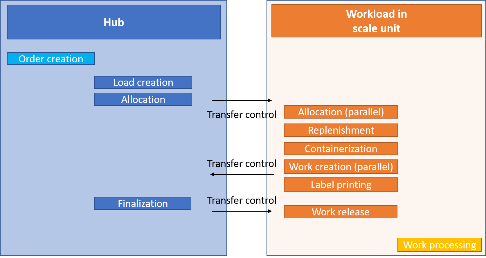

---
# required metadata

title: Warehouse management workloads for cloud and edge scale units
description: This topic provides information about the feature that enables scale units to run selected processes from your warehouse management workload.
author: perlynne
manager: tfeyr
ms.date: 10/06/2020
ms.topic: article
ms.prod: 
ms.service: dynamics-ax-applications
ms.technology: 

# optional metadata

ms.search.form: PurchTable, SysSecRolesEditUsers
# ROBOTS: 
audience: Application User
# ms.devlang: 
ms.reviewer: kamaybac
ms.search.scope: Core, Operations
# ms.tgt_pltfrm: 
ms.custom: 
ms.assetid:
ms.search.region: global
ms.search.industry: SCM
ms.author: perlynne
ms.search.validFrom: 2020-10-06
ms.dyn365.ops.version: 10.0.15
---

# Warehouse management workloads for cloud and edge scale units

[!include [banner](../includes/banner.md)]
[!include [preview banner](../includes/preview-banner.md)]

> [!WARNING]
> Not all warehouse management business functionality is fully supported for a warehouse running in a workload on a scale unit. Be sure to use only the processes that this topic explicitly describes as supported.

## Warehouse execution on scale units

This feature enables scale units to run selected processes from the warehouse management capabilities. Cloud scale units run their workloads in the cloud by using dedicated processing capacity in your selected Microsoft Azure region. For edge scale units, you can run some workloads independently on premises, even while the scale units are temporarily disconnected from the cloud.

In this topic, warehouse management executions in a warehouse that is defined as a scale unit are known as a *Warehouse execution system* (*WES*).

## Prerequisites

You must have a Dynamics 365 Supply Chain Management hub and a scale unit that has been deployed with the warehouse management workload. For more information about the architecture and deployment process, see [Cloud and edge scale units for manufacturing and warehouse management workloads](cloud-edge-landing-page.md).

## How the WES workload works on scale units

For the processes in the warehouse management workload, the data is synced between the hub and the scale units.

A scale unit can maintain only the data that it owns. The data ownership concept for scale units helps prevent multi-master conflicts. Therefore, it's important that you understand which processes are owned by the hub and which are owned by the scale units.

The scale units own the following data:

- **Wave processing data** – Selected wave process methods are handled as part of the scale unit wave processing.
- **Work processing data** – The following types of work order processing are supported:

  - Inventory movements (manual movement and movement by template work)
  - Purchase orders (putaway work via a warehouse order when purchase orders are not associated with loads)
  - Sales orders (simple picking and loading work)
  - Transfer orders (only outbound with simple picking and loading work)

- **Warehouse order receipt data** – This data is used only for purchase orders that are manually released to a warehouse.
- **License plate data** – License plates can be created on the hub and the scale unit. Dedicated conflict handling has been provided. Note that this data isn't warehouse-specific.

## Outbound process flow

The hub owns the following data:

- All source documents, such as sales orders and transfer orders
- Order allocation and outbound load processing
- The release to warehouse, shipment creation, wave creation, and wave finalization processes.

The scale units own the actual wave processing (such as work allocation, replenishment work, and demand work creation) after the release of the wave. Therefore, warehouse workers can process outbound work by using a warehouse app that is connected to the scale unit.

## Inbound process flow

The hub owns the following data:

- All source documents, such as purchase orders and sales return orders
- Inbound load processing
- All cost and financial updates

> [!NOTE]
> The inbound purchase order flow is conceptually different from the outbound flow. You can both operate for the same warehouse on the scale unit and hub depending on whether the purchase order has been released to warehouse or not.

If you're using the *release to warehouse* process, [**Warehouse orders**](cloud-edge-warehouse-order.md) are created, and ownership of the related receiving flow is assigned to the scale unit. The hub won't be able to register inbound receiving.

The worker can run the receiving process by using a warehouse app that is connected to the scale unit. The data is then recorded by the scale unit and reported against the inbound warehouse order. The creation and processing of the subsequent putaway will also be handled by the scale unit.

If you aren't using the *release to warehouse* process, and therefore aren't using *warehouse orders*, the hub can process warehouse receiving and work processing independently from scale units.

## Supported processes and roles

Not all warehouse management processes are supported in a WES workload on a scale unit. Therefore, we recommend that you assign roles that match the functionality that is available to each user.

To facilitate this process, a sample role that is named *Warehouse manager on workload* is included in the demo data at **System administration \> Security \> Security configuration**. The purpose of this role is to enable warehouse managers to access the WES on the scale unit. The role grants access to the pages that are relevant in the context of a workload that is hosted on a scale unit.

User roles on a scale unit are assigned as part of the initial data synchronization from the hub to the scale unit.

To modify the roles that are assigned to a user, go to **System administration \> Security \> Assign users to roles**. Users who act as warehouse managers only on scale units should be assigned only the *Warehouse manager on workload* role. This approach will ensure that those users have access only to the supported functionality. Remove any other roles that are assigned to those users.

Users who act as warehouse managers on both the hub and scale units should be assigned the existing *Warehouse worker* role. Be aware that this role grants warehouse workers access to features (such as transfer order receiving processing) that appear in the user interface (UI) but aren't currently supported on scale units.

## Supported WES processes

The following warehouse execution processes can be enabled for a WES workload on a scale unit:

- Selected wave methods for sales and transfer orders (allocation, demand replenishment, containerization, work creation, and wave label printing)
- Processing sales and transfer order warehouse work by using the warehouse app (including replenishment work)
- Querying on-hand inventory by using the warehouse app
- Creating and running inventory movements by using the warehouse app
- Registering purchase orders and doing putaway work by using the warehouse app

The following work order types are currently supported for WES workloads on scale unit deployments:

- Sales orders
- Transfer issue
- Replenishment
- Inventory movement
- Purchase orders (linked to warehouse orders)

No other processing of source documents and warehouse work types are currently supported on scale units. For example, for a WES workload on a scale unit, you can't perform a transfer order receiving process (Transfer receipt) or process a cycle counting work.

> [!NOTE]
> The mobile device menu items and buttons for the unsupported functionalities cannot be seen on the _Warehouse app_ logged in against a scale unit deployment.

> [!WARNING]
> If you use a workload on a scale unit, you can't run unsupported processes for the specific warehouse on the hub. The following tables document the supported capabilities.
>
> Selected warehouse work types can both be created on hub and on scale units, but only get maintained by the owner (the deployment which created the data). If enabling a warehouse for scale unit workload processing with e.g. active work, this work will need to get finalized on the hub, who will be the owner of this data.
>
Even though a specific process is scale unit supported, be aware that all the needed data might not get synchronized from the hub to the scale unit, or from the scale unit to the hub, and thereby risk resulting in unexpected system processing. Examples being:

>
 - Location directive query joining a data table record which only exists at the hub deployment.

>
 - Use of the location status and/or location volumetric load functionalities. This data will not get synchronized between the deployments and thereby only work when updating location inventory on-hand on one of the deployments.

The following warehouse management functionality isn't currently supported for scale unit workloads:

- Inbound processing of purchase order lines assigned to a load
- Inbound processing of purchase orders for a project
- Inbound and outbound processing for items that have active tracking dimensions **Owner** and/or **Serial number**
- Processing of inventory that has a blocking status value
- Changing of an inventory status during any work movement process
- Order-committed flexible warehouse-level dimension reservations
- Use of *Warehouse location status* functionality (data not getting sync'ed between the deployments)
- Use of *Location license plate positioning* functionality
- Use of *Product filters* and *Product filter groups* incl. **Number of days to mix batches**
- Integration with quality management
- Processing with catch-weight items
- Processing with only TMS enabled items
- Processing with negative on-hand inventory
- Warehouse work processing with custom work types
- Warehouse work processing with shipment notes
- Warehouse work processing with cycle counting threshold triggering
- Warehouse work processing with material handling/warehouse automation
- Use of product master data image (e.g. on at Warehouse management app)

> [!WARNING]
> Some warehouse functionality won't be available for warehouses running the warehouse management workloads in a scale unit; not supported on the hub nor on the scale unit workload.
Other capabilities can get processed on both, but will require careful use in scenarios where e.g. the inventory on-hand gets updated for the same warehouse on both the hub and scale unit workload due to the asynchronous data update process.
Specific functionalities (like for example **Block work**) which is supported on both the hub and scale units will only be supported for the owner of the data.

### Outbound (supported only for sales and transfer orders)

The following table shows which outbound features are supported, and where they are supported, when the warehouse management workloads are used in cloud and edge scale units.

| Process                                                      | Hub | WES workload on a scale unit |
|--------------------------------------------------------------|-----|------------------------------|
| Source document processing                                   | Yes | No |
| Load and transportation management processing                | Yes | No |
| Release to warehouse                                         | Yes | No |
| Planned cross docking                                        | No  | No |
| Shipment consolidation                                       | Yes | No |
| Shipment wave processing                                     | Yes, but only initialization and finalization of the wave is handled in the hub. This means that outbound transfer and sales order processing only can get handled by the scale unit.|
No, initialization and finalization gets handled by the hub and the **Load building and sorting** are not supported
<b>Note:</b> Access to the hub is required to finalize the wave status as part of the wave processing.
 |
| Maintain shipments for wave                                  | Yes | No |
| Warehouse work processing (incl. license plate print)        | No  | 
Yes, but only for the above mentioned supported capabilities. |
| Cluster picking                                              | No  | Yes|
| Manual packing processing, incl. 'Packed container picking' work processing                                           | No 
Some processing can be done after a initial picking process handled by a scale unit, but not recommended due to following blocked operations.
  | No  |
| Remove container from group                        | No  | No                           |
| Outbound sorting processing                                  | No  | No |
| Printing of load related documents                           | Yes | No |
| Bill of lading and ASN generation                            | Yes | No |
| Shipment confirm                    | Yes  | No |
| Shipment confirmation with "Confirm and transfer"                    | No  | No |
| Packing slip and invoicing processing                | Yes | No |
| Short picking (sales and transfer orders)                    | No  | No |
| Over picking (sales and transfer orders)                     | No  | No |
| Change of work locations (sales and transfer orders)         | No  | Yes|
| Complete work (sales and transfer orders)                    | No  | Yes|
| Print work report                                            | Yes | No |
| Wave label                                                   | No  | Yes|
| Work split                                                   | No  | Yes|
| Work processing - Directed by 'Transport loading'            | No  | No |
| Reduce picked quantity                                       | No  | No |
| Reverse work                                                 | No  | No |
| Reverse shipment confirmation                                | Yes | No |

### Inbound

The following table shows which inbound features are supported, and where they are supported, when the warehouse management workloads are used in cloud and edge scale units.

| Process                                                          | Hub | WES workload on a scale unit
_Yes is only when there is a warehouse order_
 |
|------------------------------------------------------------------|-----|----------------------------------------------------------------------------------|
| Source&nbsp;document&nbsp;processing                                       | Yes | No |
| Load and transportation management processing                    | Yes | No |
| Inbound shipment confirmation                                            | Yes | No |
| Purchase order release to warehouse (warehouse order processing) | Yes | No |
| Cancellation of warehouse order lines
Note that this only is supported when no registration has happened against the line
          | Yes | No |
| Purchase order item receiving and put away                       | 
Yes,&nbsp;when&nbsp;there&nbsp;isn't a warehouse order

No, when there is a warehouse order
 | 
Yes, when a purchase order isn't part of a <i>load</i>
 |
| Purchase order line receiving and put away                        | 
Yes, when there isn't a warehouse order

No, when there is a warehouse order
 | 
Yes, when a purchase order isn't part of a <i>load</i>

 |
| Return order receiving and put away                               | Yes | No |
| Mixed license plate receiving and put away                        | 
Yes, when there isn't a warehouse order

No, when there is a warehouse order
 | No |
| Load item receiving                                             | 
Yes, when there isn't a warehouse order

No, when there is a warehouse order
 | No |
| License plate receiving and put away                              | 
Yes, when there isn't a warehouse order

No, when there is a warehouse order
 | No |
| Transfer order item receiving and put away                        | Yes | No |
| Transfer order line receiving and put away                        | Yes | No |
| Cancel work (inbound)                                              | 
Yes, when there isn't a warehouse order

No, when there is a warehouse order
 | 
Yes, but only when the <b>Unregister receipt when canceling work</b> option (on the <b>Warehouse management parameters</b> page) is cleared
 |
| Purchase order product receipt processing                          | Yes | No |
| Purchase order receiving with underdelivery                        | 
Yes, when there isn't a warehouse order

No, when there is a warehouse order
 | No, because you can only cancel the full warehouse order line quantities |
| Purchase order receiving with overdelivery                        | 
Yes, when there isn't a warehouse order

No, when there is a warehouse order
 | Yes  |
| Receiving with creation of 'Cross docking'  work                   | 
Yes, when there isn't a warehouse order

No, when there is a warehouse order
 | No |
| Receiving with creation of 'Quality order' work                  | 
Yes, when there isn't a warehouse order

No, when there is a warehouse order
 | No |
| Receiving with creation of 'Quality item sampling' work          | 
Yes, when there isn't a warehouse order

No, when there is a warehouse order
 | No |
| Receiving with creation of 'Quality in quality check' work       | 
Yes, when there isn't a warehouse order

No, when there is a warehouse order
 | No |
| Receiving with quality order creation                            | 
Yes, when there isn't a warehouse order

No, when there is a warehouse order
 | No |
| Work processing - Directed by 'Cluster putaway'                             | Yes | No |
| Work processing with 'Short pick'                                           | Yes | No |
| License plate loading                                           | Yes | No |

### Warehouse operations and exception handing

The following table shows which warehouse operations and exception handing features are supported, and where they are supported, when the warehouse management workloads are used in cloud and edge scale units.

| Process                                            | Hub | WES workload on a scale unit |
|----------------------------------------------------|-----|------------------------------|
| License plate inquire                              | Yes | Yes                          |
| Item inquire                                       | Yes | Yes                          |
| Location inquire                                   | Yes | Yes                          |
| Change warehouse                                   | Yes | Yes                          |
| Movement                                           | Yes | Yes                          |
| Movement by template                               | Yes | Yes                          |
| Warehouse transfer                                 | Yes | No                           |
| Create transfer order from warehouse app           | Yes | No                           |
| Adjustment (in/out)                                | Yes | No                           |
| Inventory status change                            | Yes | No                           |
| Cycle counting and Counting discrepancy processing | Yes | No                           |
| Reprint label (license plate printing)             | Yes | Yes                          |
| License plate build                                | Yes | No                           |
| License plate break                                | Yes | No                           |
| Pack to nested license plates                                | Yes | No                           |
| Driver check in                                    | Yes | No                           |
| Driver check out                                   | Yes | No                           |
| Change batch disposition code                      | Yes | Yes                          |
| Display open work list                             | Yes | Yes                          |
| Consolidate license plates                         | Yes | No                           |
| Min/max and zone threshold replenishment processing| Yes 
Recommendation is not to include the same locations as part of the queries
| Yes                          |
| Slotting replenishment processing                  | Yes  | Yes
Note that the setup must be done on the scale unit
                           |
| Block and unblock work                             | Yes | Yes                          |
| Change user                                        | Yes | Yes                          |
| Change work pool on work                           | Yes | Yes                          |
| Cancel work                                        | Yes | Yes                          |

### Production

Warehouse management production scenarios isn't currently supported on scale unit workloads as indicated in the following table.

| Process | Hub | WES workload on a scale unit |
|---------|-----|------------------------------|
| 
All warehouse management processes that are related to production. Here are some examples:
<li>Release to warehouse</li><li>Production wave processing</li><li>Raw material picking</li><li>RAF and finished goods put away</li><li>Co-product and by-product put away</li><li>Kanban put away</li><li>Kanban picking</li><li>Start production order</li><li>Production scrap</li><li>Production last pallet</li><li>Register material consumption</li><li>Empty kanban</li></ul> | Yes | No |

## Maintaining scale units for WES

Several batch jobs run on both the hub and scale units.

On the hub deployment, you can manually maintain the batch jobs. You can manage the following batch jobs at **Warehouse management \> Periodic tasks \> Back-office workload management**:

- Process work status update events
- Scale unit to hub message processor
- Register source order receipts
- Complete warehouse orders
- Process quantity update responses for warehouse order lines

On the workload in scale units, you can manage the following batch jobs at **Warehouse management \> Periodic tasks \> Workload management**:

- Process wave table records
- Warehouse hub to scale unit message processor
- Process quantity update requests for warehouse order lines
