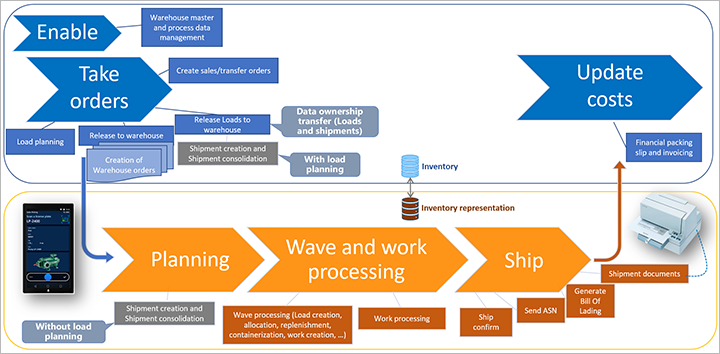
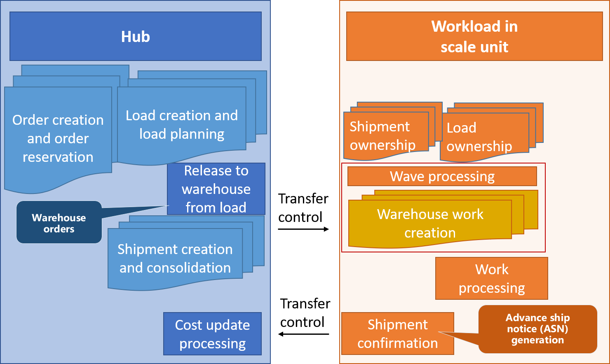
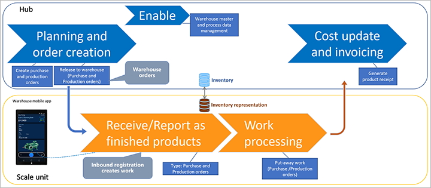

---
# required metadata

title: Warehouse management workloads for cloud and edge scale units
description: This topic provides information about the feature that enables scale units to run selected processes from your warehouse management workload.
author: perlynne
ms.date: 09/03/2021
ms.topic: article
ms.prod: 
ms.technology: 

# optional metadata

ms.search.form: PurchTable, InventTransferOrders, SalesTable, SysSecRolesEditUsers, SysWorkloadDuplicateRecord
# ROBOTS: 
audience: Application User
# ms.devlang: 
ms.reviewer: kamaybac
# ms.tgt_pltfrm: 
ms.custom: 
ms.assetid:
ms.search.region: global
ms.search.industry: SCM
ms.author: perlynne
ms.search.validFrom: 2020-10-06
ms.dyn365.ops.version: 10.0.22
---

# Warehouse management workloads for cloud and edge scale units

[!include [banner](../includes/banner.md)]

> [!WARNING]
> Not all warehouse management business functionality is fully supported for warehouses running a workload on a scale unit. Be sure to use only the processes that this topic explicitly describes as supported.

## Warehouse execution on scale units

Warehouse management workloads enable cloud and edge scale units to run selected processes from the warehouse management capabilities.

## Prerequisites

Before you start to work with the warehouse management workload, your system must be prepared as described in this section.

### Deploy a scale unit with the warehouse management workload

You must have a Dynamics 365 Supply Chain Management hub and a scale unit that has been deployed with the warehouse management workload. For more information about the architecture and deployment process, see [Scale units in a distributed hybrid topology](cloud-edge-landing-page.md).

### Turn on required features in feature management

Use the [Feature management](../../fin-ops-core/fin-ops/get-started/feature-management/feature-management-overview.md) workspace to turn on both the following features. (Both features are listed under the *Warehouse management* module.)

- Decouple putaway work from ASNs
- (Preview) Scale unit support for inbound and outbound warehouse orders

## How the warehouse execution workload works on scale units

For the processes in the warehouse management workload, the data is synced between the hub and the scale units.

A scale unit can maintain only the data that it owns. The data ownership concept for scale units helps prevent multi-master conflicts. Therefore, it's important that you understand which process data are owned by the hub and which are owned by the scale units.

Depending on the business processes, the same data record can change ownership between the hub and scale units. An example of this scenario is provided in the following section.

> [!IMPORTANT]
> Some data can be created on both the hub and on the scale unit. Examples include **License plates** and **Batch numbers**. Dedicated conflict handling is provided in case of a scenario where the same unique record gets created on both the hub and a scale unit during the same sync cycle. When this happens, the next synchronization will fail and you must go to **System administration > Inquiries > Workload inquiries > Duplicate records**, where you can view and merge the data.

## Outbound process flow

Before you deploy a warehouse management workload on a cloud or edge scale unit, make sure you have the *Scale unit support for release to warehouse of outbound orders* feature enabled on your enterprise hub. Admins can use the [feature management](../../fin-ops-core/fin-ops/get-started/feature-management/feature-management-overview.md) settings to check the status of the feature and turn it on if it's required. In the **Feature management** workspace, the feature is listed in the following way:

- **Module:** *Warehouse management*
- **Feature name:** *Scale unit support for release to warehouse of outbound orders*

The outbound data ownership process depends on whether you are using the load planning process. In all cases, the hub owns the *source documents*, such as sales orders and transfer orders, as well as the order allocation process and the related order transaction data. But when you use the load planning process, the loads will be created on the hub and therefore initially be owned by the hub. As part of the *Release to warehouse* process, the ownership of the load data is transferred to the dedicated scale unit deployment, which will become the owner of the subsequent *shipment wave processing* (such as work allocation, replenishment work, and demand work creation). Therefore, warehouse workers can only process outbound sales and transfer order work by using a Warehouse Management mobile app that is connected to the deployment running the specific scale unit workload.

As soon as the final work process puts the inventory at a final shipping location (Baydoor), the scale unit signals the hub to update the source document inventory transactions to *Picked*. Until this process runs and gets synchronized back, the inventory on-hand on the scale unit workload will be physically reserved at the warehouse level and you can immediately process the outbound shipment confirmation without waiting for this synchronization to complete. The subsequent sales packing slip and invoicing or transfer order shipment for the load will get handled in the hub.

This following diagram shows the outbound flow, and indicates where the individual business processes take place. (Select the diagram to enlarge it.)

### Outbound processing with load planning

When you are using the load planning process, loads and shipments are created on the hub and the ownership of the data is transferred to the scale units as part of the *Release to warehouse* process, as illustrated in the following figure.

### Outbound processing without load planning

When you don't use the load planning process, shipments are created on the scale units. Loads are also created on the scale units as part of the waving process.

## Inbound process flow

The hub owns the following data:

- All source documents, such as purchase and production orders
- Inbound load processing
- All cost and financial updates

> [!NOTE]
> The inbound purchase order flow is conceptually different from the outbound flow. You can operate the same warehouse on either the scale unit or the hub depending on whether the purchase order has been released to warehouse. After you have released an order to the warehouse, you can only work with that order while signed in on the scale unit.
>
> If you're using the *Release to warehouse* process, [*warehouse orders*](cloud-edge-warehouse-order.md) are created, and ownership of the related receiving flow is assigned to the scale unit. The hub won't be able to register inbound receiving.

You must sign in on the hub to use the *Release to warehouse* process. For purchase order processing, go to one of the following pages to run or schedule it:

- **Procurement and sourcing > Purchase orders > All purchase orders > Warehouse > Actions > Release to warehouse**
- **Warehouse management > Release to warehouse > Automatic release of purchase orders**

When using **Automatic release of purchase orders**, you can select specific purchase order lines based on a query. A typical scenario would be to set up a recurrent batch job that releases all the confirmed purchase order lines expected to arrive the next day.

The worker can run the receiving process by using a Warehouse Management mobile app that is connected to the scale unit. The data is then recorded by the scale unit and reported against the inbound warehouse order. The creation and processing of the subsequent putaway will also be handled by the scale unit.

If you aren't using the *release to warehouse* process, and therefore aren't using *warehouse orders*, the hub can process warehouse receiving and work processing independently from scale units.

When a worker does inbound registration using a Warehouse Management mobile app receiving process against the scale unit, a receipt is recorded against the related warehouse order, which is stored on the scale unit. The scale unit workload will then signal the hub to update the related purchase order line transactions to *Registered*. As soon as this is finished, you will be able to run a purchase order product receipt on the hub.

This following diagram shows the inbound flow, and indicates where the individual business processes take place. (Select the diagram to enlarge it.)

## Production control

The warehouse management workload supports the following three flows for production in the Warehouse Management app:

- Report as finished and put away
- Start production order
- Register material consumption

### Report as finished and put away

Workers can use the **Report as finished and put away** flow in the Warehouse Management app to report a production or batch order as finished. They can also report co-products and by-products on a batch order as finished. When a job is reported as finished, the system usually generates putaway warehouse work on the scale unit. If you don't require putaway work, you can set up your work policies to omit it.

### Start production order

Workers can use the **Start production order** flow in the Warehouse Management app to register the start of a production or batch order.

### Register material consumption

Workers can use the **Register material consumption** flow in the Warehouse Management app to report material consumption for a production or batch order. A picking list journal is then created for the reported material on the production or batch order on the scale unit. The journal lines make a physical reservation on the consumed inventory. When data is synced between the scale unit and the hub, a picking list journal is generated and posted on the hub instance.

## Supported processes and roles

Not all warehouse management processes are supported in a warehouse execution workload on a scale unit. Therefore, we recommend that you assign roles that match the functionality that is available to each user.

To facilitate this process, a sample role that is named *Warehouse manager on workload* is included in the demo data at **System administration \> Security \> Security configuration**. The purpose of this role is to enable warehouse managers to access the warehouse execution workload on the scale unit. The role grants access to the pages that are relevant in the context of a workload that is hosted on a scale unit.

User roles on a scale unit are assigned as part of the initial data synchronization from the hub to the scale unit.

To modify the roles that are assigned to a user, go to **System administration \> Security \> Assign users to roles**. Users who act as warehouse managers only on scale units should be assigned only the *Warehouse manager on workload* role. This approach will ensure that those users have access only to the supported functionality. Remove any other roles that are assigned to those users.

Users who act as warehouse managers on both the hub and scale units should be assigned the existing *Warehouse worker* role. Be aware that this role grants warehouse workers access to features (such as transfer order receiving processing) that appear in the user interface (UI) but aren't currently supported on scale units.

### Supported warehouse execution processes

The following warehouse execution processes can be enabled for a warehouse execution workload on a scale unit:

- Selected wave methods for sales and transfer orders (validation, load creation, allocation, demand replenishment, containerization, work creation, and wave label printing)

- Processing sales and transfer order warehouse work using the warehouse app (including replenishment work)
- Querying on-hand inventory by using the warehouse app
- Creating and running inventory movements by using the warehouse app
- Creating and processing cycle counting work by using the warehouse app
- Making inventory adjustments by using the warehouse app
- Registering purchase orders and doing putaway work by using the warehouse app

The following types of work can be created on a scale unit and can therefore be processed as part of a warehouse management workload:

- **Inventory movements** – Manual movement and movement by template work.
- **Cycle counting** – Including a discrepancy approval/rejection process as part of counting operations.
- **Purchase orders** – Putaway work via a warehouse order when purchase orders are not associated with loads.
- **Sales orders** – Simple picking and loading.
- **Transfer receipt** – Via license plate receiving processing.
- **Transfer issue** – Simple picking and loading.
- **Replenishment** – Not including raw materials for production.
- **Finished goods put away** – After report-as-finished production process.
- **Co-product and by-product put away** – After report-as-finished production process.
<!-- - **Packed container picking** - After manual packing station processing. -->

No other types of source document processing or warehouse work are currently supported on scale units. For example, when you run against a warehouse execution workload on a scale unit, you can't use the sales return order receiving process to process return orders. Instead, this processing must be done by the hub instance.

> [!NOTE]
> Mobile device menu items and buttons for unsupported functionalities aren't shown in the _Warehouse Management mobile app_ when it is connected to a scale unit deployment.
>
> A few extra steps are required to set up the Warehouse Management mobile app to work against a cloud or edge scale unit. For more information, see [Configure the Warehouse Management mobile app for cloud and edge scale units](cloud-edge-workload-setup-warehouse-app.md).
>
> When you run a workload on a scale unit, you can't run unsupported processes for that specific warehouse on the hub. The tables provided later in this topic document the supported capabilities.
>
> Selected warehouse work types can be created both on the hub and on scale units, but can only be maintained by the owning hub or scale unit (the deployment which created the data).
>
> Even when a specific process is scale unit supported, be aware that all the needed data might not get synchronized from the hub to the scale unit, or from the scale unit to the hub, which risks resulting in unexpected system processing. Examples of this scenario include:
>
> - If you use a location directive query that joins a data table record that only exists at the hub deployment.
> - If you use location status and/or location volumetric load functionalities. This data will not get synchronized between the deployments and will therefore only work when updating location inventory on-hand on one of the deployments.

The following warehouse management functionality isn't currently supported for scale unit workloads:

- Inbound processing of purchase order lines assigned to a load.
- Inbound processing of purchase orders for a project.
- Managing landed cost, using voyages, and tracking goods in transit.
- Inbound and outbound processing for items that have active tracking dimensions **Owner** and/or **Serial number**.
- Processing of inventory that has a blocking status value.
- Changing of an inventory status during any work movement process.
- Order-committed flexible warehouse-level dimension reservations.
- Use of *Warehouse location status* functionality (the data isn't synced between the deployments).
- Use of *Location license plate positioning* functionality.
- Use of *Product filters* and *Product filter groups*, including the **Number of days to mix batches** setting.
- Integration with quality management.
- Processing with catch-weight items.
- Processing with items only enabled for Transportation management (TMS).
- Processing with negative on-hand inventory.
- Cross-company data sharing for products. <!-- Planned -->
- Warehouse work processing with shipment notes (for example, packing notes at packing station).
- Product master data images (for example, on the Warehouse Management mobile app).
- Warehouse work processing with material handling/warehouse automation.

> [!WARNING]
> Some warehouse functionality won't be available for warehouses running the warehouse management workloads on a scale unit, and also isn't supported on the hub or on the scale unit workload.
>
> Other capabilities can get processed on both, but will require careful use in some scenarios, such as when inventory on-hand gets updated for the same warehouse on both the hub and scale unit due to the asynchronous data update process.
>
> Specific functionalities (such as *block work*), which are supported on both the hub and scale units, will only be supported for the owner of the data.

### Outbound (supported only for sales and transfer orders)

The following table shows which outbound features are supported, and where they are supported, when the warehouse management workloads are used in cloud and edge scale units.

| Process                                                      | Hub | Warehouse execution workload on a scale unit |
|--------------------------------------------------------------|-----|------------------------------|
| Source document processing                                   | Yes | No |
| Load and transportation management processing                | Yes, but only the load planning processes. Transportation management processing is not supported  | No |
| Release to warehouse                                         | Yes | No |
| Planned cross docking                                        | No  | No |
| Shipment consolidation                                       | Yes, when using load planning | Yes |
| Shipment wave processing                                     | No  |Yes, except **Load building and sorting** |
| Maintain shipments for wave                                  | No  | Yes|
| Warehouse work processing (incl. license plate print)        | No  | Yes, but only for the previously mentioned supported capabilities |
| Cluster picking                                              | No  | Yes|
| Manual packing station processing  | No  | No |
| Outbound sorting processing                                  | No  | No |
| Printing of load related documents                           | Yes | Yes|
| Bill of lading and ASN generation                            | No  | Yes|
| Shipment confirm                                             | No  | Yes|
| Shipment confirmation with "Confirm and transfer"            | No  | Yes|
| Packing slip and invoicing processing                        | Yes | No |
| Short picking (sales and transfer orders)                    | No  | Yes, without removing reservations for source documents|
| Over picking (sales and transfer orders)                     | No  | Yes|
| Consolidate license plates                                   | No  | Yes|
| Change of work locations (sales and transfer orders)         | No  | Yes|
| Complete work (sales and transfer orders)                    | No  | Yes|
| Print work report                                            | Yes | Yes|
| Wave label                                                   | No  | Yes|
| Work split                                                   | No  | Yes|
| Work processing - Directed by 'Transport loading'            | No  | No |
| Reduce picked quantity                                       | No  | Yes|
| Reverse work                                                 | No  | Yes|
| Reverse shipment confirmation                                | No  | Yes|
| Request to cancel warehouse order lines                      | Yes | No, but the request will be approved or rejected |
| 
Release transfer orders for receiving

This process will automatically occur as part of the transfer order shipment process. However, it can be manually used to enable license plate receiving at a scale unit if inbound warehouse order lines have been canceled or as part of a new workload deployment process.
 | Yes | No|
<!--| Manual packing station processing, including 'Packed container picking' work  | No  | Yes, but without TMS shipment manifesting and sales packing slip posting and without packing notes and product images |-->

### Inbound

The following table shows which inbound features are supported, and where they are supported, when the warehouse management workloads are used in cloud and edge scale units.

| Process                                                          | Hub | Warehouse execution workload on a scale unit *(Items marked "Yes" apply only for warehouse orders)* |
|------------------------------------------------------------------|-----|----------------------------------------------------------------------------------|
| Source&nbsp;document&nbsp;processing                             | Yes | No |
| Load and transportation management processing                    | Yes | No |
| Landed cost and goods in transit receiving                       | Yes | No |
| Inbound shipment confirmation                                    | Yes | No |
| Purchase order release to warehouse (warehouse order processing) | Yes | No |
| Request to cancel warehouse order lines                            | Yes | No, but the request will be approved or rejected |
| Purchase order source document product receipt processing                        | Yes | No |
| Purchase order item receiving and put away                       | 
Yes,&nbsp;when&nbsp;there&nbsp;isn't a warehouse order

No, when there is a warehouse order
 | 
Yes, when a purchase order isn't part of a <i>load</i>
 |
| Purchase order line receiving and put away                       | 
Yes, when there isn't a warehouse order

No, when there is a warehouse order
 | 
Yes, when a purchase order isn't part of a <i>load</i>

 |
| Return order receiving and put away                              | Yes | No |
| Mixed license plate receiving and put away                       | 
Yes, when there isn't a warehouse order

No, when there is a warehouse order
 | Yes |
| Load item receiving                                              | 
Yes, when there isn't a warehouse order

No, when there is a warehouse order
 | No |
| Purchase order License plate receiving and put away              | 
Yes, when there isn't a warehouse order

No, when there is a warehouse order
 | No |
| Transfer order License plate receiving and put away             | No | Yes |
| Transfer order item receiving and put away                       | Yes | No |
| Transfer order line receiving and put away                       | Yes | No |
| Purchase order receiving with underdelivery                      | 
Yes, when there isn't a warehouse order

No, when there is a warehouse order
 | Yes, but only by making a cancellation request from the hub |
| Purchase order receiving with overdelivery                       | 
Yes, when there isn't a warehouse order

No, when there is a warehouse order
 | Yes  |
| Receiving with creation of *Cross docking*  work                 | 
Yes, when there isn't a warehouse order

No, when there is a warehouse order
 | No |
| Receiving with creation of *Quality order* work                  | 
Yes, when there isn't a warehouse order

No, when there is a warehouse order
 | No |
| Receiving with creation of *Quality item sampling* work          | 
Yes, when there isn't a warehouse order

No, when there is a warehouse order
 | No |
| Receiving with creation of *Quality in quality check* work       | 
Yes, when there isn't a warehouse order

No, when there is a warehouse order
 | No |
| Receiving with quality order creation                            | 
Yes, when there isn't a warehouse order

No, when there is a warehouse order
 | No |
| Work processing - Directed by *Cluster putaway*                 | Yes | No |
| Work processing with *Short pick*                               | Yes | No |
| Cancel work (inbound)                                            | 
Yes, when there isn't a warehouse order

No, when there is a warehouse order
 | 
Yes, but only when the <b>Unregister receipt when canceling work</b> option on the <b>Warehouse management parameters</b> page is cleared
 |
| License plate loading                                           | Yes | Yes |

### Warehouse operations and exception handing

The following table shows which warehouse operations and exception handing features are supported, and where they are supported, when the warehouse management workloads are used in cloud and edge scale units.

| Process                                            | Hub | Warehouse execution workload on a scale unit |
|----------------------------------------------------|-----|------------------------------|
| License plate inquire                              | Yes | Yes                          |
| Item inquire                                       | Yes | Yes                          |
| Location inquire                                   | Yes | Yes                          |
| Change warehouse                                   | Yes | Yes                          |
| Movement                                           | Yes | Yes                          |
| Movement by template                               | Yes | Yes                          |
| Warehouse transfer                                 | Yes | No                           |
| Create transfer order from warehouse app           | Yes | No                           |
| Adjustment (in/out)                                | Yes | Yes, but not for the adjust out scenario where inventory reservation must be removed using the **Remove reservations** setting on the inventory adjustment types
                           |
| Inventory status change                            | Yes | No                           |
| Cycle counting and Counting discrepancy processing | Yes | Yes                           |
| Reprint label (license plate printing)             | Yes | Yes                          |
| License plate build                                | Yes | No                           |
| License plate break                                | Yes | No                           |
| Pack to nested license plates                      | Yes | No                           |
| Driver check in                                    | Yes | No                           |
| Driver check out                                   | Yes | No                           |
| Change batch disposition code                      | Yes | Yes                          |
| Display open work list                             | Yes | Yes                          |
| Min/max and zone threshold replenishment processing| Yes 
Recommendation is not to include the same locations as part of the queries
| Yes                          |
| Slotting replenishment processing                  | Yes  | Yes
Note that the setup must be done on the scale unit
                           |
| Block and unblock work                             | Yes | Yes                          |
| Change user                                        | Yes | Yes                          |
| Change work pool on work                           | Yes | Yes                          |
| Cancel work                                        | Yes | Yes                          |

### Production

The following table summarizes which warehouse management production scenarios are currently supported on scale unit workloads.

| Process | Hub | Warehouse execution workload on a scale unit |
|---------|-----|----------------------------------------------|
| Production order source document processing    | Yes | No |
| Release to warehouse                           | Yes | No |
| Start production order                         | Yes | Yes|
| Create warehouse orders                        | Yes | No |
| Request to cancel warehouse order lines        | Yes | No, but the request will be approved or rejected |
| Report as finished and finished goods put away | 
Yes, when there isn't a warehouse order

No, when there is a warehouse order
 | Yes|
| Co-product and by-product put away             | 
Yes, when there isn't a warehouse order

No, when there is a warehouse order
 | Yes|
| Register material consumption                  | Yes | Yes|
| Production wave processing                     | Yes | No |
| Raw material picking                           | Yes | No |
| Kanban put away                                | Yes | No |
| Kanban picking                                 | Yes | No |
| Empty kanban                                   | Yes | No |
| Production scrap                               | Yes | No |
| Production last pallet                         | Yes | No |
| Raw material replenishment                     | No  | No |

## Maintaining scale units for warehouse execution

Several batch jobs run on both the hub and scale units.

On the hub deployment, you can manually maintain the following batch jobs:

- Manage the following batch jobs at **Warehouse management \> Periodic tasks \> Back-office workload management**:

    - Scale unit to hub message processor
    - Register source order receipts
    - Complete warehouse orders
    - Generate missing outbound warehouse orders

- Manage the following batch jobs at **Warehouse management \> Periodic tasks \> Workload management**:

    - Warehouse hub to scale unit message processor
    - Process warehouse order line receipts for warehouse receipt posting

On scale unit deployments, you can manage the following batch jobs at **Warehouse management \> Periodic tasks \> Workload management**:

- Process wave table records
- Warehouse hub to scale unit message processor
- Process warehouse order line receipts for warehouse receipt posting

[!INCLUDE [cloud-edge-privacy-notice](../../includes/cloud-edge-privacy-notice.md)]

[!INCLUDE[footer-include](../../includes/footer-banner.md)]
