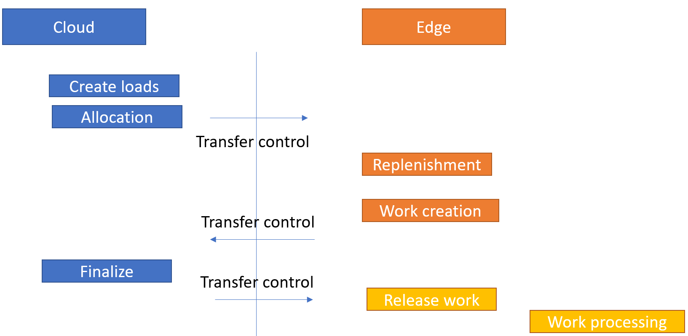
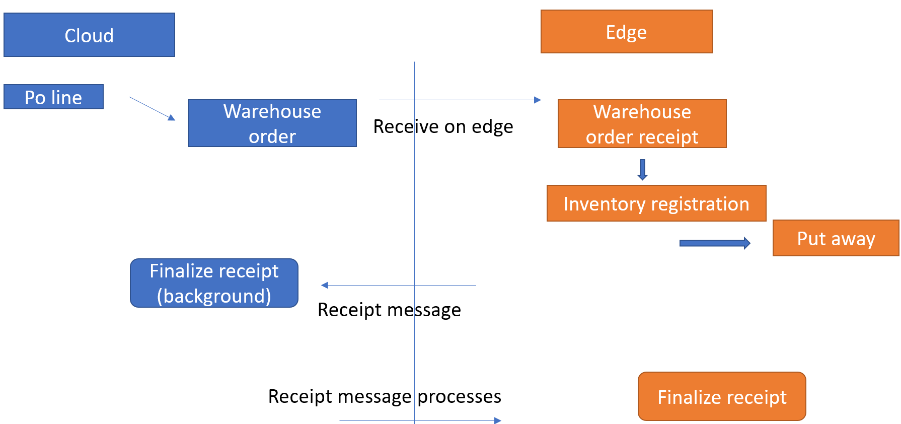

---
# required metadata

title: Warehouse management workloads for cloud and edge scale units
description: This feature allows edge scale units to run selected processes from your warehouse management workload. Cloud scale units run their workloads in the cloud using dedicated processing capacity in your selected Azure region. With edge scale units, you can run certain workloads independently on premises, even while temporarily disconnected from the cloud.
author: perlynne
manager: tfeyr
ms.date: 10/06/2020
ms.topic: article
ms.prod: 
ms.service: dynamics-ax-applications
ms.technology: 

# optional metadata

ms.search.form: PurchTable, SysSecRolesEditUsers
# ROBOTS: 
audience: Application User
# ms.devlang: 
ms.reviewer: kamaybac
ms.search.scope: Core, Operations
# ms.tgt_pltfrm: 
ms.custom: 
ms.assetid:
ms.search.region: global
ms.search.industry: SCM
ms.author: perlynne
ms.search.validFrom: 2020-10-06
ms.dyn365.ops.version: 10.0.15
---

# Warehouse management workloads for cloud and edge scale units

[!include [banner](../includes/banner.md)]
[!include [preview banner](../includes/preview-banner.md)]

> [!WARNING]
> Not all business functionality is fully supported in the public preview when using workload scale units. Be sure only to use the processes specifically described in this topic as being supported.  

## Warehouse execution for edge scale units

This feature allows edge scale units to run selected processes from your warehouse management workload. Cloud scale units run their workloads in the cloud using dedicated processing capacity in your selected Azure region. With edge scale units, you can run certain workloads independently on premises, even while temporarily disconnected from the cloud.
In this topic, warehouse management executions within a warehouse defined as an edge scale unit is called a *Warehouse execution system (WES)*.

## Prerequisites

You must have a fully deployed cloud and edge scale unit set up. For more information about the architecture and deployment process, see [Cloud and Edge scale units for manufacturing and warehouse management workloads](cloud-edge-landing-page.md).

## How does the WES edge scale unit function?

For the selected warehouse management processes, the data will get synchronized between the cloud and the edge scale units where the needed data includes ownership information.
Only the data within the ownership of a specific scale unit can get maintained by the dedicated scale unit and therefore it is important to understand which processes are supported for each of the deployments not to risk data update conflicts.
The following data will get maintained by the edge scale unit ownership:

- **Wave processing data**
  - Selected wave process methods are handled as part of the edge scale unit wave processing.

- **Work processing data**  
    The following work order type processing are supported:
  - Inventory movements (manual and movement by template work)
  - Purchase orders (Put-away work via Warehouse order)
  - Sales orders (simple picking and loading work)

- **Warehouse order receipt data**
  - Only used for purchase orders manually getting released to warehouse

- **License plate data**
  - The data is not warehouse specific and thereby shared with cloud scale unit

## Outbound process flow

In the following section the outbound flow gets described.
All source documents, like sales and transfer orders, gets handled in the ownership of the cloud scale units. The same goes for order allocation and outbound load processing.
The release to warehouse, shipment creation, and wave creation process are as well taken care of at the cloud scale unit.
The edge scale unit, and only the scale unit, will take care of the actual wave processing; such as work allocation, replenishment work, and demand work creation -  following the release of the wave making it possible for the warehouse workers to use the **Warehouse app** logged-in against the edge scale unit to process the outbound work.

## Inbound process flow

In the following section the inbound flow gets described.
All source documents, like purchase and sales return orders, gets handled in the ownership of the cloud scale units. The same goes for inbound load processing.
The inbound purchase order flow is conceptual different than an outbound, where the scale unit processing depends on whether the order has been released to a warehouse or not.
At **Release to warehouse** the **Warehouse orders** gets created and the ownership of the following receiving flow gets passed on to the edge scale unit.
The **Warehouse app** receiving process will get recorded at the edge scale unit against the inbound warehouse order and the following put-away work creation and processing can as well be handled by the edge scale units.

Without the **Release to warehouse** process - and thereby not having **Warehouse orders** - the cloud scale unit can process the warehouse receiving and work processing.

## Supported processes and roles

Not all the warehouse management processes can be supported for a WES deployment and therefore it is recommended to use dedicated roles as part of the warehouse management processes to avoid user confusions.
To ease this process a sample role Warehouse Manager on workload can be found as part of the demo data in **System administration \> Security \> Security configuration**.
This role is intended for warehouse managers when accessing the WES at the edge scale unit where the role grants user access to the forms of relevance within the context of the workload hosted on the edge.
The assignment of roles to users is part of the initial full data synchronization from the Cloud scale unit to the Edge scale unit. 

To trim a user role assignment, go to **System administration \> Security \> Assign users to roles** on the edge scale unit. Assign the **_Warehouse Manager on workload_** role, and only this role, to a user who acts as warehouse manager on the edge scale unit, as this will ensure that this user has access only to the supported functionality. Remove any other roles assigned to the user.

It is recommended to use the existing **Warehouse worker** role for the warehouse management execution for both the Cloud and Edge scale unit tasks. Please be aware however, that the role currently grants the warehouse worker access to create and update actions in the client UI on the Edge scale unit, which is currently not supported, e.g. transfer order processing.

## Supported WES processes

The following list describes the supported warehouse execution processes for a deployed scale unit edge warehouse.

- Enable selected wave methods processing, for sales orders and demand replenishment.
- Enable warehouse workers to execute sales and demand replenishment warehouse work using the warehouse app.
- Enable warehouse workers to perform inquiries into on-hand inventory using the warehouse app.
- Enable warehouse workers to create and execute inventory movements using the warehouse app.
- Enable warehouse worker to register purchase orders and conduct put away using the warehouse app.

The current supported work order types for WES scale unit deployments are:

- Sales orders
- Replenishment
- Inventory movement
- Purchase orders linked to Warehouse orders

All other source documents processing is currently not supported. This means that it will not be possible to e.g. release a transfer order to an edge scale unit warehouse and process the outbound warehouse picking and shipping operations on edge scale unit deployments, nor will it be possible to run the process on the deployed cloud scale unit deployments.

Additional limitation details within the supported processes at edge scale units are:

- Inbound and outbound processing for items having any active tracking dimensions such as batch or serial number dimensions is not supported
- Inventory status change processes and processing with a blocking inventory status value is not supported
- Integration to quality management is not supported
- Integration to production is not supported
- Catch weight item processing is not supported
- Over- under delivery processing is not supported
- Negative inventory on-hand processing is not supported

### Outbound (Only support for sales orders and demand replenishment)

>[!Warning]
>Due to only supporting sales order processing it will not be possible to use outbound warehouse management processing for transfer orders.

|Process                                      |Cloud scale unit  |Edge scale unit  |
|---------------------------------------------|----------------|-------------------|
|Source document processing                   |Yes             |No                 |
|Load and TMS processing                      |Yes             |No                 |
|Release to warehouse                         |Yes             |No                 |
|**Shipment consolidation**                   |**No**          |**No**             |
|**Cross docking (picking work)**             |**No**          |**No**             |
|Shipment wave processing                     |
(No)
But the finalization of the Wave status is handled in the cloud
       |
(Yes)
But without:<ul><li>Parallel work creation</li><li>Load building, Sorting</li> <li>Containerization</li><li>Wave label printing</li></li></ul>
Note:
Cloud access is needed to finalize the Wave status as part of the wave processing
|
|Warehouse work processing (incl. LP print)   | No             |
(Yes)
But only for:<ul><li>Sales picking</li><li>Sales loading</li><li>Without the use of active tracking dimensions</li></ul>|
|**Cluster picking**                          |**No**          |**No**             |
|**Packing processing**                       |**No**          |**No**             |
|**Outbound sorting processing**              |**No**          |**No**             |
|Printing of load related documents           |Yes             |No                 |
|Bill of Lading and ASN generation            |Yes             |No                 |
|Ship confirmation and packing slip processing|Yes             |No                 |
|**Short picking (Sales orders)**             |**No**          |**No**             |
|**Work cancellation**                        |**No**          |**No**             |
|**Change of work locations (Sales orders)**  |**No**          |**No**             |
|**Complete work (Sales orders)**             |**No**          |**No**             |
|**Block and unblock work**                   |**No**          |**No**             |
|**Change user**                              |**No**          |**No**             |
|**Print work report**                        |**No**          |**No**             |
|**Wave label**                               |**No**          |**No**             |
|**Reverse work**                             |**No**          |**No**             |

### Inbound

|Process                                      |Cloud scale unit  |Edge scale unit  |
|---------------------------------------------|----------------|-------------------|
|Source document processing                   |Yes             |No                 |
|Load and TMS processing                      |Yes             |No                 |
|Shipment confirmation                        |Yes             |No                 |
|Purchase order Release to warehouse (Warehouse order processing)|Yes  |No         |
|Purchase order item receiving and put away   |
Yes:
Without Warehouse order
No:
With warehouse order|
Yes:
With Warehouse order and without purchase order being part of a <b>Load</b>.
Note:
Only when using two mobile device menu items: One for receiving (<b>Purchase order item receiving</b>) and another with <b>Use existing work</b> to process the put-away
No:
Without warehouse order|
|Purchase order line receiving and put away|
Yes:
Without Warehouse order
No:
With warehouse order|No|
|Return order receiving and put away          |Yes              |No                 |
|Mixed license plate receiving and put away|
Yes:
Without Warehouse order
No:
With warehouse order|No|
|Load item receiving|
Yes:
Without Warehouse order
No:
With warehouse order|No|
|License plate receiving and put away|
Yes:
Without Warehouse order
No:
With warehouse order|No|
|Transfer order item receiving and put away   |Yes               |No                |
|Transfer order line receiving and put away   |Yes               |No                |
|Work cancellation|
Yes:
Without Warehouse order
No:
With warehouse order|
(Yes)
 Without <b>Unregister receipt when canceling work</b>|
|Purchase order product receipt processing    |Yes              |No                 |
|Cross docking work creation as part of receiving|
Yes:
Without Warehouse order
No:
With warehouse order|No|

### Warehouse operations and exception handing

|Process                                      |Cloud scale unit|Edge scale unit  |
|---------------------------------------------|----------------|-----------------|
|License plate inquire                        |Yes             |Yes              |
|Item inquire                                 |Yes             |Yes              |
|Location inquire                             |Yes             |Yes              |
|Change warehouse                             |Yes             |Yes              |
|Movement                                     |No              |Yes              |
|Movement by template                         |No              |Yes              |
|Adjustment (In/out)                          |Yes             |No               |
|Cycle counting and Counting discrepancy processing|Yes        |No               |
|Reprint label (License plate printing)       |Yes             |No               |
|License plate build                          |Yes             |No               |
|License plate break                          |Yes             |No               |
|Driver check in                              |Yes             |No               |
|Driver check out                             |Yes             |No               |
|Change batch disposition code                |Yes             |No               |
|Display open work list                       |Yes             |No               |
|**Consolidate license plates**               |**No**          |**No**           |
|**Remove container from group**              |**No**          |**No**           |
|**Cancel work**                              |**No**          |**No**           |
|**Min/max replenishment processing**         |**No**          |**No**           |
|**Slotting replenishment processing**        |**No**          |**No**           |

### Production

Warehouse management integration for production scenarios is currently not supported.

|Process                                      |Cloud scale unit|Edge scale unit  |
|---------------------------------------------|----------------|-----------------|
|
**All warehouse management processes related to production:**
**<li>Release to warehouse</li><li>Production wave processing</li><li>Raw material picking</li><li>Finished goods put away</li><li>Co-product and by-product put away</li><li>Kanban put away</li><li>Kanban picking</li><li>Start production order</li><li>Production scrap</li><li> Production last pallet</li><li>Register material consumption</li><li>Empty kanban</li>**|**No**|**No** |

## How to maintain the scale units for WES

A number of batch jobs runs on both the cloud and edge scale units.
On the cloud scale unit deployments you can manually maintain the batch jobs under:
**Warehouse management \> Periodic tasks \> Back-office workload management** where three jobs can be maintained:

- Process work status update events 
- Process wave execution control transfer events
- Register source order receipts

On the edge scale units the you can manually maintain the batch jobs under:

**Warehouse management \> Periodic tasks \> Workload management** where two jobs can be maintained:

- Process wave table records
- Process wave execution control transfer events
