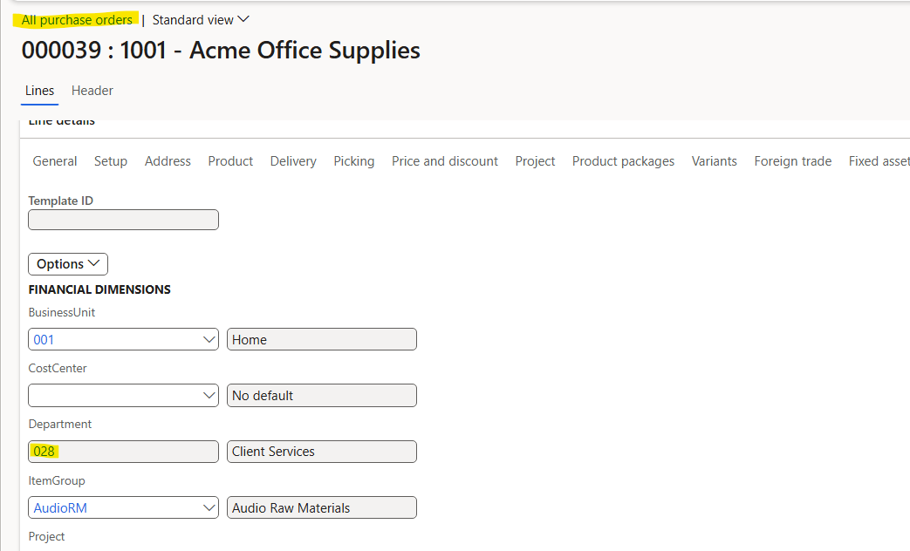
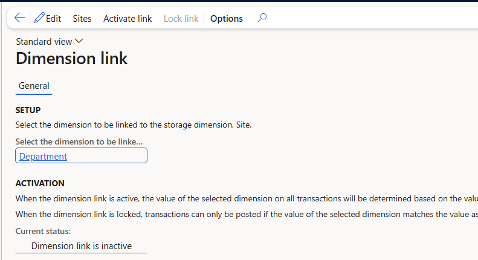
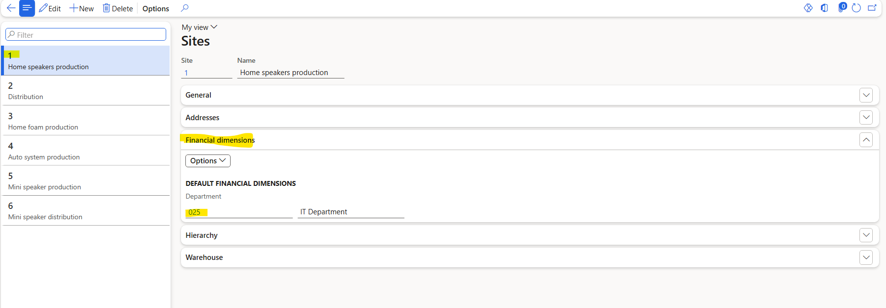
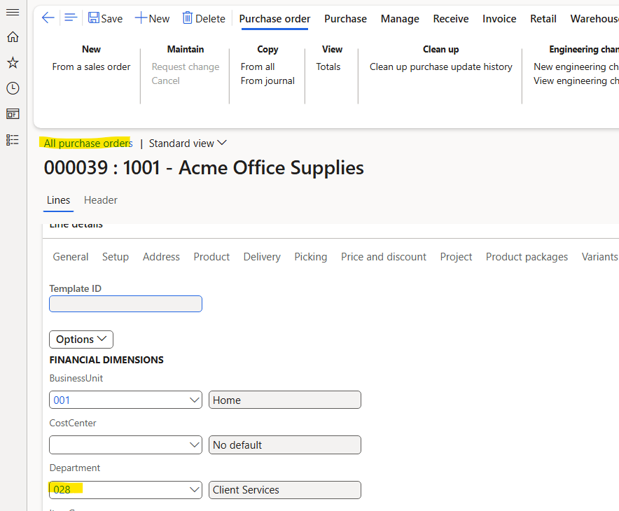

<!--
  FILE LOCATION: supply-chain/cost-management/financial-dimension-links.md

  TOC PLACEMENT: supply-chain/toc.yml
  Under the "Inventory management" node > "Inventory control" section.
  Insert after the "Tracking running average cost per inventory dimension" entry:

        - name: Financial dimension links for sites
          href: cost-management/financial-dimension-links.md

  IMAGES: The four screenshots referenced below must be copied from the TSG
  attachment source into the docs media folder at:
    supply-chain/cost-management/media/financial-dimension-links/
  Source files:
    DimensionLinkSetup.png
    DimensionLinkMap.png
    LockedDimension.png
    UnlockedDimension.png
-->

# Financial dimension links for sites

[!include [banner](../includes/banner.md)]

When you set up a link between a financial dimension and the site inventory dimension, your legal entity can calculate profit and loss figures for each site. Wherever a site is selected on a transaction, the corresponding financial dimension value is automatically populated—eliminating manual entry and reducing the risk of inconsistent postings.

For example, if your organization operates different business units across inventory sites, a dimension link ensures that selecting *Site 1* on a purchase order line automatically fills in the *Business Unit* financial dimension value mapped to that site.

The following procedures are covered in this article:

- [Prerequisites](#prerequisites)
- [Set up a financial dimension link](#set-up-a-financial-dimension-link)
- [Activate the dimension link](#activate-the-dimension-link)
- [Lock the dimension link](#lock-the-dimension-link)
- [Unlock the dimension link](#unlock-the-dimension-link)
- [Deactivate the dimension link](#deactivate-the-dimension-link)

## Prerequisites

Before you configure a dimension link, complete the following setup in General ledger.

### Create a financial dimension

1. Go to **General ledger** \> **Chart of accounts** \> **Dimensions** \> **Financial dimensions**.
1. Select **New**, choose **Custom dimension**, and assign a name (for example, *Business Unit* or *Site*).
1. Select **Activate** to make the dimension available.

> [!NOTE]
> A financial dimension can't be added as a segment in an account structure until it is activated.

1. Select **Dimension values** to create the individual values that will map to your inventory sites.

### Configure account structures

1. Go to **General ledger** \> **Chart of accounts** \> **Structures** \> **Configure account structures**.
1. Create a new structure, or edit an existing one.
1. Select **Add segment** and add your financial dimension.
1. Configure blank allowances as needed, then select **Activate**.

### Add the account structure to the ledger

1. Go to **General ledger** \> **Ledger setup** \> **Ledger**.
1. Select **Edit** and add the account structure to the ledger.

## Set up a financial dimension link

After completing the prerequisites, configure the dimension link and map each site to a dimension value.

1. Go to **Inventory management** \> **Setup** \> **Posting** \> **Dimension link**.
1. Select **Edit**, then in the dropdown, select the financial dimension you want to link to the site inventory dimension.

   > [!NOTE]
   > Only financial dimensions that have been added to your account structure appear in the list.

1. Select **Sites** in the menu to open **Inventory management** \> **Setup** \> **Inventory breakdown** \> **Sites**. **Warehouse management** \> **Setup** \> **Warehouse** \> **Sites** may also be a valid path to navigate to the **Sites** form. 
1. For each site, select **Financial dimensions** and, in edit mode, assign the corresponding financial dimension value.

   > [!IMPORTANT]
   > Each site must be mapped to a unique financial dimension value. Duplicate mappings will cause errors when the link is activated.

1. Save your changes and return to the **Dimension link** form.

## Activate the dimension link

Activating the link enables automatic population of the financial dimension on transactions whenever a site is selected.

1. Go to **Inventory management** \> **Setup** \> **Posting** \> **Dimension link**.
1. Select **Activate link** in the menu.
1. Select **OK** and wait for the operation to complete.

Once active, any transaction that includes a site—inventory journals, purchase orders, sales orders, and so on—automatically populates the associated financial dimension value based on the site-to-dimension mapping.

**Example:** With a dimension link active between *Business Unit* and the site dimension, a purchase order created for *Site 1* will automatically populate *Business Unit* with the value mapped to *Site 1*. No manual dimension entry is required.

## Lock the dimension link

Locking the dimension link prevents users from manually editing the linked financial dimension field on transaction lines. This enforces data integrity by ensuring the dimension value always derives from the site mapping rather than manual input.

1. Go to **Inventory management** \> **Setup** \> **Posting** \> **Dimension link**.
1. Select **Lock link** in the menu.

When the link is locked, the financial dimension field on transaction lines (such as purchase order lines) is grayed out and non-editable. This behavior is by design.

## Unlock the dimension link

If the dimension link was locked unintentionally, or if a site's dimension mapping needs to be corrected, you can unlock the link to restore editability.

### Step 1: Verify the dimension link setup

Go to **Inventory management** \> **Setup** \> **Posting** \> **Dimension link** and confirm that a financial dimension is configured as a surrogate to site.

If no dimension link is set up, a grayed-out field on a transaction is caused by something other than a dimension link.

### Step 2: Verify site-to-dimension mappings

Select **Sites** in the menu to open **Inventory management** \> **Setup** \> **Inventory breakdown** \> **Sites**. For each site, select **Financial dimensions** and confirm that a unique dimension value is assigned in edit mode.

If any sites are missing a mapping or share a value, correct those mappings before unlocking.

### Step 3: Unlock the link

On the **Dimension link** form, select **Unlock link** in the menu.

After unlocking, the linked financial dimension becomes editable on transaction lines.

> [!NOTE]
> The **Unlock link** action requires appropriate user permissions. If the option is unavailable, verify that your user role includes access to the **InventSiteDimensionLink** form.

## Deactivate the dimension link

To stop automatic dimension population entirely, deactivate the link.

1. Go to **Inventory management** \> **Setup** \> **Posting** \> **Dimension link**.
1. Select **Deactivate link** in the menu.

After deactivation, the financial dimension field on transactions reverts to manual entry.

## Related information

- [Tracking running average cost per inventory dimension](track-running-average-cost-per-inventory-dimension.md)
- [Inventory locations](../inventory/inventory-locations.md)

[!INCLUDE[footer-include](../../includes/footer-banner.md)]
