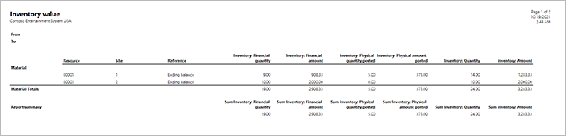
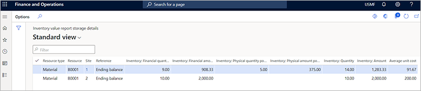
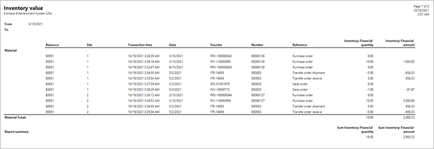
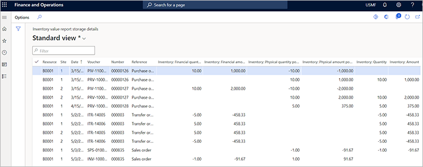

# Inventory value report examples and logic

[!include [banner](../includes/banner.md)]

Inventory value reports provide details about your inventory physical and financial quantities and amounts. This topic provides some examples of results presented in inventory value reports.

For more information about how to generate an use each type of inventory value report, see [Inventory value reports](inventory-value-report-storage.md).

## Sample data that is used in these examples

The examples in this topic are based on the sample inventory transaction data that is described in this section.

### Storage dimension setup

The example system contains the following setup of storage dimensions.

| **Name** | **Active** | **Physical inventory** | **Financial inventory** |
|---|---|---|---|
| Site | Yes | Yes | Yes |
| Warehouse | Yes | Yes | No |

### Inventory model

For the example system, the inventory model for the released products is *FIFO*, and the **Cost price** setting for the inventory model is *Include physical value*.

### Inventory transactions

The example system contains the following inventory transactions for a released product that has the item number *B0001*.

| Reference | Site | Warehouse | Receipt | Issue | Physical date | Financial date | Quantity | Cost amount | Physical cost amount |
|---|---|---|---|---|---|---|---|---|---|
| Purchase order | 1 | 11 | Purchased | | March 15 | March 15 | 10 | 1,000 | 1,000 |
| Purchase order | 2 | 21 | Purchased | | March 15 | March 15 | 10 | 2,000 | 2,000 |
| Purchase order | 1 | 11 | Received | | April 15 | | 5 | | 375 |
| Transfer order | 1 | 11 | | Sold | May 2 | May 2 | -5 | -458.33 | -458.33 |
| Transfer order | 1 | 12 | Purchased | | May 2 | May 2 | 5 | 458.33 | 458.33 |
| Sales order | 1 | 12 | | Sold | May 3 | May 3 | -1 | -91.67 | -91.67 |

### Inventory value report configuration

The example system has an inventory value report configuration with the following settings:

- **Range:**  *Posting date*
- **Inventory:** *Yes*
- **Calculate average unit cost:** *Yes*
- **Total quantity and value:** *Yes*
- **Site, View:** *Selected*
- **Resource ID, View:** *Yes*
- **Level:** *Totals*

## Inventory value report example 1

Using the sample data and report configuration described at start of this topic, you will get the results shown in the following table and screenshots.

| Resource type | Resource | Site | Reference | Inventory: Financial quantity | Inventory: Financial amount | Inventory: Physical quantity posted | Inventory: Physical amount posted | Inventory: Quantity | Inventory: Amount | Average unit cost |
|---|---|---|---|---|---|---|---|---|---|---|
| Material | B0001 | 1 | Ending balance | 9.00 | 908.33 | 5.00 | 375.00 | 14.00 | 1,283.33 | 91.67 |
| Material | B0001 | 2 | Ending balance | 10.00 | 2,000.00 | 0.00 | 0.00 | 10.00 | 2,000.00 | 200.00 |

### Inventory value report for example 1

The following screenshot shows the inventory value report for example 1 (select to enlarge).

### Inventory value report storage for example 1

The following screenshot shows the inventory value report storage for example 1 (select to enlarge).

## Inventory value report example 2

Using the sample data described at start of this topic, but changing the report configuration to use **Level**: *Transactions*, and running the report with **From date:** *March 15*, you will get the results shown in the following table and screenshots.

| Resource type | Resource | Site | Date | Number | Reference | Inventory: Financial quantity | Inventory: Financial amount | Inventory: Physical quantity posted | Inventory: Physical amount posted | Inventory: Quantity | Inventory: Amount |
|---|---|---|---|---|---|---|---|---|---|---|---|
| Material | B0001 | 1 | 3/15/2021 | 00000126 | Purchase order | 0.00 | 0.00 | 10.00 | 1,000.00 | **10.00** | **1,000.00** |
| Material | B0001 | 1 | 3/15/2021 | 00000126 | Purchase order | 10.00 | 1,000.00 | -10.00 | -1,000.00 | **0.00** | **0.00** |
| Material | B0001 | 1 | 4/15/2021 | 00000128 | Purchase order | 0.00 | 0.00 | 5.00 | 375.00 | **5.00** | **375.00** |
| Material | B0001 | 1 | 5/2/2021 | 000003 | Transfer order shipment | -5.00 | -458.33 | 0.00 | 0.00 | **-5.00** | **-458.33** |
| Material | B0001 | 1 | 5/2/2021 | 000003 | Transfer order receive | 5.00 | 458.33 | 0.00 | 0.00 | **5.00** | **458.33** |
| Material | B0001 | 1 | 5/3/2021 | 000835 | Sales order | 0.00 | 0.00 | -1.00 | -91.67 | **-1.00** | **-91.67** |
| Material | B0001 | 1 | 5/3/2021 | 000835 | Sales order | -1.00 | -91.67 | 1.00 | 91.67 | **0.00** | **0.00** |
| Material | B0001 | 2 | 3/15/2021 | 00000127 | Purchase order | 0.00 | 0.00 | 10.00 | 2,000.00 | **10.00** | **2,000.00** |
| Material | B0001 | 2 | 3/15/2021 | 00000127 | Purchase order | 10.00 | 2,000.00 | -10.00 | -2,000.00 | **0.00** | **0.00** |
| Material | B0001 | 2 | 5/2/2021 | 000003 | Transfer order shipment | 5.00 | 458.33 | 0.00 | 0.00 | **5.00** | **458.33** |
| Material | B0001 | 2 | 5/2/2021 | 000003 | Transfer order receive | -5.00 | -458.33 | 0.00 | 0.00 | **-5.00** | **-458.33** |

### Inventory value report for example 2

The following screenshot shows the inventory value report for example 2 (select to enlarge).

### Inventory value report storage for example 2

The following screenshot shows the inventory value report storage for example 2 (select to enlarge).

## Inventory value report example 3

We recommend that you execute the inventory value report after the recalculation or inventory closing to have the transactions and amounts affected by the recalculation/inventory closing.

The following subsections show inventory value reports generated after closing inventory until May 30.

### Example 3 using the totals level

**Level:** *Totals*

Using the sample data and inventory value report configuration described at start of this topic (with **Level**: *Totals*), you will get the results shown in the following table.

| Resource type | Resource | Site | Reference | Inventory: Financial quantity | Inventory: Financial amount | Inventory: Physical quantity posted | Inventory: Physical amount posted | Inventory: Quantity | Inventory: Amount | Average unit cost |
|---|---|---|---|---|---|---|---|---|---|---|
| Material | B0001 | 1 | Ending balance | 9.00 | 900.00 | 5.00 | 375.00 | 14.00 | 1,275.00 | 91.07 |
| Material | B0001 | 2 | Ending balance | 10.00 | 2,000.00 | 0.00 | 0.00 | 10.00 | 2,000.00 | 200.00 |

### Example 3 using the transactions level

Using the sample data described at start of this topic, but changing the inventory value report configuration to use **Level**: *Transactions*, you will get the results shown in the following table.

| Resource type | Resource | Site | Date | Number | Reference | Inventory: Financial quantity | Inventory: Financial amount | Inventory: Physical quantity posted | Inventory: Physical amount posted | Inventory: Quantity | Inventory: Amount |
|---|---|---|---|---|---|---|---|---|---|---|---|
| Material | B0001 | 1 | 3/15/2021 | 00000126 | Purchase order | 0.00 | 0.00 | 10.00 | 1,000.00 | 10.00 | 1,000.00 |
| Material | B0001 | 1 | 3/15/2021 | 00000126 | Purchase order | 10.00 | 1,000.00 | -10.00 | -1,000.00 | 0.00 | 0.00 |
| Material | B0001 | 1 | 4/15/2021 | 00000128 | Purchase order | 0.00 | 0.00 | 5.00 | 375.00 | 5.00 | 375.00 |
| Material | B0001 | 1 | 5/2/2021 | 000003 | Transfer order shipment | -5.00 | -458.33 | 0.00 | 0.00 | -5.00 | -458.33 |
| Material | B0001 | 1 | 5/2/2021 | 000003 | Transfer order receive | 5.00 | 458.33 | 0.00 | 0.00 | 5.00 | 458.33 |
| Material | B0001 | 1 | 5/3/2021 | 000835 | Sales order | 0.00 | 0.00 | -1.00 | -91.67 | -1.00 | -91.67 |
| Material | B0001 | 1 | 5/3/2021 | 000835 | Sales order | -1.00 | -91.67 | 1.00 | 91.67 | 0.00 | 0.00 |
| Material | B0001 | 1 | 5/31/2021 | 000835 | Sales order | 0.00 | -8.33 | 0.00 | 0.00 | 0.00 | -8.33 |
| Material | B0001 | 1 | 5/31/2021 | 000003 | Transfer order shipment | 0.00 | -41.67 | 0.00 | 0.00 | 0.00 | -41.67 |
| Material | B0001 | 1 | 5/31/2021 | 000003 | Transfer order receive | 0.00 | 41.67 | 0.00 | 0.00 | 0.00 | 41.67 |
| Material | B0001 | 2 | 3/15/2021 | 00000127 | Purchase order | 0.00 | 0.00 | 10.00 | 2,000.00 | 10.00 | 2,000.00 |
| Material | B0001 | 2 | 3/15/2021 | 00000127 | Purchase order | 10.00 | 2,000.00 | -10.00 | -2,000.00 | 0.00 | 0.00 |
| Material | B0001 | 2 | 5/2/2021 | 000003 | Transfer order shipment | 5.00 | 458.33 | 0.00 | 0.00 | 5.00 | 458.33 |
| Material | B0001 | 2 | 5/2/2021 | 000003 | Transfer order receive | -5.00 | -458.33 | 0.00 | 0.00 | -5.00 | -458.33 |
| Material | B0001 | 2 | 5/31/2021 | 000003 | Transfer order shipment | 0.00 | 41.67 | 0.00 | 0.00 | 0.00 | 41.67 |
| Material | B0001 | 2 | 5/31/2021 | 000003 | Transfer order receive | 0.00 | -41.67 | 0.00 | 0.00 | 0.00 | -41.67 |
