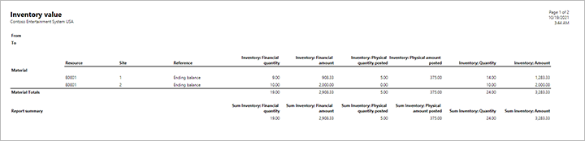
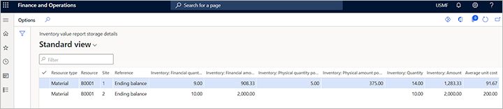

# Inventory value reports

[!include [banner](../includes/banner.md)]

## Purpose of the inventory value report

The inventory value report provides details about your inventory physical and financial quantities and amounts. You can choose to view the report in many different ways, such as by showing totals or transactions and by applying filters based on items or time range. You can view COGS values or WIP values and set other options.

With the inventory value report, you can:

- Do reconciliation between the general ledger and inventory.
- Consult on-hand inventory and values for a specific period.
- Create report configurations tailored for a specific purposes.
- Save report configurations that can be used multiple times.
- Add ranges to filter data when you run a report.

## Turn on the inventory value report feature

Before you can use this feature, it must be turned on in your system. Admins can use the [feature management](../../fin-ops-core/fin-ops/get-started/feature-management/feature-management-overview.md) settings to check the status of the feature and turn it on. In the **Feature management** workspace, the feature is listed in the following way:

- **Module** – Cost management
- **Feature name** – Inventory value report storage

## Define inventory value report storage configurations

Use the **Inventory value reports** page to set up the content that you want to include in various type of inventory value report storage reports. You can define any number of report types, and you will select a type each time you generate an inventory value report storage. <!-- KFM: Storage version only, right? More to add in this intro? Add some details about reconciliation? This section should maybe be its own topic. -->

1. Go to **Cost management \> Inventory accounting policies setup \> Inventory value reports**.
1. Do one of the following steps:
    - To edit an existing report, select it in the list pane and then select **Edit** on the Action Pane.
    - To create a new report, select **New** on the Action Pane.
1. Make the following settings in the header of the new or selected report:
    - **ID** – Enter a short identifier for the report. This value must be unique among all inventory value reports, and can't be edited after you create and save a new report configuration.
    - **Name** – Enter a descriptive name for the report.

1. If you are creating a new report configuration, then select **Save** on the Action Pane to enable the remaining settings.
1. Expand the **General** FastTab and make the following settings:  
    - **Date interval** – Choose a pre-defined date interval. This date interval can be overridden when you run the report.
    - **Range** – Choose either *Posting date* or *Transaction Time*, depending on which value the report should use to retrieve data. <!-- KFM: This isn't clear. Please revise. -->
    - **Dimension set** – Choose which dimension set to run the data for. For example, you might the data by *Main account*, or by *Main account + Business unit*. You can only choose a dimension set that has two dimensions or fewer. <!-- KFM: Where are these defined? Can we link to a topic with more info about how to set these up? What do we mean by "run the data"? -->

1. Expand the **Columns** FastTab and make the following settings. <!-- KFM: Can we briefly introduce what these options have in common? (Eg, what type of settings are these? What aspect of the report are were configuring here?) -->
    - **Inventory** – Set to *Yes* to reconcile the inventory value with inventory G/L accounts balance <!-- KFM: Spell out "G/L" on first use. -->.
    - **WIP** – Set to *Yes* to reconcile the WIP value with WIP G/L accounts balance <!-- KFM: Spell out WIP. -->. When you use this option, only the physical quantities and amounts of inventory in WIP status will show in the report. Production orders that are in WIP status have been picked or reported as finished but not ended. <!-- KFM: Is it production orders or inventory that can have "WIP status" (or both)? -->
    - **Deferred COGS** – Set to *Yes* to display a column showing the physical quantities and amounts of inventory for the mark of Deferred COGS <!-- KFM: Spell out COGS. What do you mean by "for the mark of Deferred COGS"? -->. The report will display the financial quantities and amounts for the mark of COGS <!-- KFM: "for the mark of Deferred COGS"? -->. Deferred COGS are shown using physical quantities and amounts because they offset packing slip quantities and amounts. However, COGS are shown using financial quantities and amounts because they offset the invoice quantities and amounts.
    - **COGS** – <!-- KFM: Description needed. -->
    - **Profit and loss** – Set to *Yes* to display a column for the financial amount posted to the profit and loss accounts for inventory.
    - **Print cumulative account values for comparison** – Set to *Yes* to display a column showing the G/L accounts balance in the report. By doing this, you won't need to check the trail balance. This works only with the *inventory value report*, not *inventory value report storage*. Please note that choosing a Total account <!-- KFM: How do I "choose a total account"? --> will show both the amounts of each of the inventory accounts included in the total account and the amount of the total account. After you enable this option, you must fill in the G/L account you want to reconcile <!-- KFM: Where/how do I do this? -->.
    - **Inventory account** – <!-- KFM: Description needed. -->
    - **WIP account** – <!-- KFM: Description needed. -->
    - **Deferred COGS account** – <!-- KFM: Description needed. -->
    - **COGS account** – <!-- KFM: Description needed. -->
    - **Summarize physical and financial values** – Set to *Yes* to display a column showing the total inventory quantity and inventory amount (summarizing both physical and financial inventory values). When set to *No*, the report report will show both physical and financial inventory values.
    - **Include not posted to ledger** Set to *Yes* to display a column showing the transactions that never posted to G/L. This can occur for the following types of items:
        - Received and not yet invoiced items where the **Post physical inventory** option unselected for the relevant item model group.
        - Received and not yet invoiced items when the **Post product receipt in ledger** option isn't selected in **Accounts payable parameters** (**Accounts payable \> Setup \> Accounts payable parameters**, **General** tab, **Product receipt** FastTab).

    - **Calculate average unit cost** – Set to *Yes* to display a column showing the average unit cost. The average unit cost is the total quantity divided by the total amount.
    - **Total quantity and value** – Set to *Yes* to display columns showing the total quantity of physical inventory (and financial quantities) and the total amount of physical inventory (and financial amounts). You can only enable this option when the **Summarize physical and financial values** option is not enabled. <!-- KFM: Please confirm my revision. Also, what is the difference between "quantity" and "amount"? -->
    - **Inventory dimensions** – In this grid, select the dimensions to show in the report. Only dimensions that have the **Financial inventory** option enabled will show values in the report; other dimensions will show only blank columns. <!-- KFM: What's the difference between "view" and "total"? -->
    - **Resource ID** – Set options related to displaying item numbers <!-- KFM: More detail needed. How are the "view" and "total" options different? -->. The information in the **Resource** column of the inventory value report is based on a combination of the `ItemID`, `WorkcenterID`, and `CodeID` fields. <!-- KFM: The purpose of this sentence, and the following bullet list, aren't clear. -->
        - Material: Resource = `ItemID`
        - Labor: Resource = `WorkCenterID`
        - Indirect cost: Resource = `CodeID`

        If either **Resource ID** or **Resource Group** are not marked, you will only see a total inventory value based on the inventory dimensions you selected. <!-- KFM: We have four options here. Which combination of options are you referring to? -->

    - **Resource ID** – Set options related to displaying item groups <!-- KFM: More detail needed. How are the "view" and "total" options different? -->. The information in the **Resource** column of the inventory value report is based on a combination of the `ItemGroup`, `WorkcenterGroup`, and `CostGroup` (`CostGroupType` = Indirect) fields. <!-- KFM: The purpose of this sentence (especially the part in parenthesis), and the following bullet list, aren't clear. -->
        - Material: Resource = `ItemGroup`
        - Labor: Resource = `WorkcenterGroup`
        - Indirect cost: Resource = `CostGroup`

        If either **Resource ID** or **Resource Group** are not marked, you will only see a total inventory value based on the inventory dimensions you selected. <!-- KFM: We have four options here. Which combination of options are you referring to? -->

1. Expand the **Rows** FastTab and make the following settings. <!-- KFM: Can we briefly introduce what these options have in common? (Eg, what type of settings are these? What aspect of the report are were configuring here?) -->
    - **Material** – <!-- KFM: Description needed. -->
    - **Labor** – <!-- KFM: Description needed. -->
    - **Indirect cost** – <!-- KFM: Description needed. -->
    - **Direct outsourcing** – <!-- KFM: Description needed. -->
    - **Detail Level** – Choose a view option for the report. Select one of the following options:
        - *Transactions* – View all relevant transactions in the report. Note that you may experience performance issues when viewing reports that include a large volume of transactions, so we recommend using inventory value report storage when using this option. <!-- KFM: Do this settings even apply to the non-storage report? How? Confirm my reformulation of this point. -->
        - *Totals* – <!-- KFM: Description needed. -->

    - **Include beginning balance** – <!-- KFM: Description needed. -->. This option is only available when **Detail level** is set to *Transactions*.

## New section <!-- KFM: New title is needed -->

<!-- KFM: The purpose of the following information isn't clear. It seems to require a new section. I think we are describing the report output, but that should be made clear in a new introduction added here.  -->

Supply Chain Management supports the following two important concepts regarding inventory status: <!-- KFM: Maybe also describe the difference between "amount" and "quantity". -->

- *Financial updated* – Indicates that the inventory transactions are already invoiced. For production orders, it indicates the end of a production order.
- *Physical updated* – Indicates that the inventory transactions aren't yet invoiced, but have been received or shipped. For production orders, it indicates that material has been picked or the production order has been reported as finished.

Understanding these two concepts should make it easy to understand the following columns: <!-- KFM: Where are these columns? -->

- **Inventory: Financial Quantity** – The quantity that has been financially updated.
- **Inventory: Financial Amount** – The amount value of inventory that has been financially updated.
- **Inventory: Physical Quantity Posted** – The quantity that has been physical updated.
- **Inventory: Physical Amount Posted** – The amount value of inventory that has been physical updated.
- **Inventory: Physical Quantity Not Posted** – The quantity that has inventory transactions but hasn't been posted to the GL <!-- KFM: Spell out "GL". Same as "G/L"? -->. For example, suppose you have an item model group where the **Post physical inventory** and **Post financial inventory** options aren't selected, and you have an item that is linked to this group. Then you create a purchase order, receive it, and invoice it. If you then check the inventory value report for this item, you will see that the quantity and the value in this purchase order are shown under the columns **Inventory: Physical Quantity Not Posted** and **Inventory: Physical Amount Not Posted**.
- **Inventory: Physical Amount Not Posted** – Don't include this amount when you do the inventory reconciliation because this amount is not post into G/L. <!-- KFM: This isn't clear. Doesn't match the other entries in this list. -->
- **Inventory: Quantity** – The total quantity of all the quantity columns in the report.
- **Inventory: Amount** – The total quantity of all the amount columns in the report. Don't use this column to do inventory reconciliation if your reports includes the **Inventory: Physical Amount Not Posted** column. You must exclude **Inventory: Physical Amount Not Posted** from the total amount. <!-- KFM: similar to previous note, but still not clear. -->
- **Average unit cost** – The total amount divided by the total quantity.

Normally, you will use the inventory value report to view the inventory value and quantity, but sometimes you won't see all of the relevant inventory dimensions in the report. To make inventory dimensions show in the report:

1. Check the item storage and tracking dimension groups. Only dimensions that have the **Financial inventory** option enabled can be shown in the report.
2. Go to **Cost management \> Inventory accounting policies setup \> Inventory value reports**, select the report configuration that you used to view <!-- KFM: generate? --> the report and make sure the required inventory dimensions are selected. <!-- KFM: View or Total columns? Both? Either?-->

For example, suppose you have an item *A0001*. In the storage dimensions group, only the site is enabled for financial inventory. The site and warehouse are both enabled for physical inventory. In the tracking dimension group, the batch number is enabled for physical inventory but not enabled for financial inventory. Now you use a report configuration where site, warehouse, and batch number are all selected. Then, when you view the report, you will only see a value for the site, and the warehouse and batch number columns are blank. This shows that inventory value reports can only show inventory dimension that are enabled for financial inventory.

## Generate inventory value reports

The inventory value has two options: **Inventory value report** and **Inventory value report storage**.

### Generate an inventory value report

1. Go to **Cost management \> Inquiries and reports \> Inventory accounting - status reports \> Inventory value.**
1. In the dialog box that appears, set the following values to define which records are included in your report:
    - On the **Parameters** FastTab, the **Date interval code** is used when you want to view the predefined period instead of giving the **From date** and **To date**. For example, if you select **current period** in this parameter, the report will calculate the **From date** and **To date** based on the current session date. If you don't use date interval code, you can manually fill the **From date** and **To date** based on your need.
    - On the **Records to include** FastTab, set up filters and constraints to define which data is included in the report.
    - On the **Run in the background** FastTab, specify how, when, and how often the report is generated.

1. Select **OK** to apply your settings and close the dialog box, then the report will appear on screen.

### Generate an inventory value report storage

<!-- KFM: This is already described in more detail in [Inventory value storage report](inventory-value-report-storage.md). We should keep that topic instead. Either create another topic for the standard report or create a new topic that describes generating the reports only -->

1. go to **Cost management \> Inquiries and reports \> Inventory value report storage**.
1. Click **New**.
1. In the dialog box that appears, set the following values to define which records are included in your report:

    - On the **Parameters** FastTab, for **Inventory value report storage** enter a unique name for the report. The **Date interval code** is used when you want to view the predefined period instead of giving the **From date** and **To date**. For example, if you select **current period** in this parameter, the report will calculate the **From date** and **To date** based on the current session date. If you don't use date interval code, you can manually fill the **From date** and **To date** based on your need.
    - On the **Records to include** FastTab, set up filters and constraints to define which data is included in the report.
    - On the **Run in the background** FastTab, specify how, when, and how often the report is generated.

    The **Inventory value report storage** report is always run as part of a batch job. After the batch job is completed, the report will be listed on the **Inventory value report storage** page. You might have to refresh the page to see the report.

1. Select a report in the list.
1. Select **View details** to show the report content.

There is one known issue. When you select the same date for both **From date** and **To date** and also enable **include beginning balance** option in inventory value report ID, you may get incorrect beginning balance. This is a by-design scenario.

All the filters in the **Records to include** section will be applied to the inventory transactions but not the G/L balance. So, when you try to use these filters, please keep this in mind. Otherwise, you may see the discrepancy between inventory and G/L account which is caused improper usage of the filters.

## Inventory value report examples and logic

The examples in this topic show results that are presented on a standard **Inventory value** report. Also, we will show **Inventory value report storage**, as we recommend that you use the **Inventory value report storage** version of this report, especially when you have many items and warehouses that must be processed. Inventory value report storage saves each report that you generate, shows the results as an interactive page, and lets you export any saved report.

### Sample data that is used in these examples

The examples in this topic are based on the sample inventory transaction data that is described in this section.

#### Storage dimension setup

The example system contains the following setup of storage dimensions.

| **Name** | **Active** | **Physical inventory** | **Financial inventory** |
|---|---|---|---|
| Site | Yes | Yes | Yes |
| Warehouse | Yes | Yes | No |

#### Inventory model

For the example system, the inventory model for the released products is *FIFO*, and the **Cost price** setting for the inventory model is *Include physical value*.

#### Inventory transactions

The example system contains the following inventory transactions for a released product that has the item number *B0001*.

| Reference | Site | Warehouse | Receipt | Issue | Physical date | Financial date | Quantity | Cost amount | Physical cost amount |
|---|---|---|---|---|---|---|---|---|---|
| Purchase order | 1 | 11 | Purchased | | March 15 | March 15 | 10 | 1,000 | 1,000 |
| Purchase order | 2 | 21 | Purchased | | March 15 | March 15 | 10 | 2,000 | 2,000 |
| Purchase order | 1 | 11 | Received | | April 15 | | 5 | | 375 |
| Transfer order | 1 | 11 | | Sold | May 2 | May 2 | -5 | -458.33 | -458.33 |
| Transfer order | 1 | 12 | Purchased | | May 2 | May 2 | 5 | 458.33 | 458.33 |
| Sales order | 1 | 12 | | Sold | May 3 | May 3 | -1 | -91.67 | -91.67 |

### Inventory value report example 1

By using the sample data that is described in the previous sections, you can run an **Inventory value** report that has the following **ID** settings:

- **Range:**  *Posting date*
- **Inventory:** *Yes*
- **Calculate average unit cost:** *Yes*
- **Total quantity and value:** *Yes*
- **Site View:** *Marked*
- **RESOURCE ID View:** *Yes*
- **Level:** *Totals*

| Resource type | Resource | Site | Reference | Inventory: Financial quantity | Inventory: Financial amount | Inventory: Physical quantity posted | Inventory: Physical amount posted | Inventory: Quantity | Inventory: Amount | Average unit cost |
|---|---|---|---|---|---|---|---|---|---|---|
| Material | B0001 | 1 | Ending balance | 9.00 | 908.33 | 5.00 | 375.00 | 14.00 | 1,283.33 | 91.67 |
| Material | B0001 | 2 | Ending balance | 10.00 | 2,000.00 | 0.00 | 0.00 | 10.00 | 2,000.00 | 200.00 |

#### Inventory value report for example 1

The following screenshot shows the inventory value report for example 1 (select to enlarge).

#### Inventory value report storage for example 1

The following screenshot shows the inventory value report storage for example 1 (select to enlarge).

### Inventory value report example 2

By using the same data that is described in the previous sections, but on **Level**: *Transactions* and **From date:** *March 15.*

| Resource type | Resource | Site | Date | Number | Reference | Inventory: Financial quantity | Inventory: Financial amount | Inventory: Physical quantity posted | Inventory: Physical amount posted | Inventory: Quantity | Inventory: Amount |
|---|---|---|---|---|---|---|---|---|---|---|---|
| Material | B0001 | 1 | 3/15/2021 | 00000126 | Purchase order | 0.00 | 0.00 | 10.00 | 1,000.00 | **10.00** | **1,000.00** |
| Material | B0001 | 1 | 3/15/2021 | 00000126 | Purchase order | 10.00 | 1,000.00 | -10.00 | -1,000.00 | **0.00** | **0.00** |
| Material | B0001 | 1 | 4/15/2021 | 00000128 | Purchase order | 0.00 | 0.00 | 5.00 | 375.00 | **5.00** | **375.00** |
| Material | B0001 | 1 | 5/2/2021 | 000003 | Transfer order shipment | -5.00 | -458.33 | 0.00 | 0.00 | **-5.00** | **-458.33** |
| Material | B0001 | 1 | 5/2/2021 | 000003 | Transfer order receive | 5.00 | 458.33 | 0.00 | 0.00 | **5.00** | **458.33** |
| Material | B0001 | 1 | 5/3/2021 | 000835 | Sales order | 0.00 | 0.00 | -1.00 | -91.67 | **-1.00** | **-91.67** |
| Material | B0001 | 1 | 5/3/2021 | 000835 | Sales order | -1.00 | -91.67 | 1.00 | 91.67 | **0.00** | **0.00** |
| Material | B0001 | 2 | 3/15/2021 | 00000127 | Purchase order | 0.00 | 0.00 | 10.00 | 2,000.00 | **10.00** | **2,000.00** |
| Material | B0001 | 2 | 3/15/2021 | 00000127 | Purchase order | 10.00 | 2,000.00 | -10.00 | -2,000.00 | **0.00** | **0.00** |
| Material | B0001 | 2 | 5/2/2021 | 000003 | Transfer order shipment | 5.00 | 458.33 | 0.00 | 0.00 | **5.00** | **458.33** |
| Material | B0001 | 2 | 5/2/2021 | 000003 | Transfer order receive | -5.00 | -458.33 | 0.00 | 0.00 | **-5.00** | **-458.33** |

#### Inventory value report for example 2

The following screenshot shows the inventory value report for example 2 (select to enlarge).

#### Inventory value report storage for example 2

The following screenshot shows the inventory value report storage for example 2 (select to enlarge).

### Inventory value report example 3

Note that it is recommended to execute the inventory value report after the recalculation/inventory closing to have the transactions and amounts affected by the recalculation/inventory closing.

Below are the inventory value report values after inventory closing till May 30.

#### Example 3 using the totals level

**Level:** *Totals*

| Resource type | Resource | Site | Reference | Inventory: Financial quantity | Inventory: Financial amount | Inventory: Physical quantity posted | Inventory: Physical amount posted | Inventory: Quantity | Inventory: Amount | Average unit cost |
|---|---|---|---|---|---|---|---|---|---|---|
| Material | B0001 | 1 | Ending balance | 9.00 | 900.00 | 5.00 | 375.00 | 14.00 | 1,275.00 | 91.07 |
| Material | B0001 | 2 | Ending balance | 10.00 | 2,000.00 | 0.00 | 0.00 | 10.00 | 2,000.00 | 200.00 |

#### Example 3 using the transactions level

**Level**: *Transactions*

| Resource type | Resource | Site | Date | Number | Reference | Inventory: Financial quantity | Inventory: Financial amount | Inventory: Physical quantity posted | Inventory: Physical amount posted | Inventory: Quantity | Inventory: Amount |
|---|---|---|---|---|---|---|---|---|---|---|---|
| Material | B0001 | 1 | 3/15/2021 | 00000126 | Purchase order | 0.00 | 0.00 | 10.00 | 1,000.00 | 10.00 | 1,000.00 |
| Material | B0001 | 1 | 3/15/2021 | 00000126 | Purchase order | 10.00 | 1,000.00 | -10.00 | -1,000.00 | 0.00 | 0.00 |
| Material | B0001 | 1 | 4/15/2021 | 00000128 | Purchase order | 0.00 | 0.00 | 5.00 | 375.00 | 5.00 | 375.00 |
| Material | B0001 | 1 | 5/2/2021 | 000003 | Transfer order shipment | -5.00 | -458.33 | 0.00 | 0.00 | -5.00 | -458.33 |
| Material | B0001 | 1 | 5/2/2021 | 000003 | Transfer order receive | 5.00 | 458.33 | 0.00 | 0.00 | 5.00 | 458.33 |
| Material | B0001 | 1 | 5/3/2021 | 000835 | Sales order | 0.00 | 0.00 | -1.00 | -91.67 | -1.00 | -91.67 |
| Material | B0001 | 1 | 5/3/2021 | 000835 | Sales order | -1.00 | -91.67 | 1.00 | 91.67 | 0.00 | 0.00 |
| Material | B0001 | 1 | 5/31/2021 | 000835 | Sales order | 0.00 | -8.33 | 0.00 | 0.00 | 0.00 | -8.33 |
| Material | B0001 | 1 | 5/31/2021 | 000003 | Transfer order shipment | 0.00 | -41.67 | 0.00 | 0.00 | 0.00 | -41.67 |
| Material | B0001 | 1 | 5/31/2021 | 000003 | Transfer order receive | 0.00 | 41.67 | 0.00 | 0.00 | 0.00 | 41.67 |
| Material | B0001 | 2 | 3/15/2021 | 00000127 | Purchase order | 0.00 | 0.00 | 10.00 | 2,000.00 | 10.00 | 2,000.00 |
| Material | B0001 | 2 | 3/15/2021 | 00000127 | Purchase order | 10.00 | 2,000.00 | -10.00 | -2,000.00 | 0.00 | 0.00 |
| Material | B0001 | 2 | 5/2/2021 | 000003 | Transfer order shipment | 5.00 | 458.33 | 0.00 | 0.00 | 5.00 | 458.33 |
| Material | B0001 | 2 | 5/2/2021 | 000003 | Transfer order receive | -5.00 | -458.33 | 0.00 | 0.00 | -5.00 | -458.33 |
| Material | B0001 | 2 | 5/31/2021 | 000003 | Transfer order shipment | 0.00 | 41.67 | 0.00 | 0.00 | 0.00 | 41.67 |
| Material | B0001 | 2 | 5/31/2021 | 000003 | Transfer order receive | 0.00 | -41.67 | 0.00 | 0.00 | 0.00 | -41.67 |
