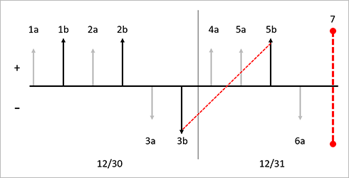
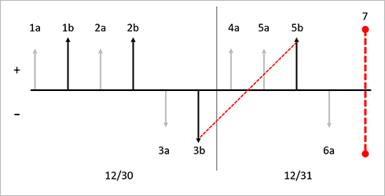
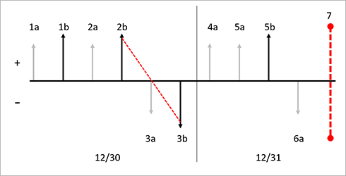

# LIFO with physical value and marking

[!include [banner](../includes/banner.md)]

Last in, first out (LIFO) is an inventory management and valuation method where inventory that was produced or acquired last is sold, used, or disposed of first. During the inventory close process in Microsoft Dynamics 365 Supply Chain Management, the system will create settlements where the last receipt is matched against the first issue, and so on. The settlements and matching principle are based on the financial date of the inventory transactions. A preliminary assessment of the settlements and adjustments can be performed by running the inventory recalculation process.

You can override the LIFO principle by marking inventory transactions so that a specific item receipt is settled against a specific issue. A periodic inventory close is required when you use the LIFO inventory model to create settlements and adjust the value of issues according to the LIFO principle. Until you run the inventory close process, issue transactions are valued at the running average when the physical and financial updates occurred. Unless you're using marking, the running average is calculated when the physical or financial update is performed.

The following examples show the effect of using LIFO in three configurations:

- LIFO without the **Include physical value** option
- LIFO with the **Include physical value** option
- LIFO with marking

## LIFO without the Include physical value option

In this example, the **Include physical value** checkbox is cleared on the item model group for the released product. The illustration that follows shows these transactions:

- 1a. Inventory physical receipt for a quantity of 1 at a cost of USD 10.00 each.
- 1b. Inventory financial receipt for a quantity of 1 at a cost of USD 10.00 each.
- 2a. Inventory physical receipt for a quantity of 1 at a cost of USD 20.00 each.
- 2b. Inventory financial receipt for a quantity of 1 at a cost of USD 22.00 each.
- 3a. Inventory physical issue for a quantity of 1 at a cost price of USD 16.00 (running average of financially posted transactions).
- 3b. Inventory financial issue for a quantity of 1 at a cost price of USD 16.00 (running average of financially posted transactions).
- 4a. Inventory physical receipt for a quantity of 1 at a cost of USD 25.00 each.
- 5a. Inventory physical receipt for a quantity of 1 at a cost of USD 30.00 each.
- 5b. Inventory financial receipt for a quantity of 1 at a cost of USD 30.00 each.
- 6a. Inventory physical issue for a quantity of 1 at a cost price of USD 23.00 (running average of financially posted transactions)
- 7\. Inventory close is performed. Based on the LIFO method, the first financially updated issue will be settled against the last financially updated receipt, and so on. In this example, one settlement is created between 5b and 3b. An adjustment of USD 14.00 will be made to 3b, and the resulting final cost will be USD 30.00.

The following illustration shows the effects of the FIFO inventory model on this series of transactions when the **Include physical value** option isn't used.

**Key to the diagram**

- Inventory transactions are represented by vertical arrows.
- Physical transactions are represented by shorter light gray arrows.
- Financial transactions are represented by longer black arrows.
- Receipts into inventory are represented by vertical arrows above the axis.
- Issues out of inventory are represented by vertical arrows below the axis.
- Each new receipt or issue transaction is designated by a new label.
- Each vertical arrow is labeled with a sequential identifier, such as *1a*. The identifiers indicate the order of inventory transaction postings in the timeline.
- Each date in the diagram is separated by a thin black vertical line. The date is noted at the bottom of the diagram.
- Inventory closings are represented by a red vertical dashed line.
- Settlements that are performed by inventory close are represented by red diagonal dashed arrows that go from a receipt to an issue.

## LIFO with the Include physical value option

If the **Include physical value** checkbox is selected for an item on the **Item model groups** page, the system uses both physical and financial receipt transactions to calculate the running average cost price. Where applicable, the system also adjusts the physically updated issue transaction. When the **Include physical value** checkbox is cleared, inventory close that uses the LIFO inventory model makes settlements only to transactions that are financially updated.

The illustration that follows shows these transactions:

- 1a. Inventory physical receipt for a quantity of 1 at a cost of USD 10.00 each.
- 1b. Inventory financial receipt for a quantity of 1 at a cost of USD 10.00 each.
- 2a. Inventory physical receipt for a quantity of 1 at a cost of USD 20.00 each.
- 2b. Inventory financial receipt for a quantity of 1 at a cost of USD 22.00 each.
- 3a. Inventory physical issue for a quantity of 1 at a cost price of USD 16.00 (running average of physically and financially posted transactions).
- 3b. Inventory financial issue for a quantity of 1 at a cost price of USD 16.00 (running average of physically and financially posted transactions).
- 4a. Inventory physical receipt for a quantity of 1 at a cost of USD 25.00 each.
- 5a. Inventory physical receipt for a quantity of 1 at a cost of USD 30.00 each.
- 5b. Inventory financial receipt for a quantity of 1 at a cost of USD 30.00 each.
- 6a. Inventory physical issue for a quantity of 1 at a cost price of USD 23.67 (running average of physically and financially posted transactions).
- 7\. Inventory close is performed. Based on the LIFO method, the first financially updated issue will be settled against the last financially updated receipt, and so on. In this example, one settlement is created between 3b and 5b. An adjustment of USD 14.00 will be made to 3b, and the resulting final cost will be USD 30.00. Additionally, transaction 6a will be adjusted to the receipt transaction cost of 4a. The system won't settle these transactions, because the receipt is updated physically but not financially. Instead, only an adjustment of USD 1.33 will be posted to the physical issue transaction, and the resulting adjusted cost will be USD 25.00.

The following illustration shows the effects of the LIFO inventory model on this series of transactions when the **Include physical value** option is used.

**Key to the diagram**

- Inventory transactions are represented by vertical arrows.
- Physical transactions are represented by shorter light gray arrows.
- Financial transactions are represented by longer black arrows.
- Receipts into inventory are represented by vertical arrows above the axis.
- Issues out of inventory are represented by vertical arrows below the axis.
- Each new receipt or issue transaction is designated by a new label.
- Each vertical arrow is labeled with a sequential identifier, such as *1a*. The identifiers indicate the order of inventory transaction postings in the timeline.
- Each date in the diagram is separated by a thin black vertical line. The date is noted at the bottom the diagram.
- Inventory closings are represented by a red vertical dashed line.
- Settlements that are performed by inventory close are represented by red diagonal dashed arrows that go from a receipt to an issue.

## LIFO with marking

Marking is a process that lets you link, or mark, an issue transaction to a receipt transaction. Marking can occur either before or after a transaction is posted. You can use marking when you want to be sure of the exact cost of inventory when the transaction is posted or the inventory close is performed. For example, the Customer Service department accepted a rush order from an important customer. Because this order is a rush order, you must pay more for the item to fulfill the customer's request.

You must make sure that the cost of the inventory item is reflected in the margin, or cost of goods sold (COGS), for the sales order invoice. When the purchase order is posted, the inventory is received at a cost of USD 120.00. If this sales order document is marked to the purchase order before the packing slip or invoice is posted, the COGS will be USD 120.00, not the current running average cost for the item. If the sales order packing slip or invoice is posted before the marking occurs, the COGS will be posted at the running average cost price.

Before inventory close is performed, these two transactions can still be marked to each other.

You can mark an issue transaction to a receipt before the transaction is posted. You can do this marking from a sales order line on the **Sales order details** page by selecting **Inventory \> Marking** on the **Sales order lines** FastTab. You can view the open receipt transactions on the **Marking** page.

You can also mark an issue transaction to a receipt after the transaction is posted. You can match or mark an issue transaction for an open receipt transaction for an inventoried item from a posted inventory adjustment journal.

The illustration that follows shows these transactions:

- 1a. Inventory physical receipt for a quantity of 1 at a cost of USD 10.00 each.
- 1b. Inventory financial receipt for a quantity of 1 at a cost of USD 10.00 each.
- 2a. Inventory physical receipt for a quantity of 1 at a cost of USD 20.00 each.
- 2b. Inventory financial receipt for a quantity of 1 at a cost of USD 22.00 each.
- 3a. Inventory physical issue for a quantity of 1 at a cost price of USD 16.00 (running average of financially posted transactions).
- 3b. Inventory financial issue for a quantity of 1 at a cost price of USD 16.00 (running average of financially posted transactions).
- 3c. Inventory financial issue for 3b is marked to inventory financial issue for 2b.
- 4a. Inventory physical receipt for a quantity of 1 at a cost of USD 25.00 each.
- 5a. Inventory physical receipt for a quantity of 1 at a cost of USD 30.00 each.
- 5b. Inventory financial receipt for a quantity of 1 at a cost of USD 30.00 each.
- 6a. Inventory physical issue for a quantity of 1 at a cost price of USD 23.00 (running average of financially posted transactions)
- 7\. Inventory close is performed. Based on the marking principle that uses the LIFO method, the marked transactions are settled against each other. In this example, 3b is settled against 2b, and an adjustment for USD 6.00 is posted to 3b to bring the value to USD 22.00. In this example, no additional settlements are made, because the close creates settlements only for financially updated transactions.

The new running average cost price reflects the average of the financially and physically updated transactions, USD 17.50.

The following illustration shows the effects of the LIFO inventory model on this series of transactions when marking between issues and receipts is used.

**Key to diagram**

- Inventory transactions are represented by vertical arrows.
- Physical transactions are represented by shorter light gray arrows.
- Financial transactions are represented by longer black arrows.
- Receipts into inventory are represented by vertical arrows above the axis.
- Issues out of inventory are represented by vertical arrows below the axis.
- Each new receipt or issue transaction is designated by a new label.
- Each vertical arrow is labeled with a sequential identifier, such as *1a*. The identifiers indicate the order of inventory transaction postings in the timeline.
- Each date in the diagram is separated by a thin black vertical line. The date is noted at the bottom of the diagram.
- Inventory closings are represented by a red vertical dashed line.
- Settlements and markings that are performed by inventory close are represented by red diagonal dashed arrows that go from a receipt to an issue.

[!INCLUDE[footer-include](../../includes/footer-banner.md)]
